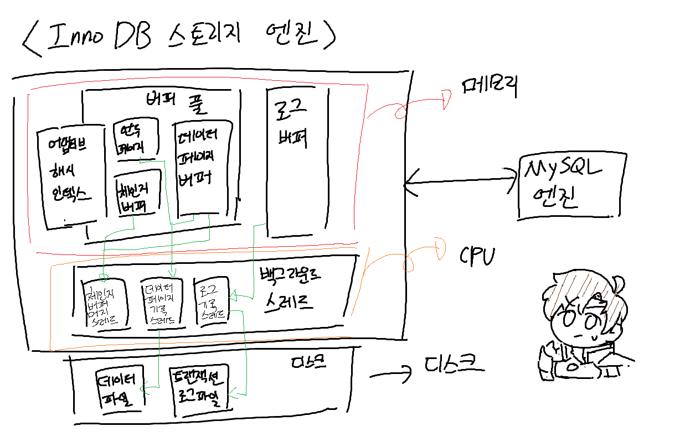
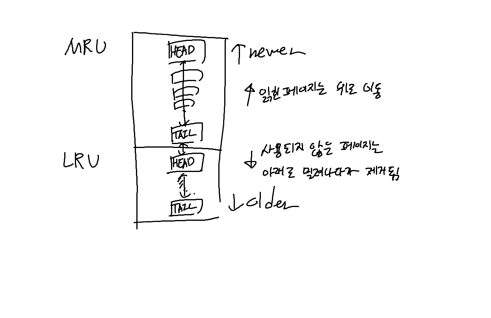

## Real MySql 8.0

### InnoDB 스토리지 엔진 특징
InnoDB의 모든 테이블은 기본적으로 PK를 기준으로 클러스터링되어, PK의 순서대로 디스크에 저장된다  
모든 세컨더리 인덱스는 레코드의 실제 주소 대신, PK의 값을 논리적인 주소로 사용한다. 따라서 PK의 레인지 스캔은 다른 인덱스를 사용한 스캔보다 빠르고, 그래서 PK는 다른 인덱스보다 내부적으로 비중이 높게 설정된다


또한 InnoDB는 FK를 지원한다 (MyISAM이나 MEMORY 테이블은 지원하지 않음)  
기본적으로 데이터나 테이블 변경 시 FK의 인덱스 생성이 필요하고, 부모 혹은 자식 테이블의 데이터 유효성을 체크하기 때문에, 락이 발생하면 여러 테이블에 전파되고 데드락이 발생하는 경우가 많다  
FK의 체크 작업을 임시로 멈출 수도 있으며. `foreign_key_checks` 시스템 변수를 OFF로 설정하면 된다  

### InnoDB 스토리지 엔진 아키텍처



### MVCC (Multi-Version Concurrency Control)
잠금을 사용하지 않는 일관된 읽기를 의미한다  
InnoDB에서는 언두 로그를 이용해 이 기능을 구현하고 있다  


데이터를 변경하기 전에는 InnoDB 버퍼 풀 and/or 디스크에 데이터가 존재하고 있는 상태이다
1. 데이터의 Update 문이 실행되면, 커밋 여부와 상관 없이 InnoDB 버퍼 풀의 데이터는 새로운 값으로 갱신된다
2. 언두 로그에는, Update 전의 데이터를 저장한다
3. 격리 수준이 `READ_UNCOMMITTED`인 경우, InnoDB 버퍼 풀이 가지고 있는 변경된 데이터를 읽는다
4. 격리 수준이 `READ_COMMITTED`거나 그 이상의 격리 수준일 경우, 변경 사항이 커밋되지 않았으므로 언두 로그에 저장된 데이터를 이용해 읽기를 수행한다


이와 같이 데이터의 잠금은 발생하지 않으며, 하나의 데이터가 두개 이상의 버전이 유지되고, 격리 수준에 따라 다른 데이터가 보여지는 구조이다  
따라서 트랜잭션이 길어질 경우 언두에서 관리해야 하는 예전 데이터가 증가하고, 언두 로그를 저장하는 테이블스페이스의 공간이 늘어나게 된다  


이 상태에서 COMMIT 명령을 실행하면 InnoDB는 별도의 작업을 수행하지 않고 현재 버퍼 풀의 상태를 영구적인 데이터로 만든다
ROLLBACK이 실행될 경우, 언두 영역의 데이터를 InnoDB 버퍼 풀로 복구하고, 언두 영역의 데이터는 삭제한다.
- 단 커밋이 되어도 바로 언두 영역의 데이터가 삭제되지 않고, 해당 언두 영역을 필요로 하는 트랜잭션이 존재하지 않을 때 삭제된다

### 자동 데드락 감지

InnoDB 스토리지 엔진은 내부적으로 락이 교착 상태에 빠졌는지 확인하기 위해 잠금 대기 목록을 그래프 형태로 관리한다  
이를 위해 데드락 감지 스레드가 주기적으로 잠금 대기 그래프를 검사해, 교착 상태에 빠진 트랜잭션을 찾아 그 중 하나를 강제로 종료한다  
- 종료 트랜잭션의 선택 아이스브레이커는 언두 레코드의 양이고, 레코드가 적은 쪽이 일반적으로 롤백 대상이 된다

동시 처리 스레드의 양이 매우 많아지거나, 잠금의 개수가 많아진다면 데드락 감지 스레드가 느려져서 서비스 쿼리를 처리하는 스레드가 대기 상태에 빠져서 서비스가 더 느려질 수 있다  
`innodb_deadlock_detect` 시스템 변수를 OFF로 설정하면 데드락 감지 스레드를 중지할 수 있다


### 자동화된 장애 복구
InnoDB 스토리지 엔진은 MySQL 서버가 비정상적으로 종료되었다면, 서버가 다시 시작될 때 트랜잭션이나 데이터 페이지 등의 복구 작업을 자동으로 진행한다  
그러나 자동 복구 수행 시 자동으로 복구할 수 없는 손상이 존재한다면, 자동 복구를 멈추고 MySQL 서버를 종료한다  
이럴 경우에는 설정 파일의 `innodb_force_recovery` 시스템 변수를 설정하여 일부 복구 옵션을 제외하고 서버를 시작해야 하는데, 옵션에 따른 효과는 다음과 같고, 숫자가 높아질수록 데이터 손실 가능성이 커지고 복구 가능성이 적어진다  

- 1: `SRV_FORCE_IGNORE_CORRUPT`
    - 테이블스페이스의 데이터나 인덱스 페이지에서 손상된 부분이 발견되도 이를 무시하고 MySQL 서버를 시작하는 옵션
- 2: `SRV_FORCE_NO_BACKGROUND`
    - InnoDB의 백그라운드 스레드 중 메인 스레드를 시작하지 않고 MySQL 서버를 시작하는 옵션
    - InnoDB의 메인 스레드가 불필요한 언두 데이터를 삭제처리하는데, 이 과정에서 장애가 발생했을 때 사용한다
- 3: `SRV_FORCE_NO_TRX_UNDO`
    - 트랜잭션의 언두 데이터를 복구하지 않고 MySQL 서버를 시작하는 옵션
    - 일반적으로 장애 복구 시 트랜잭션의 언두 데이터를 먼저 적용하고 그 다음 리두 로그의 내용을 덮어써서 장애 시점의 데이터를 재현
    - 위 옵션을 설정하면 커밋되지 않은 트랜잭션의 작업을 롤백하지 않는다 
- 4: `SRV_FORCE_NO_IBUF_MERGE`
    - 인서트 버퍼의 병합 작업을 수행하지 않고 MySQL 서버를 시작하는 옵션
    - 인서트 버퍼는 삽입/수정/삭제 작업 시 인덱스 변경 작업을 저장하는 버퍼
    - 인서트 버퍼의 데이터는 테이블의 데이터가 아니라 인덱스와 관련된 부분이므로, 데이터 자체의 손실은 발생하지 않는다 
- 5: `SRV_FORCE_NO_UNDO_LOG_SCAN`
    - 언두 로그를 무시하고 MySQL 서버를 시작하는 옵션
    - 언두 로그 스캔은 언두 영역의 데이터를 복구하는 작업
    - 언두 로그를 무시하므로 서비스 종료 시점에서 데이터가 변경되었으나 실제로 커밋되지 않은 작업도 모두 커밋된 것처럼 처리된다
- 6: `SRV_FORCE_NO_LOG_REDO`
    - 리두 로그를 무시하고 MySQL 서버를 시작하는 옵션
    - 리두 로그를 무시하므로, 커밋되었더라도 리두 로그에만 기록되고 데이터 파일에 기록되지 않은 데이터는 모두 소실된다


### InnoDB 버퍼 풀
InnoDB 스토리지 엔진에서 제일 핵심적인 부분  
디스크의 데이터 파일이나 인덱스 정보를, 메모리에 캐시해 두는 공간  
쓰기 작업을 바로 메모리까지 전달하지 않고, 모아 두었다가 일괄로 처리할 수 있게 해 주는 버퍼 역할도 담당  
실제로 메모리에 모든 데이터를 바로바로 삽입/수정/삭제 하려면 랜덤 액세스가 필요해서 시간이 많이 드는데, 메모리에 올려놨다가 일정 주기마다 모아서 처리하면 디스크 작업의 횟수를 줄일 수 있음  


버퍼 풀의 크기는 운영체제와 각 클라이언트 스레드가 사용하는 메모리를 고려해서 설정하는 것이 필요  
보통 전체 메모리 공간의 50%로 설저앟고, 조금씩 올려가면 최적점을 찾는 것이 좋다고 한다  


InnoDB 스토리지 엔진에서는, 버퍼 풀을 `페이지 크기`로 나누어서 사용하며, InnoDB 스토리지 엔진이 데이터를 필요로 할 떄, 해당 데이터가 있는 페이지를 읽어 각 조각에 저장한다  
버퍼 풀의 페이지 크기 조각을 관리하기 위한 것으로 `Least Recently Used` 리스트와 `Flush` 리스트, 그리고 `Free` 리스트가 있다  
InnoDB 스토리지 엔진에서 데이터를 찾는 과정은 이하와 같다





1. 필요한 레코드가 저장된 데이터 페이지가 버퍼 풀에 있는지 검사
   - InnoDB 어댑티브 해시 인덱스를 이용해 페이지 검색
   - 해당 테이블의 B-Tree 인덱스를 이용해 버퍼 풀에서 페이지 검색
   - 버퍼 풀에 이미 데이터 페이지가 있었다며녀, 해당 페이지의 포인터를 MRU 쪽으로 승급
2. 디스크에서 필요한 데이터 페이지를 버퍼 풀에 적재하고, 적재된 페이지의 포인터를 LRU 헤더 부분에 추가
3. 버퍼 풀의 LRU 헤더 부분에 추가한 데이터 페이지가 실제로 읽혀지면, MRU 헤더 부분으로 이동
4. 버퍼 풀에 상주하는 데이터 페이지는 사용자 쿼리가 얼마나 최근에 접근하였냐에 따라 나이가 부여되고, 오랫동안 접근되지 않으면 이 나이가 오래되고, 해당 페이지는 버퍼 풀에서 제거됨  
버퍼 풀의 데이터 페이지가 다시 쿼리에 의해 접근되면, 나이가 초기화도고 다시 MRU의 헤더 부분으로 이동됨
5. 필요한 데이터가 자주 접근됐다면, 해당 페이지의 인덱스 키를 어댑티브 해시 인덱스에 추가


`플러시 리스트`는 수정되었으나 디스트에 동기화되지 않은 데이터를 가진 데이터 페이지 (=`더티 페이지`)의 변경 시점 기준의 페이지 목록을 관리  
데이터 변경이 일어난 페이지는 플러시 리스트에 의해 관리되고, 특정 시점이 되면 디스크에 기록되어야 함 (안그러면 소실되니까)  
- 데이터가 변경되면 InnoDB는 변경 내용을 리두 로그에 기록하고, 버퍼 풀의 데이터 페이지에도 변경 내역을 반영
- 그러나 리두 로그와 데이터 페이지가 디스트에 기록되었는지 여부는 항상 일치하지는 않음
  - 따라서 일정 간격으로 `체크포인트`를 발생시켜, 디스트와, 리두 로그와 데이터 페이지의 상태를 동기화시킴


#### 버퍼 풀 플러시
더티 페이지를 한번에 기록하면 갑작스럽게 디스크 기록 작업이 폭증해서 사용자 쿼리 처리에 영향을 미칠 수 있음  
따라서 이런 성능상의 악영향 없이 더티 페이지들을 디스크에 동기화하기 위해 플러시 기능을 실행한다  
- 플러시 리스트 플러시
  - 리두 로그의 공간은 제한되어 있으므로, 리두 로그 공간의 재활용을 위해 주기적으로 오래된 리두 로그를 없애야 한다
  - 그 전에 더티 페이지가 디스크에 동기화되어야 한다
  - 이를 위해 주기적으로 `Flush List` 플러시 함수를 호출해서, 오래전에 변경된 데이터 페이지 순서대로 디스크에 동기화하는 작업을 수행한다
- LRU 리스트 플러시
  - LRU 리스트에서 사용 빈도가 낮은 페이지를 제거하는 작업을 수행하는 함수
  - LRU 리스트의 끝(tail?) 부터 일정 수의 페이지를 스탠하여, 더티 페이지는 디스크에 동기화시키며, 클린 페이지는 즉시 Free 리스트로 이동한다


#### 버퍼 풀의 백업 및 복구
쿼리 요청이 빈번한 MySQL 서버의 경우, 셧다운하고 다시 시작할 경우 버퍼 풀이 초기화되어, 일정 시간동안 쿼리 처리 성능이 평상시보다 감소하게 된다  
서버를 재시작하는 경우에 버퍼 풀을 유지할 수 있도록, 버퍼 풀의 덤프, 백업 및 복구가 가능하다  
```mysql
# 버퍼 풀 상태 백업
SET GLOBAL innodb_buffer_pool_dump_now = ON;
# 버퍼 풀 상태 복구
SET GLOBAL innodb_buffer_pool_load_now = ON;
```

백업되는 버퍼 풀의 경우 데이터 페이지의 메타 정보만 가져와서 저장하므로, 그 용량은 크지 않고 백업 속도도 빠르다  
다만 이를 복구하는 경우, 메타 데이터를 가지고 각 테이블의 데이터 페이지를 다시 디스크에서 읽어와야 하므로, 시간이 걸린다  
버퍼 풀의 백업과 복구를 자동화하는 것도 지원하며, `innodb_buffer_pool_dump_at_shutdown`과 `innodb_buffer_pool_load_at_startup` 설정을 MySQL 설정 파일에 입력하면 된다


#### Double Write Buffer
리두 로그는 페이지의 변경된 내용만 기록하기에, 더티 페이지를 디스크 파일에 플러시할 때 일부만 기록되는 문제가 발생하면 페이지의 내용을 복구하기 어렵다  
이를 해결하기 위해 InnoDB는 `Double Write Buffer`를 사용한다  
리두 로그에서 실제 데이터 파일에 변경 내용을 기록하기 전에, 먼저 Double Write Buffer에 더티 페이지를 한 번에 기록하고, 이후 각 더티 페이지를 디스크에 랜덤으로 쓰기를 실행한다  


#### 언두 로그
InnoDB는 트랜잭션과 격리 수준을 보장하기 위해, 수정/삭제/삽입으로 변경되기 이전 버전의 데이터를 별도올 백업하는데, 이를 언두 로그라 한다  
언두 로그는 트랜잭션 롤백 시 변경 전 데이터를 복구할 때,  
또는 한 커넥션에서 데이터를 변경하는 중일 때 다른 커넥션에서 데이터를 요청하면, 트랜잭션 격리 수준을 보장하기 위해, 언두 로그에 백업되어 있는 이전 데이터를 반환할 때 쓰인다  


하나의 트랜잭션이 오랜 시간 커밋되지 않는 경우나, 트랜잭션의 크기가 매우 큰 경우에는 언두 로그의 크기가 커질 수 있다  


MySQL5.6 이전에는 언두 로그는 시스템 테이블스페이스에 저장되었으나, 이후부터는 테이블스페이스 외부 별도 로그 파일을 사용할 수 있게 되었으며, 8.0.14부터는 별도 로그 파일로만 기록된다  
하나의 언두 테이블스페이스는 1 ~ 128개의 롤백 세그먼트를 가지고, 롤백 세그먼트는 1개 이상의 언두 슬롯을 가진다  
하나의 롤백 세그먼트는, InnoDB의 페이지 크기를 16바이트로 나눈 값만큼 언두 슬롯을 가진다  
하나의 트랜잭션은 2 ~ 4개의 언두 슬롯을 필요로 하고, 따라서 최대 동시 트랜잭션 수는 다음과 같다
```plaintext
동시 트랜잭션 수 = InnoDB 페이지 크기 / 16 * (롤백 세그먼트 개수) *  (트랜잭션당 언두 슬롯 수)
```

### 체인지 버퍼
레코드가 변경되어 인덱스의 변경이 필요할 때, 인덱스 페이지가 버퍼 풀에 존재한다면 버퍼 풀에서 바로 업데이트를 수행한다  
하지만 인덱스 페이지가 버퍼 풀에 없다면, 이를 즉시 실행하지 않고 변경된 레코드를 체인지 버퍼에 기록한다
- 반드시 중복 여부를 체크해야 하는 UK의 경우, 체인지 버퍼를 사용할 수 없다


### 리두 로그
데이터 파일에 변경된 내용을 기록하기 전에, 먼저 리두 로그 버퍼에 기록한다  
(DBMS는 쓰기보다 읽기 성능에 더 중점을 두었기 때문에, 읽기보다 쓰기가 상대적으로 큰 비용이 필요하기 때문이라고 한다)  

보통 DB 서버에서 리두 로그는 트랜잭션이 커밋되면 즉시 디스크에 기록되도록 설정하는 것을 권장한다  
단 이는 많은 부하를 유발하기 때문에, InnoDB 스토리지 엔진에서는 리두 로그의 동기화 주기를 조정할 수 있으며, 세 가지 옵션이 있다

- `innodb_flush_log_at_trx_commit`
  - 1 : 트랜잭션이 커밋되면 리두 로그를 디스크에 즉시 기록하고 동기화를 수행한다
  - 2 : 트랜잭션이 커밋되면 리두 로그를 디스크에 기록하고, 1초마다 동기화를 수행한다
  - 0 : 1초에 한 번씩 리두 로그를 디스크에 기록하고 동기화를 수행한다

8.0 버전부터 리두 로그를 수동으로 비활성화하는 것이 가능해졌다  
데이터를 복구하거나 한번에 다량의 데이터를 삽입하는 등의 작업 수행 시 리두 로그를 비활성화하면 작업 시간을 단축시킬 수 있다
```mysql
# 비활성화
ALTER INSTANCE DISABLE INNODB REDO_LOG;
# 활성화
ALTER INSTANCE ENABLE INNODB REDO_LOG;
```


### 어댑티브 해시 인덱스
InnoDB에서 사용자가 자주 요청하는 데이터에 대해 자동으로 생성하는 인덱스  
자주 읽히는 데이터 페이지의 키 으로 해시 인덱스를 생서앟고, 필요할 때마다 어댑티브 해시 인덱스를 검색하여 레코드가 저장된 페이지를 즉시 탐색한다  
따라서 아래와 같은 경우에 어댑티프 해시 인덱스가 큰 효과를 발휘한다  
- 디스크 데이터가 InnoDB의 버퍼 풀 크기와 비슷한 경우 (= 디스크 일기가 많지 않은 경우)
- 동등 조건 검색(동등 비교, IN)이 많은 경우
- 쿼리가 데이터 중에서 일부 데이터에만 집중되는 경우


디스크 읽기가 많거나, join, like 등의 패턴 쿼리가 많거나, 매우 큰 데이터를 가진 테이블의 레코드를 폭넓게 읽는 경우에는 성능 향상에 큰 도움이 되지 않는다  


어댑티브 해시 인덱스를 사용하면, 어탭티브 해시 인덱스에 있는 테이블의 삭제/변경 작업을 처리할 때 해당 테이블의 모든 데이터 페이지의 내용을 어댑티브 해시 인덱스에서도 삭제해야 하므로 상당히 많은 자원을 사용하게 된다  

