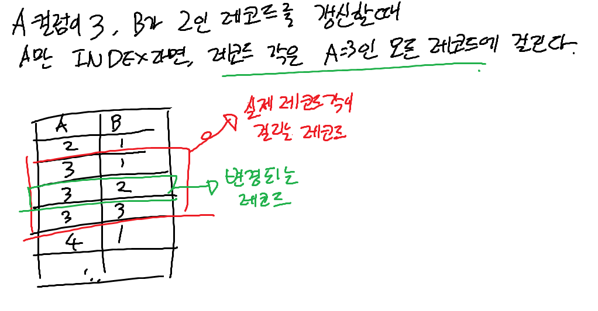

## Real MySql 8.0

### 트랜잭션
데이터의 정합성을 보장하기 위한 기능    
트랜잭션은 다음과 같은 특성을 가진다 (이를 줄여 ACID라고도 부른다)
- 원자성(Atomicity): 트랜잭션 내의 모든 작업이 성공하거나 실패한다
- 일관성(Consistency): 트랜잭션의 작업이 완료된 후에도 데이터베이스는 일관된 상태를 유지한다
- 독립성(Isolation): 여러 트랜잭션이 동시에 실행되더라도 각 트랜잭션은 서로 영향을 주지 않는다
- 지속성(Durability): 트랜잭션이 성공적으로 완료되면 그 결과는 영구적으로 반영된다


#### 주의사항
데이터베이스 서버의 커넥션 풀의 개수는 제한적이므로, 하나의 트랜잭션이 너무 길어져서 커넥션을 점거하게 된다면 성능이 저하될 수 있다  
따라서, 트랜잭션은 꼭 필요한 최소의 코드에만 적용하고, 하나의 트랜잭션으로 묶을 필요가 없는 DBMS의 작업이라면 별개의 트랜잭션으로 분리해도 괜찮다


### 락
락은 여러 트랜잭션이 동시에 데이터를 읽기 and/or 쓰기하는 것을 방지하기 위한 기능으로, 동시성을 제어하기 위한 기능이다  
스토리지 엔진 레벨의 잠금과 MySQL 엔진 레벨의 잠금으로 나눌 수 있으며, 
MySQL 엔진 레벨의 잠금은 해당 MySQL 서버 내에 존재하는 모든 스토리지 엔진에 영향을 미치지만,  
스토리지 엔진 레벨의 잠금은 다른 스토리지 엔진에 영향을 끼치지 않는다


#### 글로벌 락
MySQL에서 제공하는 잠금 중 제일 범위가 크고, 서버 전체에 영향을 미친다
즉 글로벌 락은 MySQL 서버의 모든 변경 작업을 멈춘다.
```mysql
FLUSH TABLES WITH READ LOCK;
```
- MyISAM, 혹은 MEMORY 테이블에 대하 `mysqldump`로 일관된 데이터 상태를 유지하며 백업을 해야 할 경우에 사용
- InnoDB 엔진은 트랜잭션을 지원하므로, 일관성을 위해 글로벌 락을 반드시 사용할 필요는 없다
  - 이를 위해 8.0 버전부터는 백업 락 `LOCK INSTACE FOR BACKUP`을 사용할 수 있다
  - 백업 락은 테이블의 스키마나 사용자의 인증 관련 정보 등만 변경 불가능해진다
  - 일반적인 테이블의 데이터 변경은 허용된다

#### 테이블 락
개별 테이블 단위로 설정되는 잠금이고, 명시적 혹은 묵시적으로 해당 테이블의 락을 획들할 수 있다
- 명시적이란? `LOCK TABLES table_name [READ | WRITE]` 명령으로 특정 테이블의 락을 획득하는 것
- 묵시적이란? MyISAM이나 MEMORY 테이블에서 데이터를 변경하는 쿼리를 실행하면 자동으로 발생하는 것
  - InnoDB 테이블은 레코드 기반 잠금을 제공하므로 단순 데이터 변경으로는 테이블 락을 걸지는 않는다
  - 스키마를 변경하는 쿼리에만 영향을 미친다

#### 네임드 락
테이블과 레코드와 관계 없는, 사용자가 요청하는 임의의 문자열에 대한 잠금
```mysql
# 락 획득
SELECT GET_LOCK('lock_name', 100);
# 락 확인
SELECT IS_FREE_LOCK('lock_name');
# 락 해제
SELECT RELEASE_LOCK('lock_name');
# 정상적으로 락 획윽 혹은 해제했다면 1을, 아니라면 NULL(에러) 혹은 0(실패)을 리턴한다
```
MySQL 5.7 미만에서는 한 번에 하나의 잠금만 획득 가능하고, 잠금 문자열의 길이는 무제한이였으나,  
5.7 이상부터는 여러 개의 잠금을 동시에 획득할 수 있고, 잠금 문자열의 길이는 60자로 제한된다

DB 서버가 분산되어 있거나, 여러 클라이언트가 상호 동기화를 처리해야 할 때 사용할 수 있다  


#### 메타데이터 락
데이터베이스 객체의 이름이나 구조를 변경할 때 획득하는 락  
- 명시적으로 획득하거나 해제할 수 없고, 객체 변경시 묵시적으로 획득


### InnoDB 스토리지 엔진의 락
InnoDB는 스토리지 엔진 내부에서 레코드 기반의 락 기능을 탑재하고 있다  
잠금 정보는 매우 작은 공간으로 관리되기 때문에, 레코드 락이 페이지 락이나 테이블 락으로 레벨업되지 않는다  

#### 레코드 락
테이블이나 전체가 아닌, 레코드 자체만을 잠그는 것  
엄밀하게는 레코드 자체를 잠그는 것이 아니라, 인덱스의 레코드를 잠근다  
- 인덱스가 없는 테이블이라면, 내부적으로 자동으로 생성된 클러스터 인덱스를 이용해 잠금을 설정

### 갭 락
다른 DBMS와는 다른 InnoDB의 락 특징 중 하나로, 레코드와 바로 인접한 레코드 사이의 간격만을 잠그는 것  
레코드 사이에 새로운 레코드가 생성되는 것을 제어

#### 넥스트 키 락
레코드 락과 갭 락을 합쳐 놓은 형태의 잠금  
바이너리 로그에 기록되는 쿼리가 레플리카 서버에서 실행될 때, 소스 서버에서 만들어진 결과와 동일한 결과를 만들어내도록 보장할 때 주로 사용된다고 한다  


#### 자동 증가 락
AUTO_INCREMENT 컬럼이 존재하는 테이블에서 동시에 여러 레코드가 INSERT될 때, 해당 레코드가 중복되어 동일한 값을 가지지 않도록 거는 락  
- 따라서 INSERT, REPLACE 등의 새로운 레코드를 저장하는 쿼리 발생 시에만 걸림
- UPDATE, DELETE 쿼리에는 영향을 미치지 않음
- 트랜잭션과는 관계 없이, AUTO_INCREMENT 값을 가져오는 순간에만 락이 걸렸다가 즉시 해제된다


### 인덱스와 레코드 락


InnoDB의 레코드 잠금은 실제로 "인덱스의 레코드 잠금"이라, 변경해야 할 레코드를 찾기 위해 검색한 "인덱스의 모든 레코드"에 락을 건다  
적당한 인덱스가 없다면, 모든 테이블의 레코드에 락을 걸고 풀스캔하면서 처리하게 되므로 성능이 떨어진다  


### MySQL의 격리 수준
격리 수준은 여러 트랜잭션이 동시에 처리될 떄, 특정 트랜잭션이 다른 트랜잭션에서 변경하거나 조회하는 데이터를 볼 수 있게 허용하는 것의 여부를 결정한다  
격리 수준과, 각 격리 수준에 따른 부정합의 발생 여부는 다음과 같다

|                  | DIRTY READ | NON-REPEATABLE READ | PHANTOM READ      |
|------------------|------------|---------------------|-------------------|
| READ UNCOMMITTED | O          | O                   | O                 |
| READ COMMITTED   | X          | O                   | O                 |
| REPEATABLE READ  | X          | X                   | O <br>InnoDB는 미발생 |
| SERIALIZABLE     | X          | X                   | X                 |

- DIRTY READ: 다른 트랜잭션이 변경하고 커밋하지 않은 데이터를 읽는 것
- NON-REPEATABLE READ: 한 트랜잭션 내에서 같은 조회 쿼리를 두 번 실행했을 때, 값이 달라지는 것
- PHANTOM READ: 한 트랜잭션 내에서 같은 쿼리를 두 번 실행했을 때, 결과가 다른 것 (없던 값이 생기거나, 있던 값이 없어지는 것)

#### READ UNCOMMITTED
트랜잭션의 변경 내용이 커밋, 롤백 여부에 상관 없이 다른 트랜잭션에게 공개되는 것  
따라서 DIRTY READ가 발생할 수 있다

#### READ COMMITTED
오라클 DBMS의 기본 격리 수준이며, 온라인 서비스에서 많이 선택되는 격리 수준  
트랜잭션의 커밋이 완료된 데이터만 다른 트랜잭션에서 조회될 수 있다  
(트랜잭션의 변경 도중이라면, 다른 트랜잭션에는 언두 로그에 저장된 변경 전 데이터를 조회 결과로 넘겨준다)  
한 트랜잭션의 도중에, 다른 트랜잭션에서 커밋을 완료하면, 커밋 완료 전후의 쿼리의 결과가 달라질 수 있어,  
NON-REPEATABLE READ가 발생한다  

#### REPEATABLE READ
InnoDB 스토리지 엔진의 기본 격리 수준으로, 바이너리 로그를 가진 MySQL 서버는 최소 REPEATABLE READ 격리 수준을 이상을 사용해야 한다  
InnoDB 엔진은 트랜잭션의 롤백에 대비해 변경 전 레코드를 언두 로그에 백업하기에, 이를 이용해 동일 트랜잭션 내에서는 동일한 결과를 보여주도록 보장한다  
- READ COMMITTED와의 차이는 언두 영영에 백업된 레코드의 몇 번째 이전 버전까지 찾아 들어가느냐는 점  

InnoDB 엔진의 경우, 갭 락이 있어 특정 예외를 제외하면 PHANTOM READ가 발생하지 않는다
- 트랜잭션 내에서 일정 범위의 레코드를 조회할 경우, 인덱스 범위 내에 빠진 인덱스가 있을 수 있다
- 조회한 레코드에 추가로, 빠진 사이에 갭 락을 걸어서 다른 트랜잭션이 해당 레코드에 쓰지 못하도록 막는다
- 조회 범위 내의 모든 가능한 인덱스에 락을 걸었으므로, PHANTOM READ가 발생할 수 없다

다만 `SELECT FOR UPDATE` 쿼리로 조회할 경우, 언두 로그에 백업한 레코드에는 잠금을 걸 수 없으므로 현재 레코드의 값을 가져오게 되어 `PHANTOM READ`가 발생할 수 있다

#### SERIALIZABLE
가장 엄격한 격리 수준으로, 쓰기/변경뿐 아니라 읽기 작업도 공유 락을 획득해야만 한다  
Phantom Read를 방지할 수 있지만, InnoDB에서는 특정 예외를 제외하면 PHANTOM READ가 발생하지 않으므로 사용할 이유는 적다