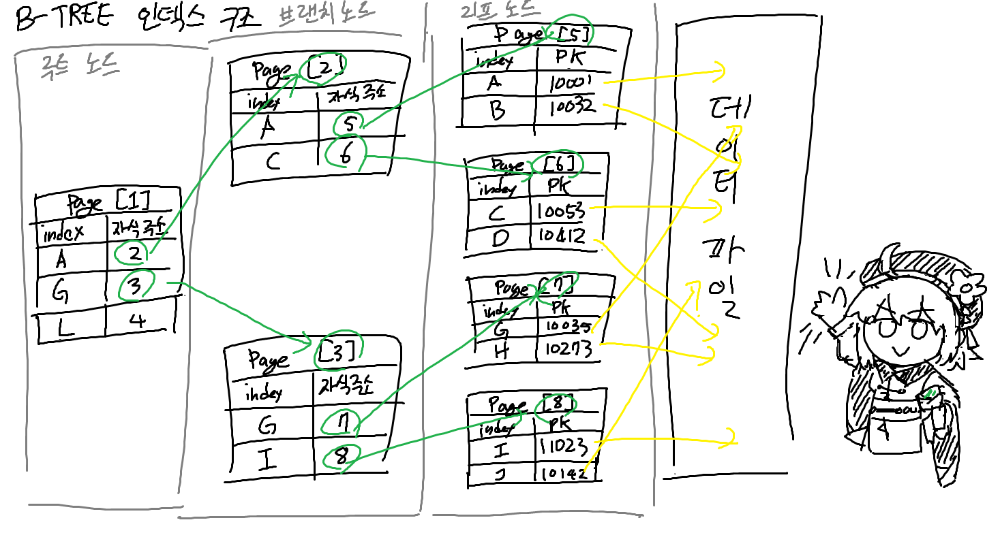

## Real MySQL 8.0
### 인덱스
데이터베이스의 검색, 조회 속도를 높이기 위해 사용하는 자료구조  
DBMS의 인덱스는 JAVA의 TreeSet과 유사하게, 데이터의 삽입/삭제 시마다 데이터를 정렬한다  
TreeSet의 경우 다른 리스트와 달리, 삽입/삭제 시 정렬을 매 회 실행하므로 삽입/삭제 시 시간복잡도가 O(1) -> O(log n)로 증가한다  
단, 데이터 조회 시에는 정렬되어 있으므로 시간 복잡도가 O(n) -> O(log n)으로 감소한다  
즉, 인덱스를 사용하면 삽입/수정/삭제 시의 성능이 떨어지지만, 그 대신 데이터의 조회 상능이 올라간다  
따라서 인덱스를 몇 개나, 어떻게 사용할지는, 데이터의 저장 속도의 희생과 읽기 속도의 성능 을 생각해서 결정해야 한다  


#### 인덱스의 구분
인덱스는 역할에 따른 분류와 알고리즘에 따른 분류로 나눠서 생각할 수 있다  
1. 역할에 따른 분류
   - PK : PK의 값으로 생성된 인덱스. Null값과 중복을 허용하지 않고, 해당 컬럼을 대표하는 값으로 볼 수 있다
   - Secondary Index : PK를 제외한 나머지 인덱스  
   중복을 허용하지 않는 경우를 Unique Index라고 하고, PK와 그 성질이 일부 비슷하다
2. 알고리즘에 따른 분류
   - B-Tree 알고리즘 : 가장 일반적으로 사용되는 인덱스 알고리즘  
   컬럼 원래의 값을 이용해 인덱싱하는 알고리즘
   - Hash 알고리즘 : 컬럼의 값을 해시 함수를 이용해 인덱싱하는 알고리즘
   값을 변형해서 인덱싱하기에 값의 일부만 검색하거나 범위를 검색할 때는 사용하기 어렵다
   주로 메모리 기만 데이터베이스에서 많이 사용된다고 한다

### B-TREE 인덱스

B-Tree는 데이터베이스 인덱싱 알고리즘으로 제일 많이 사용되는 알고리즘이다  
여러 변형이 있으나, 보통 B+-Tree, B*-Tree를 사용한다  
컬럼의 원래 값을 변형시키지 않고, 인덱스 구조체 내에서 항상 정렬된 상태를 유지한다


#### B-TREE 구조와 특성


아래와 같은 세 종류의 노드로 구성된다  
- 루트 노드 : 최상위에 존재하는 하나의 노드
- 리프 노드 : 제일 하위에 존재하는 노드
- 브랜치 노드 : 루트 노드와 리프 노드 사이에 존재하는 노드 (2계층 이상 존재할 수 있다)

루트 노드와 브랜치 노드는 하위 노드를 가리키는 주소 값을 가지고 있으며, 리프 노드는 항상 실제 데이터 레코드의 주솟값을 가지고 있다  
그림과 같이 각각의 노드 내의 키 값은 정렬되어 있다  
MyISAM의 경우 리프 노드가 실제 레코드의 주소를 가지고 있어, 리프 노드에서 바로 데이터 파일에 있는 레코드를 바로 찾아간다  
InnoDB의 경우 리프 노드가 실제 레코드의 주소를 가지고 있지 않고, PK의 값을 가지고 있어서,  
PK의 값을 사용해 PK 인덱스를 한번 더 검색한 뒤, PK 인덱스의 리프 노드에 저장되어 있는 레코드를 읽는다  

#### 인덱스 키 추가 및 삭제

인덱스를 추가할 경우, 저장될 키 값을 이용해 B-TREE 상에서 적절한 위치를 검색해서, 레코드의 키 값과 대상 레코드의 주소 정보를 리프 노드에 저장한다  
만약 리프 노드가 꽉 차있다면, 리프 노드를 분리해서 새로운 리프 노드를 만든다  

인덱스를 삭제할 경우, 해당 키 값이 저장된 리프 노드를 찾아서 삭제되었음을 표기한다  
삭제 마킹이 된 인덱스는 방치될 수도 있고, 다른 인덱스 키를 저장하기 위한 공간으로 재사용될 수도 있다  

인덱스를 변경할 경우, 인덱스의 삭제 작업을 선행한 후 추가 작업을 수행하는 형태로 처리된다  

#### 인덱스 키 검색
B-TREE 인덱스를 활용한 검색은 100% 일치 (=) 혹은 값의 앞부분 일치(LIKE 'ABC%'), 혹은 부등호 비교 조건(<, >)에서 사용할 수 있다  
값의 뒷부분의 검색에는 사용할 수 없다  
또한 인덱스의 값을 변경해서 검색하는 경우에도 사용할 수 없다 (변형된 값은 B-TREE에 존재하는 인덱스 값과는 다르기 때문에)  

InnoDB에서는 인덱스를 잠글 때 갭 락을 사용해서 잠근 값의 사이도 잠그게 되는데, 적절한 인덱스가 없으면 불필요하게 많은 값을 잠글 가능성이 생긴다  
따라서 InnoDB에서는 인덱스의 설계가 더욱 중요하다  

#### 인덱스 사용에 영향을 미치는 요소
- 인덱스의 키 값의 크기 : 인덱스의 키 값이 클수록, 인덱스의 리프 노드에 저장될 수 있는 키 값의 수가 줄어든다  
인덱스 노드 그룹은 페이지로 구성되고, 하나의 인덱스마다 인덱스 + 자식노드 주소 값을 저장하게 된다.  
따라서 하나의 인덱스 페이지가 가질 수 있는 키 값의 수는 페이지 크기 / (인덱스 키 값 크기 + 주소 값 크기) 가 된다  
인덱스의 키 값이 커질수록 하나의 인덱스 페이지가 가질 수 있는 키의 수가 줄어들게 되고, 전체적인 인덱스의 크기가 커지며 인덱스의 깊이가 깊어지게 된다
- B-TREE의 깊이 : 인덱스의 깊이가 깊어질수록 리프 노드로 도달하기까지 검색 횟수가 늘어나게 된다  
다만 B-TREE의 깊이를 직접적으로 제어할 수는 없고, 인덱스 키 값의 크기와 페이지 크기를 설정해서 간접적으로만 변경할 수 있다  
- 선택도(Selectivity) : 기수성(Cardinality)와 거의 같은 의미로 사용된다  
모든 인덱스 키 값 중에 유니크한 값의 수를 의미한다  
인덱스 키 값의 중복된 값이 많아질수록, 기수성이 낮아지고, 선택도가 떨어진다  
선택도가 높을수록 검색 대상이 줄어들어 조회 시 속도가 빨라진다  
- 읽어야 하는 레코드 건수 : 인덱스를 사용해 테이블의 레코드를 읽는 것은, 인덱스를 사용하지 않고 바로 테이블에서 레코드를 읽는 것보다 더 높은 비용이 든다  
보통 인덱스를 통해 레코드를 읽는 것은, 직접 읽는 것보다 4~5배의 시간이 걸리는 것으로 계산한다  
따라서, 인덱스를 사용해 읽어야 할 레코드의 수가 전체 레코드의 수의 2~ 2.5할 이상이라면,  
인덱스를 사용하는 것보다 테이블을 풀 스캔하는 것이 더 유리할 수 있다  
단, 이 경우에는 MySQL 옵티마이저에서 인덱스를 사용할지의 여부를 직접 판단해서 작업 계획을 세워준다고 한다  

#### B-TREE를 인덱스를 사용해 데이터 읽기

1. 인덱스 레인지 스캔
   - 검색해야 할 인덱스의 범위가 결정되었을 때 사용하는 방식
   - 범위의 시작 키를 들고 B-TREE 인덱스에서, 루트와 브랜치 노드를 이용해 스캔 시작 위치를 검색
   - 스캔 시작 위치를 찾으면, 범위의 끝 키를 만날 때까지 인덱스의 리프 노드를 순차적으로 읽어 나감 (= 인덱스 스캔)
   - 읽어들인 인덱스 키와 해당 키의 레코드 주소를 이용해서, 레코드가 저장된 페이지를 읽어온다.
   - 만약 쿼리가 필요로 하는 데이터가 인덱스에 모두 존재한다면, 인덱스 키만 읽어들이고 레코드 전체를 읽어오지 않는데, 이를 커버링 인덱스라고 한다
2. 인덱스 풀 스캔
   - 인덱스의 처음부터 끝까지 모두 읽는 방식
   - 인덱스의 리프 노드의 제일 앞, 혹은 제일 뒤로 이동하여, 인덱스를 끝까지 스캔한다
   - 인덱스를 통해 레코드를 검색하는 것보다 테이블 풀 스캔이 더 빠르므로, 인덱스 풀 스캔은 쿼리가 인덱스에 명시된 컬럼만 결과로 원할 때 주로 사용된다  
3. 루스 인덱스 스캔
   - 인덱스 레인지 스캔과 비슷하게 작동하지만, 중간에 필요하지 않은 인덱스 키 값은 무시하고 다음으로 넘어가는 형태로 처리된다  
   - 보통 GROUP BY, MAX, MIN 함수에 대해 최적화를 하는 경우 사용된다
   - 인덱스가 (A, B) 형식으로 구성되어 있고, A 컬럼에 대해 GROUP BY를 수행하고 B 컬럼에 대해 MAX를 수행한다면,  
     인덱스는 A, B 순으로 정렬되어 있으므로, A의 그룹별로 마지막 레코드의 B 값만 읽어도 충분하므로 해당 조건이 아닌 다른 레코드는 무시한다  
4. 인덱스 스킵 스탠
   - 두 개 이상의 컬럼으로 생성된 복합 인덱스에서, 선행 컬럼을 건너뛰고 두 번째 이상의 컬럼의 조건만으로도 인덱스 검색을 가능하게 해 주는 기능
   - (A, B) 복합 인덱스에서 B에 대한 조건만을 걸었을 때, 모든 가능한 A 값에 대해 B에 대한 조건을 읽어온다  
   - 조건이 없는 인덱스의 컬럼의 유니크한 값의 종류가 적어야 하고, 쿼리가 인덱스에 존재하는 컬럼만으로 처리 가능해야만 (커버링 인덱스) 사용 가능하다


#### 인덱스의 정렬 및 스캔 방향

인덱스는 생성할 때 설정한 정렬 규칙에 따라, 오름차순 혹은 내림차순으로 정렬된다  
8.0부터는, 복합 인덱스를 생성할 때, 컬럼별로 다른 정렬 순서를 설정할 수도 있다  


인덱스를 스캔할 때, 데이터를 오름차순으로 정렬한다면 정순으로, 내림차순으로 정렬한다면 역순으로 스캔한다  
LIMIT 등으로 일정 개수만을 필요로 할 때에도, 조건에 맞는 모든 인덱스를 스캔하는 것이 아니라, 필요로 하는 개수만 읽어서 반환한다  


인덱스의 스캔 방향은 정순이 역순보다 빠르다.
- 페이지 잠금이 인덱스 정순 스캔에 더 적합하고
- 인덱스 레코드가 단방향 링크드 리스트라서

따라서 인덱스를 생성할 때, 쿼리에서 자주 사용되는 정렬 순서대로 인덱스를 생성하면 도움이 된다  

#### B-TREE 인덱스의 가용성과 효율성
복합 인덱스에서는, 각 컬럼의 순서와 컬럼에 사용된 조건이 무엇인지에 따라 인덱스 컬럼의 활용 형태와 효율이 달라진다  
여러 조건 중 인덱스의 비교 범위를 줄이는데 사용되는 조건을 `작업 범위 결정 조건`이라고 하고,  
비교 범위를 줄이지 못하고 조회한 결과를 제한하는 데에 사용되는 조건은 `체크 조건`이라고 표현한다  

B-TREE에서 인덱스를 사용할 수 없는 조건문은 보통 다음과 같다
- NOT EQUAL이 사용된 경우 : `<>`, `NOT IN`, `NOT BETWEEN`, `IS NOT NULL`
- 뒷부분 일치 형태의 문자열 패턴 : `LIKE '%ABC'`
- 스토어드 함수나 다른 연산자로 인덱스 컬럼을 변형한 후 비교할 경우 : `WHERE SUBSTRING(column, 1, 3) = 'ABC'`
- NOT-DETERMINISTIC 함수를 사용한 경우 : `WHERE NOW() = column`
- 데이터 타입이 서로 다른 비교 : `WHERE '1' = 1`
- 문자열 데이터 타입의 콜레이션이 다른 경우

복합 인덱스를 사용할 수 없는 경우는 다음과 같다
- 인덱스의 첫 번째 컬럼에 대한 조건이 없는 경우
- 인덱스의 첫 번째 컬럼의 비교 조건이 인덱스를 사용할 수 없는 조건문인 경우

작업 범위 결정 조건으로 복합 인덱스를 사용할 수 있는 경우
- 첫번째 ~ i-1번째 컬럼까지 동등 비교 형태인 경우 : `=` 혹은 `IN`
- i번째 컬럼에 대해 다음 연산자 중 하나로 비교 : `=`, `IN`, `BETWEEN`, `>`, `<`, `LIKE 'ABC%'`

위와 두 조건을 만족하는 쿼리일 경우 1 ~ i번째 컬럼은 작업 범위 결정 조건으로 사용되고, i+1 ~ n번째까지의 조건은 체크 조건으로 사용된다  


## 좌표 압축 알고리즘
수의 범위가 매우 큰 상태에서, 값과 상관 없이 숫자 간의 대소관계만 알면 될 때 사용하는 알고리즘

1. 주어진 수의 집합을 배열에 저장하여 오름차순 정렬
2. 배역에서 중복된 요소를 제거
3. 해당 위치의 인덱스 값이 좌표 압축된 값
   - 주어진 수의 인덱스 값을 탐색할 때 효율을 위해 이분 탐색을 사용


```java
import java.util.*;
import java.io.*;
public class main {

	public static int n;
	
	public static int[] xs;
	
	public static List<Integer> numbers;

	public static void main(String[] args) throws Exception {
		BufferedReader br = new BufferedReader(new InputStreamReader(System.in));
		StringTokenizer st = new StringTokenizer(br.readLine());
		
		StringBuilder sb = new StringBuilder();
		
		n = Integer.parseInt(st.nextToken());
		
		xs = new int[n];
		
		// HashSet에 데이터를 저장해서 중복을 제거한다
		HashSet<Integer> numbersHash = new HashSet<>();
		
		st = new StringTokenizer(br.readLine());
		for(int i = 0; i < n; i++) {
			int number = Integer.parseInt(st.nextToken());
			xs[i] = number;
			numbersHash.add(number);
		}
		
		numbers = new ArrayList<>(numbersHash);
		// 중복을 제거한 데이터를 정렬한다
		Collections.sort(numbers);
		// 주어진 수의 좌표 압축 값을 검색하기 쉽도록 HashMap에 저장한다
		Map<Integer, Integer> compress = new HashMap<>();
		
		for(int i = 0; i < numbers.size(); i++) {
			compress.put(numbers.get(i), i);
		}
		// 좌표 압축된 값을 출력한다
		for(int i = 0; i < n; i++) {
			sb.append(compress.get(xs[i])).append(" ");
		}
		
		System.out.println(sb);
	}
}
```


