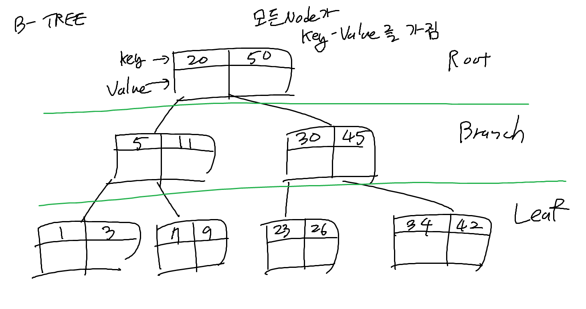

### MySQL Isolation Level
READ-UNCOMMITED


READ-COMMITED


REPEATABLE-READ


SERIALIZABLE


- READ-COMMITED도 언두 로그를 통해 이전 데이터를 보여준다.  
단, 제일 마지막에 COMMIT된 트랜잭션의 데이터의 이전 언두 로그까지 보지는 않는다  
= 커밋 완료된 트랜잭션은 다른 트랜잭션의 조회 결과에 영향을 끼친다

- REPEATABLE-READ도 언두 로그를 통해 이전 데이터를 보여준다.  
REPEATABE-READ는 현재 트랜잭션을 시작한 시점부터 현재까지의 모든 언두 로그를 확인한다  
= 다른 트랜잭션의 커밋과는 관계없이, 현재 트랜잭션의 시작 시점의 데이터를 보여준다

### B TREE 종류

#### B-TREE
균형 트리로, 자식 노드를 2개 초과로 가질 수 있는 트리 구조이다


- 전체 데이터를 탐색하기 위해서는 전체 트리를 탐색해야 할 필요가 있다
#### B+-TREE
- B-TREE의 변형으로, 리프 노드에만 data (레코드X, value, InnoDB에서는 PK)를 담는다
- 루트 노드와 브랜치 노드는 key만을 담는다


리프 노드에만 data를 저장하므로 메모리 확보에 용이하여, 하나의 노드에 더 많은 인덱스 키를 저장할 수 있어 트리의 depth를 낮추기에 용이하다  


#### B*-TREE
- 루트가 아닌 노드가 노드 전체에서 2/3이 채워지도록 보장하는 트리
- 데이터 삽입에 의해 노드가 꽉 찼을 경우, 노드를 분할하기 전에, 키와 포인터 값을 재분배해서 오른쪽 형제 노드와 재분배한다
  - 오른쪽 형제 노드가 꽉 차있지 않다면, 현재 노드와 오른쪽 노드의 키를 균등하게 재분배한다
  - 오른쪽 형제 노드도 꽉 찼을 경우, 현재 노드와 오른쪽 노드를 합쳐서, 3개의 노드로 분할한다
  - 이 때, 중간 키는 부모 노드로 올라가고, 가장 작은 키는 현재 노드에 남아 있는다
    - 해당 작업으로 인해 부모 노드가 꽉 차게 된다면, 부모 노드도 위 과정을 반복한다


### 런타임 데이터 영역


| 영역                   | 용도                                                                          |
|----------------------|-----------------------------------------------------------------------------|
| Method Area          | JVM에서 읽어들인 클래스와 인터페이스에 대한 런타임 상수 풀, 메서드, 필드, Static 변수, Static 메서드의 바이트 코드  |
| Runtime Contant Pool | 클래스와 인터페이스 상수, 메서드와 필드에 대한 레퍼런스 저장                                          |
| Heap                 | new 키워드로 생성된 객체, 인스턴스 배열이 저장되는 공간                                           |
| Stack                | 메서드 호출 시 생성되는 스레드 수행 정보를 기록하는 frame 저장. 메서드 정보, 지역변수, 매개변수, 연산 중 발생하는 임시 데이터 저장 |
| PC Register          | 스레드마다 생성되는 영역으로, 스레드가 실행 중인 JVM 명령의 주소를 저장                                  |
| Native Method Stack  | 자바 외부에서 실행되는 네이티브 코드를 위한 메모리 영역                                             |

- 즉 static 변수와 메소드는, JVM이 실행되면서 메모리에 있는 Method Area에 로딩되면서 초기화된다  
- 프로그램이 종료될 때 해제된다

### 불변 객체
객체 생성 이후 내부의 상태가 변하지 않는 객체
- read-only 메소드만을 제공
- 객체의 내부 변수를 제공하는 메서드가 없거나, 제공하더라도 방어적 복사를 통해 제공

#### 불변 객체를 사용해야 하는 이유
1. thread-safe해서 병렬 프로그래밍 시에 동기화를 고려하지 않아도 됨
2. 실패 원자적인 메소드를 생성 가능
   - 어떠한 예외가 발생하더라도, 메소드 호출 전의 상태를 유지함
3. cache, map, set 등의 요소로 활용하기 적합
   - 가변 객체라면 객체 값의 변경 후 이를 갱신해야 하나, 불변이므로 고려하지 않아도 됨
4. 객체의 상태가 변하지 않으므로 부수효과를 피할 수 있음
5. 가비지 컬렉션의 성능을 높일 수 있음
   - 불변 객체는 생성된 이후에야 참조 가능하므로, 불변 객체를 참조하는 객체는 해당 불변 객체들보다 더 나중에 생성된다
   - 상위 불변 객체가 살아 있다면 하위 불변 객체들이 모두 참조되고 있음을 의미하므로, GC가 하위 불변 객체의 스킨을 스킵할 수 있다고 한다 
6. 다른 사람이 작성한 메서드를 쉽게 예측 가능하며 안전하게 사용할 수 있음

#### 불변 클래스의 규칙
1. 클래스 선언 시 final로 선언한다
2. 모든 객체 변수는 private final로 선언한다
3. 객체를 생성하기 위한 생성자, 혹은 정적 팩토리 메소드를 추가한다
4. 참조에 의한 변경 가능성이 있다면 방어적 복사를 이용해서 전달한다

#### 불변 객체의 단점
- 불변객체은 메소드로 값을 리턴할 시, 방어적 복사를 통해 새로운 객체를 생성해야 해서 성능상 이슈가 있을 수 있다  
- 객체의 상태가 변경될 때마다, 상태를 변경할 수 없으므로 변경된 상태 값을 가진 새로운 객체를 생성해야 한다  


### Constant Pool?
자세히 찾아 보니, String과 관련된 것은 String Constant Pool이고, Constant Pool은 총 3가지가 있다고 한다  

#### String Constant Pool
문자열 리터럴을 저장하는 독립된 영역으로, Heap Area에 위치한다  
- 리터럴로 선언된 문자열이 저장된다 : `String str = "hello";`
- new 키워드를 사용해 동적으로 생성한 문자열은 Heap Area에 저장된다 : `String str = new String("hello");`
- 한번 선언해서 생성된 문자열은, 동일한 문자열을 다시 선언할 경우 새로운 객체를 생성하지 않고, 기존의 객체를 참조한다


##### intern method?
intern 메소드는 String Constant pool에 해당 문자열이 있는지 확인하고,  
존재한다면 String contant 풀에 있는 객체의 레퍼런스를 리턴,  
없다면 String Constant Pool에 새로운 객체를 생성하고, 그 레퍼런스를 리턴한다


즉? 선언한 문자열을 intern 메소드를 사용해 String Constant Pool에 없다면 저장하고, 이미 동일한 객체가 존재한다면 해당 객체의 레퍼런스를 리턴하는 과정 자체를 interning이라고 한다


#### Class file Constant Pool
컴파일시 클래스 파일 내부에 존재하는 영역, JVM에서 클래스 파일을 로드할 때 메모리에 로드된다  
클래스의 구성요소인 상수, 문자열, 클래스, 인터페이스 참조 데이터를 저장  


#### Method Area의 Runtime Constant Pool
클래스와 관련된 메타데이터와 클래스 구조, 필드 메서드 등의 데이터를 저장
Class file Constant Pool에 있는 클래스의 구성요소 또한 런타임 시 저장


### Equals와 HashCode

#### Oracle API 문서에서의 equals와 hashCode 정의

equals()
```text
- 재귀적이여야 한다 : x.equals(x)는 true여야 한다
- 대칭적이여야 한다 : x.equals(y)가 true라면, y.equals(x)도 true여야 한다
- 타동적이여야 한다 : x.equals(y)가 true이고, y.equals(z)가 true라면, x.equals(z)도 true여야 한다
- 일관적이여야 한다 : x.equals(y)를 여러 번 호출해도 항상 같은 값을 리턴해야 한다
- null이 아님 : x.equals(null)은 항상 false여야 한다
```

<br>
hashCode()

```text
- JAVA 애플리케이션이 실행 중에, 어떠한 객체에 대해서 이 메소드가 호출될 때마다, 객체에 대해서 비교에 필요한 정보가 수정되지 않는 한, 동일한 integer를 리턴해야 한다
- equals 메소드를 사용해 비교했을 때 true인 두 객체가 있다면, 두 객체의 hashCode 메소드의 리턴 값은 같아야 한다
- equals 메소드를 사용해 비교했을 때 false인 두 객체가 있다면, 두 객체의 hashCode 메소드의 리턴 값은 반드시 다를 필요는 없다  
그러나, 다른 객체에 대해서 같은 hashcode 값이 반환된다면, hash table에서의 퍼포먼스에 불리해질 수 있다
```

#### HashCode method
- override하지 않으면, 기본적으로 객체의 메모리 주소를 16진수로 리턴

#### Equals method
- 객체의 동등성을 비교하는 메소드

#### HashCode와 Equals를 동시에 override하는 이유


Collection Framework에서 객체의 동등성을 확인할 때, equals() 메소드 사용 전에 HashCode 값을 비교하기 때문  
(Hash 값을 활용하여 동등한 객체의 중복을 허용하지 않는 자료구조에서 주로 큰 영향을 받음)  
equals() 메소드를 overriding 하여, 두 객체의 동등성을 판단하는 기준을 마련했더라도,  
HashCode()를 오버라이드하지 않아 동등하도록 의도한 두 객체가 다른 HashCode를 가지게 된다면,  
Collection Framework에서 동등한 객체로 인식하지 못해 의도하지 않은 결과가 발생할 수 있다


즉, hashcode 메소드를 오버라이딩 하지 않았어도 equals 메소드의 기능 자체에는 문제가 없으나,  
hashcode 값을 활용하여 객체의 동등성을 판단하는 자료구조에서는 문제가 발생할 수 있기 때문에,  
두 메소드를 동시에 오버라이딩 하도록 권장하는 것이다


#### 다른 두 객체가 같은 hashcode를 가질 때의 불리한 점?
hash table을 생성할 때, 해시코드가 충돌할 경우`Open Addressing`이나 `Separate Chaining`을 사용해서 예외를 처리  
JAVA 에서는 기본적으로 `Separate Chaining`을 사용


장/단점 등은 [해시값이 충돌할 경우? 참고](20240921.md)