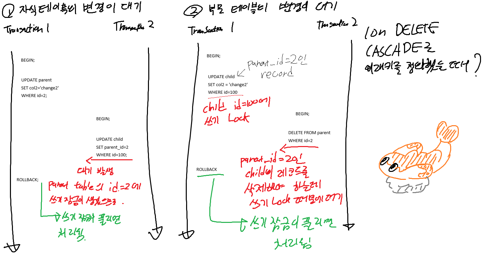

## Real MySQL 8.0
### 인덱스
#### 함수 기반 인덱스
일반적으로 인덱스는 컬럼의 값 앞부분의 일부나 전체에 대해서만 인덱스 생성이 가능  
8.0 버전부터는 함수 기반 인덱스를 지원해서, 컬럼의 값에 함수를 적용한 결과에 대해서도 인덱스를 생성할 수 있게 됨  

```sql
CREATE TABLE tb_test (
    id INT PRIMARY KEY,
    name VARCHAR(100),
    age INT,
    INDEX idx_name_age ((CONCAT(name, age)))
);
```

- 테이블의 구조를 변경하지 않고 (=별도의 컬럼을 추가하지 않고) 계산된 결과값에 대한 인덱스를 추가할 수 있다  
- 함수 기반 인덱스를 사용할 때, 인덱스에 정의한 표현식과 조건절에 사용하는 표현식을 동일하게 사용해야 한다  

#### 유니크 인덱스
일반 세컨더리 인덱스와 구조상 다른 점은 없으나, 모든 인덱스의 키 값이 고유해야 한다는 제약 조건이 있다  
- 쓰기 작업 발생 시, 유니크 인덱스는 새로 쓰는 키 값이 고유한지 체크하는 과정이 더 필요하다  
MySQL에서는 유니크 인덱스의 중복값을 체크할 때는 읽기 락, 쓸때는 쓰기 락을 사용하기에, 데드락이 발생할 확률이 높다고 한다  
중복체크 과정이 필요하기에 버퍼링할 수 없어서 변경 작업이 더 느려지게 된다
- 따라서 유니크 인덱스를 생성할 때에는, 반드시 유니크 인덱스로 선언해야만 하는지 생각해 보아야 한다  

#### 외래키
두 테이블의 관계를 정의하는 외래키를 선언했다면, 한 테이블을 변경하는 동안, 다른 테이블의 변경 작업에 잠금 대기가 발생할 수 있다  





### 옵티마이저
옵티마이저는 쿼리를 실행할 때, 쿼리문을 분석한 후 가장 효율적인 실행 계획을 수립하는 역할을 한다

- 불필요한 조건 제거, 복잡한 연산의 단순화
- 테이블의 조인 순서를 결정
- 각 테이블에서 사용된 조건과 인덱스 통계 정보를 활용해, 검색에 사용할 인덱스 결정
- 가져온 레코드를 임시 테이블에 넣어서 다시 가공해야 할지 결정

#### 옵티마이저의 종류
- 규칙 기반 최적화 : 옵티마이저에 내장된 우선 순위에 따라 실행 계획을 수립하는 방식  
같은 쿼리에 대해서는 항상 같은 실행 방법을 만들어 내나, 통계정보를 사용하지 않으므로 비효율적인 실행 계획이 만들어질 확률이 높다

- 비용 기반 최적화 : 쿼리를 처리하기 위한 여러 가지 가능한 방법을 만들고, 각 방법에 대한 비용 정보와 대상 테이블의 예측된 통계 정보를 이용해서 실행 계획별 최종 비용을 산출한다  
이를 가지고 비용이 최소로 소요될 것으로 생각되는 처리 방식을 선택한다 


MySQL은 비용 기반 최적화 방법을 사용하고 있으며, 대부분의 RDBMS가 사용하는 방법이라고 한다  

#### 기본 데이터 처리

##### 풀 테이블 스탠
인덱스를 사용하지 않고 테이블의 데이터를 처음부터 끝까지 읽어오는 방식
- 테이블의 레코드 개수가 작아 인덱스를 사용하는 것보다 풀 스캔이 더 빠른 경우
- WHERE이나 ON 절에 인덱스를 사용할 수 있는 조건이 없는 경우
- 인덱스 레인지 스캔을 사용할 수 있어도, 예상되는 조건 일치 레코드의 개수가 많은 경우 (테이블의 레코드의 2~3할 이상인 경우)


단, 전체 테이블의 데이터를 요청하더라도, `COUNT(*)` 같은 집계 함수를 사용했다면, 레코드의 건수만 알면 되기 때문에 풀 인덱스 스캔을 해서 개수만을 가져오는 경우도 있다  


InnoDB에서는 `리드 어헤드`라는 개념이 있어, 풀 테이블 스캔을 할 때, 필요할 것으로 예상되는 데이터를 예척해서 요청이 오기 전에 미리 읽어서 버퍼 풀에 가져다 두는 것을 의미  

##### ORDER BY 처리 (filesort)
정렬을 처리하는 방법으로, 인덱스를 사용하는 방벅과 별개로 쿼리가 실행될 때 `Filesort`라 불리는, 별도의 처리를 이용하는 방법이 있다

Filesort는 정렬해야 할 레코드가 많지 않을 경우에는 충분히 빠르며, 인덱스를 사용하지 않으므로 인덱스의 단점을 가지고 있지 않으나,  
정렬해야 할 레코드가 많아질 경우에는 정렬에 시간이 소요되므로 쿼리의 응답 속도가 느려지게 된다  

###### 소트 버퍼
MySQL이 정렬을 수행하기 위해 할당받는 메모리 영역을 의미한다  
정렬할 데이터가 작아서 소트 버퍼의 공간보다 작다면 바로 정렬을 수행하나,  
소트 버퍼의 공간보다 크다면, 정렬할 데이터를 여러 조각으로 나누어서 처리하고, 이 과정에서 정렬 결과를 임시 저장하기 위해 디스크를 사용하게 된다  
(소트 버퍼의 크기만큼 정렬하고 디스크에 임시로 쓰면서 병합하는 과정을 거치는데, 이를 멀티 머지라고 한다)  

###### 정렬 알고리즘
레코드를 정렬할 때 "레코드 전체를 소트 버퍼에 담기", "정렬 기준 컬럼만 소트 버퍼에 담기" 두 가지의 정렬 모드가 존재한다
MySQL에서는 첫번째 방식 한가지, 두번째 방식 두 가지 총 3가지의 정렬 방식이 있다  
옵티마이저에서 트레이스 기능으로 확인할 수 있으며, sort_mode에 적힌 명칭에 따른 방법은 다음과 같다  
- `<sort_key, rowid>` : 정렬에 사용되는 키와 row ID만 가져와서 정렬
- `<sort_key, additional_fields>` : 정렬 키와 레코드 전체를 가져와서 정렬, 레코드의 컬럼들은 고정 사이즈로 메모리에 저장
- `<sort_key, packed_additional_fields>` : 정렬 키와 레코드 전체를 가져와서 정렬, 레코드 컬럼들은 가변 사이즈 메모리로 저장

정렬 컬럼만 소트 버퍼에 담을 경우, 테이블을 두 번 읽어야 하는 단점이 있다.  
단 레코드 전체를 소트 버퍼에 담을 경우, 전자에 비해 더 많은 소트 버퍼 공간이 필요하다. 


MySQL에서는 보통 후자의 정렬 방식을 사용하지만, 다음과 같은 경우에는 전자의 방식을 사용하게 된다
- 레코드의 크기가 시스템 변수 `max_length_for_sort_data`보다 큰 경우
- BLOB, TEXT 타입의 컬럼이 SELECT 대상에 있을 때


###### 정렬 처리 방법
쿼리에 Order BY를 사용하고 EXPLAIN으로 실행 계획을 확인했을 때, Extra 컬럼에 표기 내역에 따라 어떤 정렬 방법이 사용되었는지 확인할 수 있다  
다음 3가지 방식 중 하나를 사용하게 되며, 아래로 갈수록 처리 속도가 떨어진다
- 인덱스를 사용한 정렬 : 별도 표기 없음
- 조인에서 드라이빙 테이블만 정렬 : `Using filesort`
- 조인 결과를 임시 테이블로 저장하여 정렬 : `Using temporary; Using filesort`

1. 인덱스를 사용한 정렬
- ORDER BY에 명시된 컬럼이 제일 먼저 읽는 테이블 (드라이빙 테이블)에 속하고, ORDER BY 순서대로 생성된 인덱스가 있어야 함.  
- B-TREE 인덱스여야 함
- WHERE절에서 첫 번째로 읽는 테이블의 컬럼에 조건이 있다면, 그 조건과 ORDER BY의 컬럼은 같은 인덱스를 사용할 수 있어야 함  
<br>
- 인덱스를 사용해 정렬을 처리할 경우, 이미 인덱스 값이 정렬되어 있기 때문에, 조건에 맞는 레코드를 인덱스 순서대로 읽기만 하면 됨

2. 조인의 드라이빙 테이블만 정렬
- 조인을 실행하기 전에 첫 번째 테이블의 레코드를 정렬한 후, JOIN을 실행하는 방법
- 조인에서 첫 번째로 읽히는 테이블의 컬럼만으로 ORDER BY를 걸어야 함


3. 임시 테이블을 이용한 정렬
- 1, 2번의 조건을 만족하지 않을 경우 사용하는 방법
- JOIN의 결과를 임시 테이블에 저장한 후, 이 결과를 정렬한다
- 1, 2에 비해 정렬해야 할 컬럼의 수가 많으므로 제일 느리다

##### GROUP BY 처리
GROUP BY도 정렬과 동일하게, 인덱스를 사용할 수 있는 경우와 없는 경우로 나눠서 생각할 수 있다 

###### 인덱스를 사용한 GROUP BY - 타이트 인덱스 스캔
JOIN의 드라이빙 테이블에 속한 컬럼만 이용해 그루핑할 때, GROUP BY에 사용된 컬럼이 이미 인덱스가 있다면,  
인덱스를 차례대로 읽으면서 그루핑 작업을 수행하고, 그 결과로 join을 처리한다
- GROUP 함수 등의 그룹값을 처리해야 한다면 임시 테이블이 필요할 수도 있다  

###### 루스 인덱스 스캔을 사용하는 GROUP BY
인덱스의 레코드를 던너뛰며 필요한 부분만 읽어서 가져오는 루스 인덱스 스캔을 group by에서도 사용한다  
루스 인덱스 스캔이 사용되면, 실행 계획의 Extra 컬럼에 `Using index for group-by`라고 표기된다
- GROUP-BY의 컬럼도 인덱스를 사용 가능해야 한다 


###### 임시 테이블을 사용하는 GROUP BY
GROUP BY의 컬럼이 인덱스를 전혀 사용하지 못할 때는 임시 테이블을 사용한다  

##### DISTINCT 처리
DISTINCT는 중복된 값을 처리하여 특정 컬럼의 유니크한 값만 조회하는 경우에 사용된다  
DISTINCT도 인덱스를 사용하지 못하면 임시 테이블을 필요로 하지만, 실행 계획에서는`Using temporary`가 표기되지 않는다  

- SELECT DISTINCT~ : 단순 SELECT DISTINCT라면 GROUP BY와 동일하게 처리된다  
MySQL 8.0 버전부터는 GROUP BY에 ORDER BY 절이 없다면 정렬을 수행하지 않기 때문에, GROUP BY와 SELECT DISTINCT는 내부적으로 동일한 작업을 수행하게 된다  
하나의 컬럼에만 적용할 수 없고, SELECT 절의 모든 컬럼에 적용된다 
- 집합 함수와 사용된 DISTINCT : 집합 함수 내부에 DISTINCT가 사용된 경우, 해당 집합 함수의 인자로 전달된 컬럼값중에서만 유니크한 것을 가져온다


