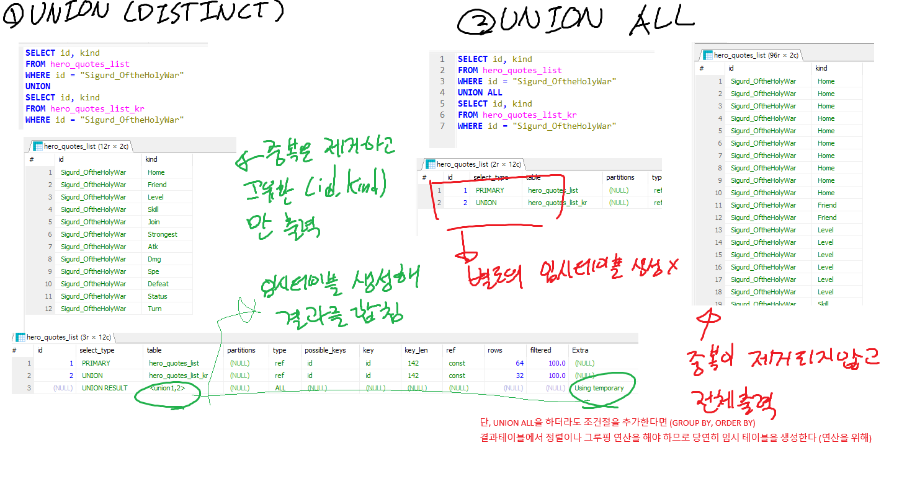
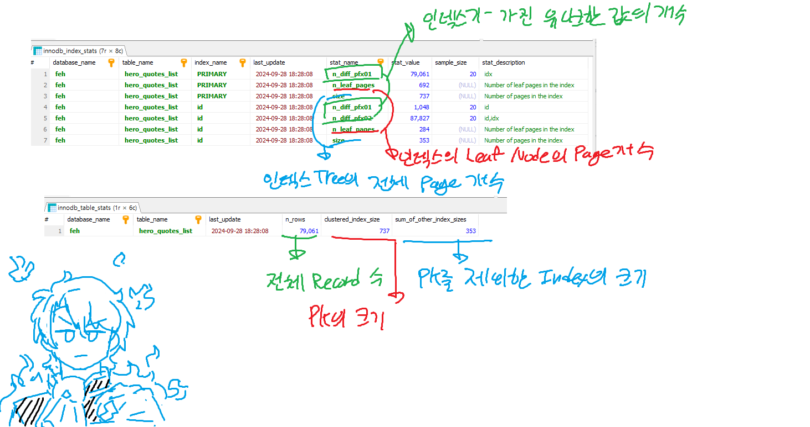
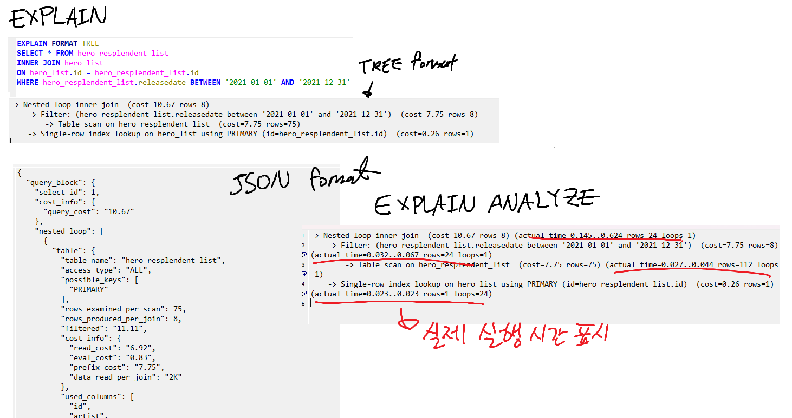

## Real MySQL 8.0

### 내부 임시 테이블
인덱스만을 활용해서 결과를 반환할 수 없을 경우, MySQL엔진에서 스토리지 엔진으로부터 레코드를 받아 내부적으로 임시 테이블을 생성하여 결과 도출에 사용한다  
임시 테이블은 보통 메모리에 생성되다가, 테이블의 크기가 커지면 디스크에 저장된다  
내부 테이블은 다른 세션이나 다른 쿼리에서는 접근할 수 없고, 쿼리의 처리가 완료되면 자동으로 삭제된다  

#### 임시 테이블을 필요로 하는 쿼리
다음과 같은 쿼리의 경우, MySQL에서 레코드를 가공해야 하므로 내부 임시 테이블을 생성하게 된다.  
이 밖에도, 인덱스를 사용하지 못할 경우에는 임시 테이블을 생성하게 된다.  
- ORDER BY와 GROUP BY에 명시된 컬럼이 다름
- ORDER BY나 GROUP BY에 명시된 컬럼이 조인 순서에서의 첫 번째 테이블의 컬럼이 아님
- DISTINCT와 ORDER BY가 동시에 존재하거나, DISTINCT가 인덱스로 처리되지 못함
- UNION이나 UNION DISTINCT가 사용됨
- 실행 계획에서 select_type이 derived인 경우


쿼리에서 임시 테이블이 사용된다면, 실행 계획의 Extra 컬럼에 Using temporary가 표시된다.  
단, 위 예시의 3 ~ 5번째 경우에는 Using Temporary가 표기되지 않지만 임시 테이블이 사용된다  

##### UNION, UNION DISTINCT, UNION ALL
- UNION : 합친 뒤 중복된 레코드는 제거한다
- UNION DISTINCT : UNION과 동일
- UNION ALL : 레코드에 변형을 가하지 않고 합친다  
MySQL 8.0버전 이전에는 내부 임시 테이블을 사용하도록 되어 있었으나, 8.0부터는 내부 임시 테이블을 사용하지 않도록 개선되었다  




### 실행 계획

#### 통계 정보
MySQL 서버는 테이블에 대한 통계 정보를 생성하여, 쿼리 실행 계획을 수립할 때 사용한다  
MySQL 5.6 이전 버전까지는 통계 정보를 메모리에만 저장했지만 5.6부터는 통계 정보를 테이블에 영구적으로 저장할 수 있도록 개선되었다  
통계 정보 데이터는 `mysql` 데이터베이스의 `innodb_table_stats`와 `innodb_index_stats` 테이블에 저장된다  
통계 정보는 테이블 생성 이후에도 일정 간격동안 재수집되고, `ANALYZE TABLE` 명령어로 수동으로도 수집할 수도 있다  


각 통계 정보 에티블의 컬럼에 대한 값의 의미는 다음과 같다 
- `innodb_index_stats` 테이블
    - `table_name` : 테이블명
    - `index_name` : 인덱스명
    - `stat_name` : 통계 정보의 종류
      - `n_diff_pfx~` : 인덱스가 가진 유니크한 값의 개수
      - `n_leaf_pages` : 리프노드 페이지 개수
      - `size` : 인덱스 크기의 전체 페이지 개수
    - `stat_value` : 통계 정보의 값
- `innodb_table_stats` 테이블
    - `table_name` : 테이블명
    - `n_rows` : 테이블의 레코드 개수
    - `clustered_index_size` : 클러스터 인덱스의 크기
    - `sum_of_other_index_sizes` : 클러스터 인덱스를 제외한 다른 인덱스의 크기




#### 히스토그램
실제 레코드의 일부 페이지를 랜덤으로 가져와 참조하여, 컬럼의 값의 분포를 참조할 수 있도록 히스토그램 정보를 생성한다  
히스토그램 정보는 자동으로 수집되지 않고, `ANALYZE TABLE tb UPDATE HISTOGRAM` 명령어로 수동으로 수집해야 한다  
수집된 정보는 시스템 딕셔너리에 함께 저장되고, `information_schema` 데이터베이스의 `column_statistics` 테이블에 로드된다  


생성된 히스토그램은 레코드의 예상되는 일치 건수 등을 확인할 때 쓰이며, 특정 범위의 데이터가 많고 적음을 좀 더 정확하게 예측할 수 있게 되이 조인의 순서 등을 결정할 때 사용되어 쿼리의 성능에 영향을 미치게 된다  

#### 코스트 모델
쿼리를 처리하는 과정에서 발행하는 작업들에 대한 예측된 비용을 코스트 모델이라고 한다  
기존에는 코스트 모델에 설정된 비용이 서버 코드 내에 상수화되어 있었으나, 8.0 버전부터는 코스트 모델의 값이 mysql의 테이블로 저장되며, 단위작업의 비용을 변경할 수 있게 되었다  

|             | 이름                           | 기본값  | 설명                |
|-------------|------------------------------|------|-------------------|
| engine_cost | id_block_read_cost           | 1.00 | 디스크 데이터 페이지 읽기    |
| engine_cost | memory_block_read_cost       | 0.25 | 메모리 데이터 페이지 읽기    |
| server_cost | disk_temptable_create_cost   | 20   | 디스크 임시 테이블 생성     |
| server_cost | disk_temptable_row_cost      | 0.5  | 디스크 임시 테이블 레코드 읽기 |
| server_cost | key_compare_cost             | 0.05 | 인덱스 키 비교          |
| server_cost | memory_temptable_create_cost | 1    | 메모리 임시 테이블 생성     |
| server_cost | memory_temptable_row_cost    | 0.1  | 메모리 임시 테이블 레코드 읽기 |
| server_cost | row_evaluate_cost            | 0.1  | 레코드 비교            |


#### 실행 계획 확인

쿼리의 제일 앞에 `EXPLAIN`을 붙여 실행하면 실행 계획을 확인할 수 있다  
또한 8.0 버전부터는 `FORMAT` 옵션을 사용해 실행 계획의 표시 방법으로 JSON, TREE 테이블 형태 중 선택할 수 있고,  
`ANALYZE` 옵션을 사용해 실행 계획의 단계별로 소요된 시간 정보를 확인할 수 있다



TREE FORMAT에서 들여쓰기가 제일 깊을수록 먼저 실행되며, 같은 들여쓰기라면 상단이 먼저 실행된다

```text
즉 아래 실행 계획은 다음과 같은 순서로 실행된다
4)-> Nested loop inner join  (cost=10.67 rows=8) (actual time=0.046..0.129 rows=24 loops=1)
2)    -> Filter: (hero_resplendent_list.releasedate between '2021-01-01' and '2021-12-31')  (cost=7.75 rows=8) (actual time=0.030..0.062 rows=24 loops=1)
1)        -> Table scan on hero_resplendent_list  (cost=7.75 rows=75) (actual time=0.025..0.040 rows=112 loops=1)
3)    -> Single-row index lookup on hero_list using PRIMARY (id=hero_resplendent_list.id)  (cost=0.26 rows=1) (actual time=0.003..0.003 rows=1 loops=24)


1) hero_resplendent_list 테이블을 풀 스캔한다
2) releasedate 컬럼의 값이 2021년 1월 1일부터 2021년 12월 31일 사이인 레코드만 필터링한다
3) hero_list 테이블에서 hero_resplendent_list 테이블의 id 컬럼을 참조해 레코드를 찾는다 (inner join이니까 존재하는 컬럼의 row당 하나씩, 그래서 loops=24임)
4) 3)에서 찾은 레코드를 2)에서 필터링한 레코드와 조인한다
```

`ANALYZE` 옵션에서 추가로 출력되는 값은 다음을 의미한다
- actual time : 레코드를 검색하는데 걸린 시간  
첫번째 숫자 값은 첫 번째 레코드를 가져오는데 걸린 평균 시간, 두 번째 숫자는 마지막 레코드를 가져오는데 걸린 평균 시간
- rows : 테이블에서 읽은 평균 레코드 건수
- loops : 해당 작업이 반복된 횟수