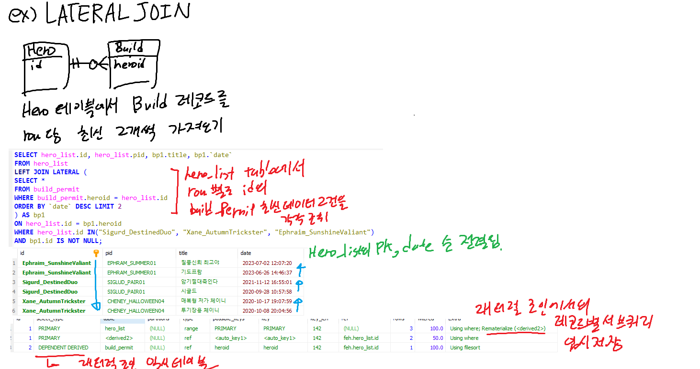

## Real MySQL 8.0

### 실행 계획 분석
1. ID 컬럼
- 쿼리를 분리했을 때, SELECT 키워드 단위별로 구분해서, 각각의 단위 쿼리별로 부여되는 식별자 값
- ID 컬럼의 값의 크기가 테이블의 접근 순서를 의미하지는 않는다
2. select_type 컬럼
- 각 단위 SELECT 쿼리의 유형을 표시
- SIMPLE: 단순 SELECT 쿼리  
실행 계획이 복잡한 쿼리라도, 실행 계획에서 SIMPLE인 단위 쿼리는 하나만 존재한다 (일반적으로 제일 바깥 SELECT 쿼리)
- PRIMARY: UNION이나 서브쿼리를 사용한 SELECT 쿼리
- UNION: UNION으로 결합되는 단위SELECT 쿼리 중 두번째 이후의 단위 SELECT 쿼리  
- DEPENDENT UNION: UNION이나 UNION ALL로 집합을 결합하는 쿼리이면서, 외부 쿼리에 의해 영향을 받는 경우  
- UNION RESULT : UNION의 결과를 저장한 임시 테이블 (단위 쿼리는 아님)
- SUBQUERY: FROM 절 이외에서 사용되는 서브쿼리  
FROM 절에서 사용되는 서브쿼리는 파생 테이블을 생성하므로 DERIVED로 표시
- DEPENDENT SUBQUERY: 외부 쿼리에 의해 영향을 받는 서브쿼리
- DERIVED: 단위 SELECT 쿼리의 결과가 임시 테이블을 생성할 때
- DEPENDENT DERIVED: 외부 쿼리에 의해 영향을 받는 DERIVED (8.0부터) LATERAL JOIN에 사용된다
- UNCACHEABLE SUBQUERY: 캐시할 수 없는 서브쿼리  
사용자 변수가 서브쿼리에 사용되었거나, NOT-DETERMINISTIC 속성의 스토어드 루틴이 서브쿼리 내에 사용되었거나, 결괏값이 호출할 때마다 달라지는 함수가 서브쿼리에 사용된 경우  
- UNCACHEABLE UNION: 캐시할 수 없는 UNION (위 경우와 동일할 때 캐시 불가능하다)
- MATAERIALIZED: FROM 절이 아닌 서브쿼리의 결과를 임시 테이블에 저장한 경우
3. table 컬럼  
단위 SELECT 쿼리에서 사용된 테이블 이름  
별도의 테이블을 사용하지 않는 경우에는 `NULL`이 대신 표시된다  
임시 테이블이라면 <>로 감싸서 표시된다  
4. partitions 컬럼  
단위 SELECT 쿼리에서 사용된 테이블의 파티션 정보  
5. type 컬럼  
각 테이블의 레코드를 어떤 방식으로 읽었는지에 대한 정보
- system: 레코드가 1개 이하인 테이블을 참조하는 방식, InnoDB에서는 나타나지 않고, MyISAM이나 MEMORY 테이블에서만 사용되는 접근방식  
- const: 레코드 건수와 관계 없이, 쿼리가 PK나 UK를 사용한 WHERE 절을 사지고 있고, 반드시 1건만을 반환하는 쿼리의 처리 방식  
단, 키의 일부만 조건으로 사용한다면 ref로 표시된다  
const인 실행 계획의 단위 쿼리의 경우, 옵티마이저가 해당 쿼리를 먼저 실행해서 상수로 변경하는 방식으로 최적화된다  
- eq_ref: 여러 테이블을 조인한 쿼리에서, 조인에서 처음 읽은 테이블의 컬럼값을, 그 다음 조인하는 테이블의 PK나 UK검색 조건에 사용될 때, 두 번째부터 읽는 테이블은 eq_ref로 표시된다  
- ref: 인덱스의 종류와 관계없이 `=`, `<=>` 조건으로 검색할 때
Unique한 컬럼이 아니라서 = 연산자라도 결과가 1개라는 보장이 없기 때문에, const와는 다르다 
- fulltext: MySQL의 전문 검색(full-text search) 인덱스를 사용해 레코드를 읽었을 때  
전문 검색은 MATCH() ... AGAINST() 으로 사용하고, 전문 검색용 인덱스가 테이블에 존재해야 한다  
- ref_or_null: ref와 같은 방식으로 인덱스를 사용하지만, NULL 값 비교가 추가되었을 때
- unique_subquery: IN(subquery) 형태의 쿼리를 사용하였을 떄, 서브쿼리에서 중복되지 않는 유니크한 값만 반환할 때  
- index_subquery: IN(subquery) 형태의 쿼리를 사용하였을 때, 서브쿼리의 결과가 유니크함을 보장하지 않아서, 중복 제거가 필요할 때 이를 index로 처리할 수 있을 때
- range: 인덱스 레인지 스캔을 사용할 때
- index_merge: 2개 이상의 인덱스를 사용해 각각의 검색 결과를 병합할 때  
여러 인덱스를 읽어야 하고, 두 집합을 합치면서 중복 제거 등의 연산이 필요하기에 비교적 덜 효율적이다  
- index: 인덱스를 풀 스캔을 사용할 때  
이하 조건 중 1, 2번째 혹은 1, 3번째 조건을 충족할 때 사용된다  
1: range, const, ref 같은 접근 방식으로 인덱스를 사용할 수 없을 때  
2: 인덱스에 포함된 컬럼만으로 처리할 수 있는 쿼리일 때 (= 레코드를 읽을 필요가 없을 때)  
3: 인덱스를 사용해 정렬이나 그루핑이 가능할 때
- ALL: 풀 테이블 스캔을 사용할 때
6. possible_keys 컬럼  
옵티마이저가 최적의 실행 계획을 수립할 떄 사용을 고려한 인덱스의 목록
7. key 컬럼  
실행 계획에서 실제로 사용된 인덱스
8. key_len 컬럼  
인덱스를 사용할 때, 실제로 사용된 인덱스의 길이
9. ref 컬럼  
참조 조건으로 어떤 컬럼을 사용했는지 표시
10. rows 컬럼  
실행 계획에서 얼마나 많을 레코드를 읽어야 할지 예측한 수치
11. filtered 컬럼  
실행 계획에서 조건절에 의해 필터링될 것으로 예상되는 레코드의 비율  
12. Extra 컬럼
- const row not found: const 접근 방식으로 ㅌ이블을 읽었지만, 실제로 해당 테이블에 레코드가 존재하지 않았을 때  
- Deleteng all rows: MyISAM 등의, 스토리지 엔진의 핸들러 차원에서 테이블의 모든 레코드를 삭제하는 기능을 제공하는 경우, 테이블의 모든 레코드를 삭제할 때 표시
WHERE 조건이 없는 DELETE 쿼리의 실행 계획에 자주 표기됨
- Distinct: SELECT DISTINCT 쿼리를 실행할 때, 조인하지 않아도 되는 항목을 무시하고 필요한 것만 조인했음고, 필요한 레코드만 읽어왔음을 의미  
- FirstMatch(table_name): 여러 테이블을 조인한 쿼리에서, FirstMatch 전략을 사용했을 때  
- Full scan on NULL key: col1 IN(subquery) 형태의 쿼리일 경우, col1이 Null이 될 수 있는 경우, 결과를 알기 위해 풀 테이블 스캔이 필요함을 의미  
- Impossible HAVING: HAVING 조건을 만족하는 레코드 값이 존재 불가능할 때 (not null 컬럼인데 null 비교를 했거나 등등)
- Impossible WHERE: WHERE 조건을 만족하는 레코드 값이 존재 불가능할 때
- LooseScan: 조인 최적화 중에서 LooseScan 전략을 사용했을 때
- No matching min/max row: WHERE 조건을 만족하는 레코드가 없으면서 MIN(), MAX() 함수를 사용했을 때
- no matching row in const table: 조인에 사용된 테이블에서 const 방식으로 접근했는데 일치하는 레코드가 없을 때 
- No matching rows after partition pruning: 해당 파티션에서 UPDATE/DELETE할 대상 레코드가 없을 떄
- No tables used: FROM 절이 없거나 FROM dual을 사용했을 때
- Not exists: OUTER JOIN을 사용해서 안티 조인을 수행할 때  
안티 조인: A 테이블에는 존재하지만 B에는 존재하지 않는 값을 찾을 때 NOT IN(), NOT EXISTS() 등을 사용해서 검색하는 방법
- Plan isn't ready yet: 실행 계획이 준비되지 않았을 때
- Range checked for each record: 조인할 때, 레코드마다 인덱스를 사용할지 풀 스캔을 사용할지 체크할 때
- Recursive: Command Table Expression을 사용하여 재귀 쿼리를 수행할 떄
- Rematerialize: 래터럴 조인에서 선행 테이블의 레코드별로 서브쿼리를 실행해서 임시 테이블에 저장할 때
- Select tables optimized away: MIN, MAX만 SELECT절에 사용되거나, GROUP BY로 MIN, MAX를 조회하는 쿼리가, 인덱스를 오름차순 혹은 내림차순으로 한 건만 읽는 형태의 최적화가 적용되었을 떄
- unique row not found: 두 테이블이 UK혹은 PK로 아우터 조인을 수행할 떄, 아우커 케이블에 일치하는 레코드가 존재하지 않을 때  
- Using filesort: ORDER BY 절에 인덱스를 사용할 수 없어서 정렬을 위해 임시 테이블을 사용할 때
- Using index: 레코드를 읽을 필요 없이 인덱스만으로 처리할 수 있는 쿼리일 때
- Using index condition: 인덱스 컨디션 푸시다운 최적화를 사용했을 때
- Using index for group-by: GROUP BY 절에 인덱스를 사용할 수 있을 때 (루스 인덱스 스캔)
- Using index for skip-scan: 인덱스 스킵 스캔을 사용했을 때
- Using join buffer: 드리븐 테이블에 조인 컬럼에 적절한 인덱스가 없어서, 블록 네스티드 루프 조인이나 해시 조인을 사용했을 떄  
이 경우 조인 버퍼가 사용된다
- Using MRR: Multi-Range Read 최적화를 사용했을 때 (MRR - 여러 키 값을 한 번에 스토리지 엔진으로 전달해서, 스토리지 엔진은 넘겨받은 키 값을 정렬해서 테이블에 최적화된 방식으로 접근함)
- Using sort_union, union, intersect: index_merge 접근 계획으로 실행되었을 때, 결과를 어떻게 병합했는지
  - intersect: 각각의 인덱스를 사용할 수 있는 조건이 AND로 연결된 경우, 각 처리 결과에서 교집합을 추출해내는 작업을 수행함
  - union: 각 인덱스를 사용할 수 있는 조건이 OR로 연결된 경우, 각 처리 결과에서 집합을 추출하는 작업을 수행함
  - sort_union: union과 같은 작업을 수행하지만, union으로 처리할 수 없는 경우 (OR절에 상대적으로 많은 레코드 일치 조건이 사용될 때)
- Using temporary: 임시 테이블을 사용했을 때
- Using where: WHERE 절을 처리하면서, 인덱스만으로 where을 전부 처리하지 못해서 MySQL엔진 레이어에서 별도의 체크 조건을 처리해서 필요없는 레코드를 버렸을 때
- Zero limit: LIMIT 0을 사용했을 때 (쿼리 결괏값의 메타데이터만 필요할 때 사용. 옵티마이저가 레코드는 읽지 않고 메타데이터만 반환함)

### 래터럴 조인?
FROM절의 `파생 테이블`이 이전 테이블의 컬럼을 참조할 수 있게 하는 것  
MySQL 8.0.14 버전부터 사용할 수 있다  

#### JPA에서 래터럴 조인 사용?
당연히? Mapper에 쿼리를 직접 때려박는 MyBatis를 쓰거나, JPA Native Query를 써주면 사용 가능
기본적으로 QueryDSL에서는 지원하지 않는데, `Blaze-Persistence`[(링크)](https://github.com/Blazebit/blaze-persistence) 익스텐션을 사용하면 된다고 한다  
[querydsl issue page](https://github.com/querydsl/querydsl/issues/2607)
