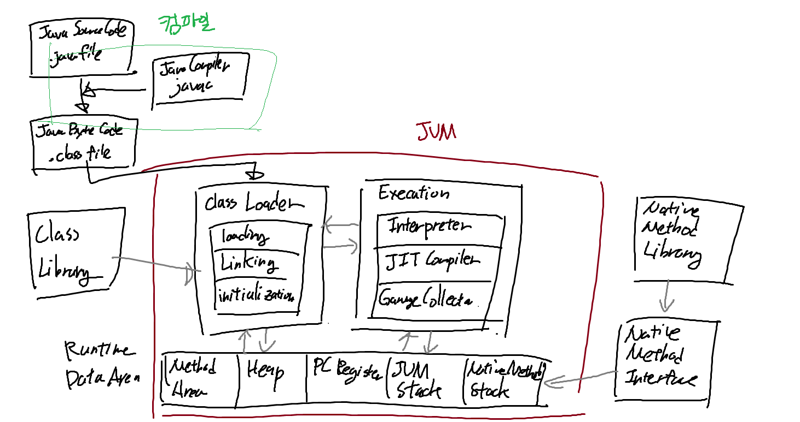
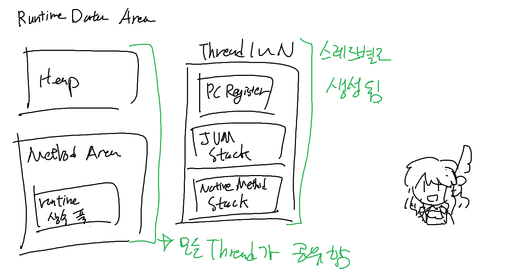
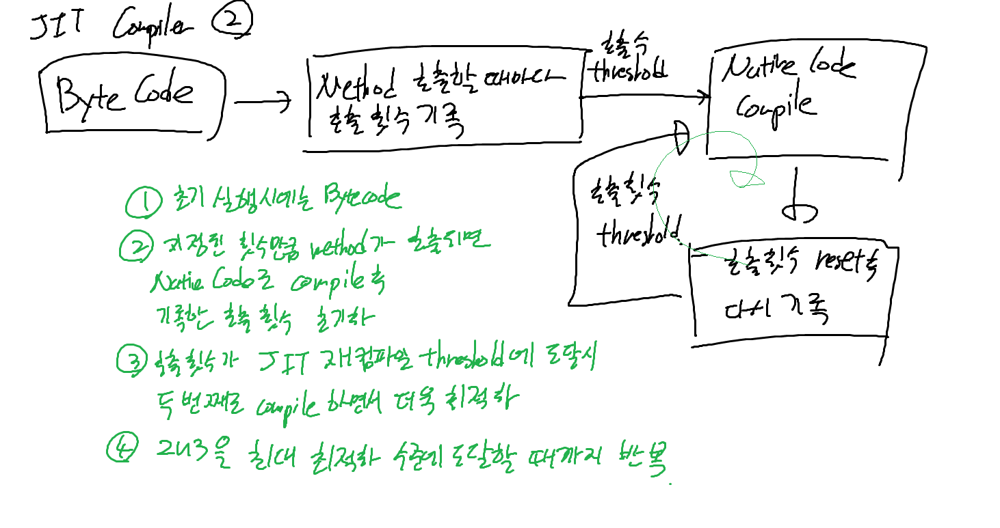
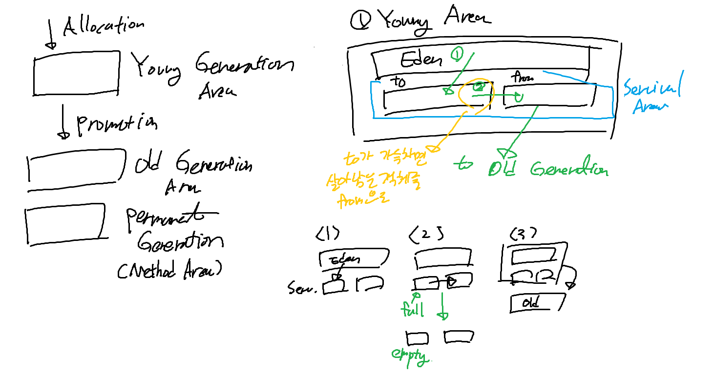

## Java Virtual Machine

### JRE, JDK?
- JRE(Java Runtime Environment) : JAVA 프로그램을 실행하기 위한 환경
  - 자바 프로그램을 실행시키는데만 사용되는 패키지
  - JVM, Java Class Library, Java Command, 기타 인프라
- JDK(Java Development Kit) : JAVA 프로그램을 개발하기 위한 환경
  - JRE 패키지에 추가로 컴파일러(javac), 디버거(jdb), 문서생성자(javadoc) 등이 포함된 패키지

### JAVA Application의 실행 과정


1. Class Loader
- JVM 내로 클래스 파일을 동적으로 로드하고, 링크를 통해 배치하는 작업을 수행
- 로드된 바이트 코드를 엮어서 실행 가능한 형태로 만들어 메모리에 배치
- 클래스 로딩은 한번에 올라가지 않고, 애플리케이션에서 필요할 때마다 동적으로 메모리에 올림


- 클래스 로딩 순서
  1. Loading: 클래스 파일을 가져와서 JVM의 메모리에 로드
  2. Linking: 클래스 파일을 사용하기 위해 검증하는 과정 
     1. Verifying: 읽어온 클래스 파일이, JVM 명세에 명시된 대로 구성되어 있는지 확인
     2. Preparing: 클래스가 필요로 하는 메모리를 할당
     3. Resolving: 클래스 상수 풀 내의 모든 심볼릭 레퍼런스를 다이렉트 레퍼런스로 변경   
     = 클래스가 참조하는 다른 클래스와 메소드를 실제로 찾아서 연결
  3. Initializing: 클래스 변수들을 적절한 값으로 초기화

2. Execution Engine
- 클래스 로딩 과정을 통해 런타임 영역에 배치된 바이트 코드를, 명령어 단위로 읽어서 실행하는 엔진  
- JVM은 인터프리터와, JIT 컴파일러 두 방식을 같이 사용하여 바이트 코드를 실행

3. Garbage Collector
- 더 이상 참조되지 않는 객체를 탐지하여 정리하는 역할

4. Runtime Data Area
- JVM이 프로그램을 수행하기 위해 OS로부터 별도로 할당받은 메모리 공간
  


| 영역                   | 용도                                                                                                                                                                                                                            |
|----------------------|-------------------------------------------------------------------------------------------------------------------------------------------------------------------------------------------------------------------------------|
| Method Area          | 클래스 정보를 처음 메모리에 올릴 때, 초기화되는 대상을 저장. (= 클래스의 정적 필드와 클래스 구조)<br>Field Information: 멤버번수에 대한 정보 (타입, 이름, 접근 지정자)<br>Method Information: 메서드에 대한 정보 (이름, 리턴 타입, 패러미터, 접근 지정자 등)<br>Type Information: 객체의 타입, 속성, super class의 이름 등 |
| Runtime Contant Pool | 클래스와 인터페이스 상수, 메서드와 필드에 대한 레퍼런스 저장                                                                                                                                                                                            |
| Heap                 | new 키워드로 생성된 객체, 인스턴스 배열이 저장되는 공간                                                                                                                                                                                             |
| Stack                | 메서드 호출 시 생성되는 스레드 수행 정보를 기록하는 frame 저장. 메서드 정보, 지역변수, 매개변수, 리턴 값, 연산 중 발생하는 임시 데이터 저장                                                                                                                                         |
| PC Register          | 스레드가 시작될 때 스레드마다 생성되는 영역으로,<br> 스레드가 실행 중인 JVM 명령의 주소를 저장                                                                                                                                                                     |
| Native Method Stack  | 바이트 코드가 아닌 네이티브 코드를 실행시키는 영역<br>(JIT 컴파일러로 컴파일된 Native Code 등)                                                                                                                                                                |


- 참조형 변수냐, 기본형 변수냐에 따라 스택과 힙에 저장되는 방식이 다르다
  - 기본형 변수 : Stack 영역에 직접 값을 저장
  - 참조형 변수 : Stack 영역에는 참조 값만 저장하고, 실제 객체는 Heap 영역에 저장


5. Java Native Interface
- JAVA Native Interface를 통해 Native Method Library를 호출하는 역할
- JVM이 Native Method를 적재하여 수행할 수 있게 함
6. Native Method Library
- JAVA Native Interface를 통해 호출되는 C, C++ 등의 네이티브 라이브러리

### 인터프리터 방식 
- 바이트코드 명령어를 하나씩 읽어서 해석하여 바로 실행하는 방식
- 같은 메소드를 여러 번 호출하더라도 매번 바이트코드 명령어를 다시 읽어서 작업을 수행하므로, 전체적인 속도가 느리다

### JIT Compiler
- 인터프리터 방식의 낮은 속도를 보완하기 위한 방식
- 반복되어 호출되는 코드는 Native Code로 실시간으로 컴파일하여, 한 번 변경된 메소드는 인터프리팅하지 않고 네이티브 코드로 직접 실행함
- Method별로 compile
- C#, JAVA등이 존재



#### JIT Compiler의 장점
1. 실행 시 Native Code로 Compile하지 않고 Byte Code로 실행하므로 초기 실행 속도가 빠름
2. 자주 사용되는 Method일수록 더 빠른 시간 안에 최적화를 수행하므로 속도 이점
3. 사용되지 않거나 적게 사용되는 Method는 Compile하지 않으므로 불필요한 Compile을 하지 않음
4. 애플리케이션을 업데이트할 때, 변경된 바이트 코드만 업데이트할 수 있다
5. 런타임에 필요한 코드만을 메모리에 올릴 수 있다 

#### JIT Compiler의 단점
1. Compile 여부를 감시하는 데 리소스를 추가로 필요로 함 (메모리 사용량이 더 높아진다)
2. 런타임에 바이트 코드를 기계어로 변환해야 하므로, 프로그램 실행 파일의 크기가 커질 수 있다


### AOT Compiler
- 전체 코드를 애플리케이션 시작 전에 기계어(Native Code)로 Compile
- 애플리케이션 실행 시에는 Native code를 실행
- C, C++등이 대표적

#### AOT Compiler의 장점
1. 실행 시점에 컴파일 지연이 없고, 메모리에 바이트 코드를 로딩할 필요가 없으므로 메모리 사용량이 적으며, 시작 시간이 단축됨
2. CPU 사용량이 JIT에 비해 낮다 (실시간 컴파일 여부를 결정할 필요가 없으니까)
3. 특정 플랫폼에 최적화를 높일 수 있다
4. Native Code로 배포하므로, Byte Code에 비해 해석하기 어려워 보안성이 높다


#### AOT Compiler의 단점
1. 미리 컴파일해야 하므로 설치 속도가 느리고 설치 용량이 비교적 크다
2. JIT에 비해 최적화가 힘드므로, 최적화를 적절하게 하지 않으면 메모리 사용량이 증가할 수 있다
3. 애플리케이션 업데이트 시, 전체 코드의 Native Code를 생성해야 하므로 빌드 시간이 증가한다
4. 빌드가 특정 플랫폼에 종속적이다. 


### JAVA Garbage Collection
- JAVA는 개발자가 메모리를 명시적으로 해제하지 않음
- 대신 JVM의 Garbage Collector가 자동으로 메모리를 관리.  
Garbage Collector는 객체가 다음과 같은 생명주기를 가졌음을 전제해서 만들어짐 (= Weak Generational Hypothesis)
  - 대부분의 객체는 금방 접근 불가능한 상태가 된다
  - 오래된 객체에서 젊은 객체로의 참조는 아주 적게 존재한다
- GC는 JVM의 메모리 영역 중 Heap 영역을 다룬다

#### Young 영역과 Old 영역
- Young 영역: 새롭게 생성된 객체가 위치하는 곳  
이 영역에서 객체가 정리되는 것을 Minor GC라고 한다
- Old 영역: Young 영역에서 일정 시간 살아남은 객체가 복사되는 곳  
대부분 Young 영역보다 크고, GC가 적게 발생한다  
이 영역에서 객체가 정리되는 것을 Major GC 혹은 Full GC라고 한다


#### Young Area의 GC



Young 영역은 크게 Eden, Survivor1, Survivor2 영역으로 나뉜다.  
각 영역 별 객체의 생성 및 GC 발생 시 다음과 같은 처리 절차를 거친다

1. 새로 생성되는 객체는 Eden 영역에 위치한다
2. Eden 영역이 가득 차면, Minor GC가 발생하여, 살아남은 객체는 Survivro 영역 중 하나로 이동한다
3. 이후 Eden 영역이 다시 가득 차면, 살아남은 객체는 비어있지 않은 Survivor 영역으로 계속 이동한다
4. 하나의 Survival 영역이 가득하면, 그 중 살아남은 객체는 다른 Survivor 영역으로 이동한다  
기존 Survival 영역은 비워진다
5. 이 과정을 반복하면서 계속 살아남는 객체는 Old 영역으로 이동한다


#### Old Area의 GC
- 기본적으로 데이터가 가득 차면 GC를 실행

#### GC의 종류
1. Serial GC
- mark-sweep-compact 알고리즘을 사용
  - old 영역에 살아있는 객체를 식벽
  - heap의 앞 부분부터 확인하여 살아있는 것만 남김
  - 남은 객체들이 연속되게 쌓이도록 힙의 앞 부분부터 다시 채워서 객체가 존재하는 영역과 존재하지 않는 영역으로 구분
2. Parallel GC
- Serial GC와 동일한 알고리즘을 사용하지만, GC를 수행하는 스레드가 여러 개
- 메모리가 충분하고 CPU의 코어 수가 많을 때 유지
3. Parallel Old GC
- OLD 영역에서 mark-summary-compaction 단개를 추가로 거침
4. CMS GC
- stop-the-world 시간이 다른 GC에 비해 짧음
- 단 메모리와 CPU를 더 많이 사용하고, Compaction 단계가 기본적으로 제공되지 않음
5. G1 GC
- 고정된 메모리 크기로 각 영역을 구분하지 않고, 힙 영역을 동일한 크기의 region으로 나누어서 관리 (바둑판처럼)
- Garbage 비중이 높은 region을 집중적으로 수집
- JAVA 9부터 defailt GC로 사용
- 적용하기에 좋은 상황
  - 힙 크기가 수십GB 이상이며, 힙의 50% 이상이 live object로 채워질 때
  - 시간이 지남에 따라서, 객체의 allocation 및 promotion 비율이 크게 달라질 때
  - 수백 밀리초보다 길지 않은, 예측 가능한 stop-the-world 시간을 목표로 할 때   

[출처](https://blog.leaphop.co.kr/blogs/42/G1GC_Garbage_Collector%EC%97%90_%EB%8C%80%ED%95%B4_%EC%95%8C%EC%95%84%EB%B3%B4%EA%B8%B0___1)


### 객체지향

#### 객체지향의 특징
1. 상속 : 상위 클래스의 속성과 행위를 물려받음
2. 캡슐화: 속성과 행위, 즉 변수와 함수를 하나로 묶어 클래스로 만들고, 접근 제어자를 사용해서 데이터를 보호하고 은닉한다
3. 다형성: 하나의 변수명, 함수명이 상황에 따라 다르게 해석될 수 있는 것
   - 서브타입 다형성: 베이스 클래스 혹은 인터페이스를 구현하는 상위 클래스를 생성하고, 해당 클래스를 상속받는 하위 클래스를 만들어, 상위 클래스의 포인터나 참조변수가 하위 클래스의 객체를 참조하게 하는 것  
   - 매개변수 다형성: 타입을 매개 변수로 받아 새로운 타입을 되돌려주는 것 (제네릭 등)
   - 임시 다형성: 함수 오버로딩, 혹은 연산자 오버로딩을 의미 (JAVA는 연산자 오버로딩이 불가)
   - 강제 다형성: 묵시적/명시적 형 변환
4. 추상화: 객체에서 공통돤 속성과 행위를 추출하여 타입을 정의하는 것

#### SOLID 5대 원칙
1. Single Responsibility Principle (단일 책임 원칙)
- 객체는 단 하나의 책임만 가져야 한다
2. Open-Closed Principle (개방-폐쇄 원칙)
- 객체는 변화에는 폐쇄적이여야 하며, 확장에는 개방적이여야 한다
3. Liskov Substitution Principle (리스코프 치환 원칙)
- 프로그램의 정합성을 깨지 않으면서, 상위 객체는 하위 객체로 치환 가능해야 한다
- 부모 객체를 호출하는 동작에서, 자식 객체가 부모 객체의 역할을 완전히 대체할 수 있어야 한다

```java
class Shape {
    int width;
    int height;
    
    public Shape(int width, int height) {
        this.width = width;
        this.height = height;
    }

    public int getArea() {
        return width * height;
    }
}

class Rectangle extends Shape {
}

class Triangle extends Shape {
    @java.lang.Override
    public int getArea() {
        return super.getArea()/2;
    }
}

Shape shape = new Rectangle(2, 2);
Shape shape2 = new Triangle(2, 2);

//부모 객체 shape의 method를 호출했을 때, 각각 자식 객체의 함수가 부모 객체의 역할을 대체함
shape.getArea(); // 4
shape2.getArea(); // 2
```

4. Interface Segregation Principle (인터페이스 분리 원칙)
- 클라이언트는 자신이 사용하지 않는 인터페이스를 구현하도록 강요받아서는 안 된다
- 클라이언트는 자신이 사용하지 않는 메서드에 의존하지 않아야 한다
- 즉, 인터페이스를 각각의 역할과 사용에 맞게끔 구체적으로 여러 인터페이스로 쪼개서 분리하라는 뜻


5. Dependency Inversion Principle (의존 역전 원칙)
- 변하기 쉬운 것에 의존하지 않고, 추상화된 인터피이스나 상위 클래스를 두어야 한다
- 어떤 클래스를 참조해서 사용해야 할 때, 그 대상의 상위 요소를 참조하라는 뜻
- 의존 관계를 맺을 때는, 변화하기 쉬운 것이 아니라 변화하기 어려운 것에 의존하라는 뜻
  - 즉, 상위 계층은 하위 계층의 변화로부터 독립적이여야 한다
```java
interface IDBConnection {
    String connect();
}

class MySQLConnection implements IDBConnection {
    public String connect() {
        // MySQL 연결
        return "MySQL Connection";
    }
}
class OracleConnection implements IDBConnection {
    public String connect() {
        // Oracle 연결
        return "Oracle Connection";
    }
}

// MySQLConnection과 OracleConnection의 상위의 공통 인터페이스 IDBConnection을 참조하도록 구성하였으므로, 
// DBConnection 클래스는 데이터베이스 모듈의 변화에 독립적이다
class DBConnection {
    private dbConnection;
    
    public DBConnection(IDBConnection dbConnection) {
        this->dbConnection = dbConnection;
    }
    
    public String connect() {
        return this->dbConnection->connect();
    }
}
```

### 제네릭
클래스 내부에서 사용할 데이터 타입을, 클래스 외부에서 지정하는 것

1. 클래스, 인터페이스 선언
```java
public class GenericClass<T> {
    private T data;
    
    public T getData() {
        return data;
    }
    
    public void setData(T data) {
        this.data = data;
    }
}

public interface GenericInterface<T> {
    T getData();
    void setData(T data);
}

GenericClass<Integer> genericClass = new GenericClass<>();
genericClass.setData(1);
System.out.println(genericClass.getData()); // 1
```

2. 제네릭 메소드
```java
public <T> T genericMethod(T data) {
    return data;
}

System.out.println(genericMethod(1)); // 1
System.out.println(genericMethod("Hello")); // Hello

// 클래스의 제네릭과 별개로 내부 메소드에서 제네릭을 사용할 수 있음
public <T> GenericClass {
    private T data;

    public T getData() {
        return data;
    }
    
    public void setData(T data) {
        this.data = data;
    }
        
    public <K> K genericMethod(K data) {
        return data;
    }
}
```
- static 메소드는 객체 생성 전에 호출할 수 있으므로, 클래스의 제네릭은 사용할 수 없다  
- static 메소드에서 제네릭을 사용하려면, 메소드의 제네릭을 따로 선언해야 한다

3. 제네릭 제한, 와일드카드
- 제네릭 타입에 사용하는 타입을 제한할 수 있다
```java
<K extends T> // T와 T의 자손 타입만 사용 가능, 해당 객체 혹은 메소드를 호출 시 K는 지정된 타입으로 변환된다
<K super T> // T와 T의 조상 타입만 사용 가능
<? extends T> // T와 T의 자손 타입만 사용 가능
<? super T> // T와 T의 조상 타입만 사용 가능
<?> // 모든 타입 사용 가능
```


#### 장점
1. 컴파일 시 타입 체크를 할 수 있음
2. 따로 타입을 체크해서 변환해 줄 필요가 없음
3. 코드의 재사용성이 높아짐

#### 단점
1. 자바의 기본 자료형은 사용할 수 없음 (Wrapper 클래스 사용)
2. 제네릭 타입의 객체는 생성할 수 없음
3. 컴파일 시에만 타입 체크를 하므로, 런타임 시에는 타입 안정성을 보장하지 않는다