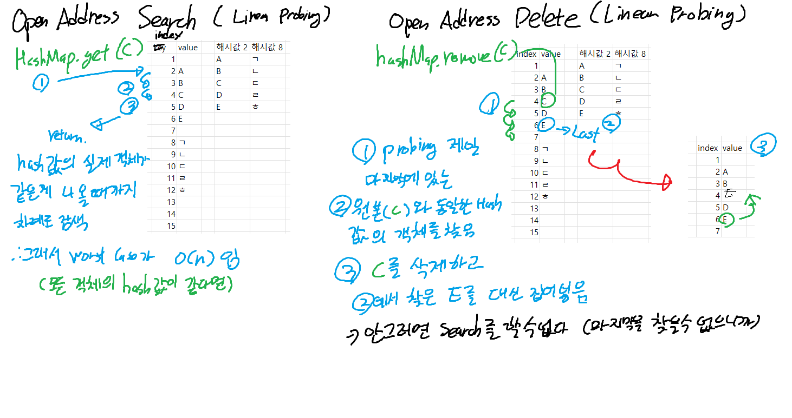
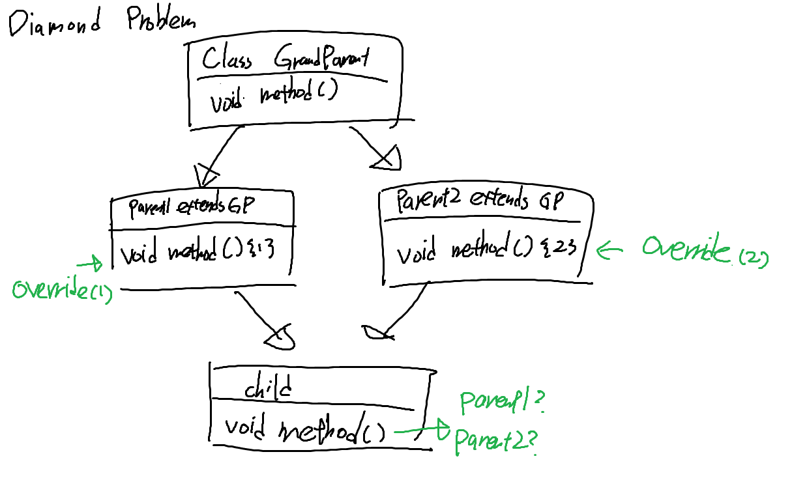
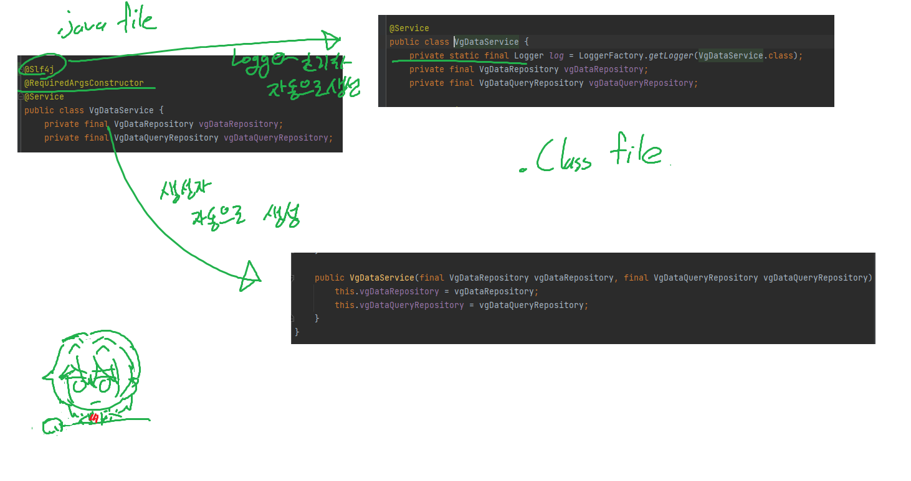

### Open Addressing의 search와 delete


### Separate Chainning - 자세히
- 해시 충돌 발생 시 LinkedList로 연결
  - Treeify: Java 8부터, 데이터의 사이즈가 커지면 List 구조를 Tree로 변경 (검색속도의 이점)
    - 한 인덱스에 저장된 데이터의 수가 `TREEIFY_THRESHOLD`(8)보다 크면 Tree로 변경
    - 한 인덱스에 저장된 데이터 수가 `UNTREEIFY_THRESHOLD`(6)보다 작으면 다시 LinkedList로 변경
  - Tree는 검색이 O(log n)이지만 데이터 저장 시 더 많은 비용을 사용하고, LinkedList는 검색이 O(n)이지만 데이터 저장시 더 적은 비용을 사용하기에, 데이터의 크기에 따라 적절하게 변경


### Interface
- 구현되지 않은 메소드를 가지고 있는 추상 클래스
- implements 키워드를 통해 구현
- implements 키워드를 사용해 interface를 구현 시, interface의 메소드는 반드시 상속받은 클래스에서 구현해야 하므로, 한 번에 두 개 이상의 interface를 구현하는 것이 가능
- 내부의 모든 변수는 public static final 상수
- 내부의 모든 메소드는 public 메소드

#### Default Method
- Java 8부터 추가된 기능
- 인터페이스에 있는 구현 메소드
- 인터페이스를 구현한 클래스에서 구현하지 않아도 사용 가능
- `default` 키워드를 사용하여 선언하고, 반드시 구현부가 존재해야 한다
- 구현부가 존재하므로 다중 상속 시 문제가 발생하게 된다


- 인터페이스에 추상 메소드를 추가하면, 해당 인터페이스를 상속받는 모든 메서드에 다시 구현을 해 줘야 하는데, default method를 사용하면 추가 변경을 막을 수 있다  
- 확장에 개방되어 있고, 변화에는 폐쇄되어 있는, OOP의 SOLID 원칙 중 Open-Closed 원칙을 지킬 수 있다

##### Default Method에 따른 다중 상속 문제
- Java에서 Class는 다중 상속을 금지하고 있는데, 이는 다이아몬드 문제 때문이다
  - 다이아몬드 문제: 다중 상속 시, 부모 클래스가 같은 메소드를 가지고 있을 때, 자식 클래스에서 어떤 메소드를 호출해야 하는지 모호해지는 문제
  
- 인터페이스에도 Default method로 구현이 가능해지기에, 동일한 부모 인터페이스를 상속받아서 다르게 구현한 두 자식 인터페이스를 상속받거나, 부모 인터페이스를 상속받아 구현한 인터페이스와 클래스를 동시에 상속받으면 다이아몬드 문제가 발생할 수 있다  
- 이 경우에는 다음과 같은 순서로 호출 시 사용될 메소드를 정한다
  1. 클래스가 다른 인터페이스보다 우선순위가 높다
  2. 서브 인터페이스가 슈퍼 인터페이스보다 우선순위가 높다
  ```java
  interface A {
    default void hello() {
      System.out.println("Hello from A");
    }
  } 

  interface B extends A {
    default void hello() {
      System.out.println("Hello from B");
    }
  }
  // Super Interface: A, Sub Interface: B
  
  class C implements A, B {
      public static void main(String[] args) {
      new C().hello(); // Hello from B
      }
  }
  ```
  3. 이외에는 명시적 호출을 하거나, 직접 오버라이딩 한다


### Abstract Class
- Abstract Class(추상 클래스)는 하나 이상의 추상 메소드를 가지고 있는 클래스이다
- 추상 메소드: 선언만 되어 있고, 구현이 되어 있지 않은 메소드
- 사용 가능 변수나 접근 제어자에 제한 없음


### Interface와 Abstract Class의 차이
- Interface는 static, final 메소드를 사용할 수 없지만 Abstract Class는 사용 가능
- Interface는 다중 상속이 가능하지만 Abstract Class는 불가능
- 사용 가능 접근 제어자와 변수에 차이가 있다
- Interface는 상속에 구애받지 않으므로, 구현된 객체가 같은 동작을 할 수 있음을 보장하기 위해 사용
- Abstract Class는 클래스인 만큼, 상속의 개념을 통해 클래스 간 연관 관계를 구축하기 위해 사용

#### Interface를 사용할 때
- 클래스의 관계와는 독립적으로, 공통적인 행위를 정의하고자 할 때
  - 다형성이나 의존 역전 등을 위해서, 연관 관계가 없는 여러 클래스의 공통적인 상위 요소가 필요할 때
  - 이를 위해서, 아무 메소드도 선언하지 않고 공통적인 타입임을 표시하기 위한 `마커 인터페이스` 개념도 존재 (~able, ~ible로 끝나는 이름을 가진 인터페이스)

#### Abstract Class를 사용할 때
- 상속 관계를 통해 클래스 간 연관 관계, 계층 관계를 구축하고자 할 때
- 상속받을 클래스들이 공통적으로 가지는 필드와 메소드가 많아서 이를 통합하고자 할 때
- public 이외의 접근 제어자를 사용하고 싶을 때

### Annotation?
- Java 5부터 추가된 기능
- 클래스, 메소드, 변수 등에 추가 정보를 제공하는 메타데이터
  - 컴파일러에게 정보를 알려줌
  - 컴파일할 때와 설치 시의 작업 지정
  - 실행할 때 별도의 처리가 필요할 때
- `@` 기호를 사용하여 선언

#### JAVA의 어노테이션 3개
- @Override: 컴파일러에게 메소드가 오버라이드 되었음을 알림
- @Deprecated: 해당 메소드가 더 이상 사용되지 않음을 알림
- @SuppressWarnings: 특정 경고 메시지가 나타나지 않도록 함

#### 메타 어노테이션 4개
- @Retention: 어노테이션 정보가 유지되는 범위
  - `RetentionPolicy.SOURCE`: 소스 코드까지만 유지, 컴파일 시 사라짐
  - `RetentionPolicy.CLASS`: 컴파일러가 참조 가능하지만, JVM에서는 사라짐
  - `RetentionPolicy.RUNTIME`: 런타임 시에도 사용 가능
- @Target: 어노테이션을 적용할 대상
  - `ElementType.TYPE`: 클래스, 인터페이스, Enum 등
  - `ElementType.FIELD`: 필드 (Enum 상수 포함)
  - `ElementType.METHOD`: 메소드
  - `ElementType.PARAMETER`: 메소드의 매개 변수
  - `ElementType.CONSTRUCTOR`: 생성자
  - `ElementType.LOCAL_VARIABLE`: 지역 변수
  - `ElementType.PACKAGE`: 패키지
- @Documented: 해당 어노테이션 정보가 javadoc으로 작성된 문서에 포함되어야 함
- @Inherited: 해당 어노테이션을 하위 클래스까지 전파할 것인지

#### Lombok
- Java에서 반복되는 코드를 줄이기 위해 사용하는 라이브러리
- Getter, Setter: 변수에 대한 Getter, Setter 메소드를 자동 생성
- 자주 사용되는 어노테이션은 아래와 같다
  - ToString: 객체의 toString() 메소드를 자동 생성
  - EqualsAndHashCode: 객체의 equals()와 hashCode() 메소드를 자동 생성
  - Builder: 객체를 생성할 때 Builder 패턴을 사용할 수 있도록 생성
  - Slf4j, Log4j2, ... : Logger 객체를 생성
  - NoArgsConstructor: 파라미터가 없는 생성자를 생성
  - RequiredArgsConstructor: 필수 파라미터만을 받는 생성자를 생성
  - AllArgsConstructor: 모든 파라미터를 받는 생성자를 생성



##### Lombok을 통한 메소드 자동 추가
1. 먼저 javac이 java 코드를 파싱하여 AST(Abstract Syntax Tree)를 생성
2. Lombok은 AnnotaionProcessor에 따라, AST를 분석하여 동적으로 수정
3. 수정된 AST를 다시 javac에게 전달
4. javac은 수정된 AST를 컴파일하여 바이트 코드를 생성

[참고: Annotation Processor로 바이트 코드를 수정](https://free-strings.blogspot.com/2015/12/lombok.html)  
[참고: Lombok의 AnnotationProcessor.java](https://github.com/projectlombok/lombok/blob/5120abe4741c78d19d7e65404f407cfe57074a47/src/core/lombok/core/AnnotationProcessor.java)

###### AST(Abstract Syntax Tree)
- 소스 코드를 분석하여, 프로그램의 구조를 표현하는 트리 구조


### Garbage Collection Root
- GC가 Collect 대상을 고르기 위해 참조하는 객체 중 기준으로 사용하는 객체
  - 스레드의 스택에 살아 있는 지역 변수
  - 활성화되어 있는 스레드
  - 클래스 로더로 로드된 클래스 (+ 해당 클래스의 Static 변수)
  - JNI(Java Native Interface)로 생성된 객체 
