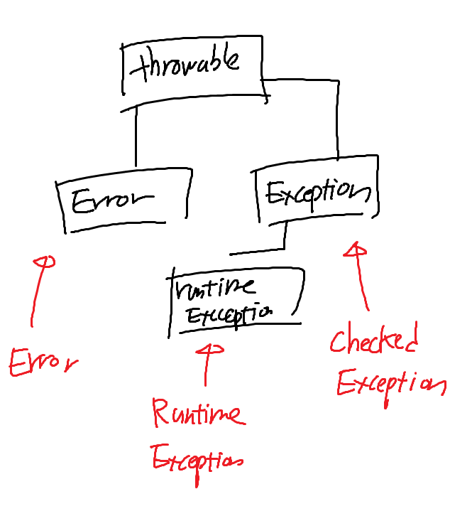

### Enum
- Enum은 열거형이라는 뜻으로, 서로 연관된 상수들을 모아 심볼릭한 이름으로 정의하기 위한 것
- java.lang.Enum 클래스를 상속받는 형태이기 때문에, 다른 클래스를 상속받을 수 없고, 인터페이스만 상속 가능 

#### 대표적인 Enum 메소드
- Static Method
  - `values()`: Enum 클래스에 정의된 모든 상수를 배열로 반환
  - `valueOf(String name)`: 지정된 이름(name)과 일치하는 Enum 상수를 반환
- Instance Method
  - `name()`: Enum 상수명을 문자열로 반환
  - `ordinal()`: Enum 상수가 정의된 순서를 반환 (내부적으로 정의된 순서대로 인덱스가 매겨짐)
  - `compareTo(E o)`: Enum 상수의 순서 차이를 리턴
  - `equals(Object other)`: 지정된 객체가 enum 상수와 같다면 true 반환
  
### Error와 Exception


#### Throwable
- Error와 Exception 클래스의 공통적인 조상 클래스
- 생성자를 통해 오류의 메시지나 원인을 넘겨줄 수도 있다
- printStackTrace() 메소드를 통해 오류의 발생 경로를 추적할 수 있다


#### Error
- 프로그램 내부가 아닌 외부에서 발생하는 오류
- 프로세스에 영향을 주기 때문에, Java 애플리케이션 전체가 중지된다

#### Runtime Exception
- 이름 그대로, Runtime에서의 원인으로 발생하는 오류
- 따라서 컴파일 시에는 확인할 수 없고, 실행 시에만 발생 가능
- 컴파일 시 확인할 수 없으므로, Runtime Exception은 처리하는 코드를 작성하는 것이 강제되지 않는다

#### Checked Exception
- 컴파일 시에 확인할 수 있는 예외
- 따라서 반드시 예외 코드를 작성해야 하며, 작성하지 않으면 컴파일 시 오류가 발생한다
- Error를 throws 키워드를 통해 메소드 밖으로 던지거나, try-catch 블록을 통해 예외를 처리해야 한다
  - catch 블록은 두 개 이상 작성할 수 있고, 발생한 Exception을 처리할 지 여부는 선언한 순서대로 처리된다   
  ```java
  public class ExceptionChild extends Exception {
  }
  
    try {
        throw new ExceptionChild();
    } catch (Exception e) {
  //catch문은 순서대로 처리되기 때문에, 아래 catch 블록에서 ExceptionChild를 잡아내도록 추가했어도, 위의 catch 블록에서 처리된다
        System.out.println("Exception");
    } catch (ExceptionChild e) {
        System.out.println("ExceptionChild");
    }
  
    // 출력 결과: Exception
  ```
- Checked Exception은 Exception 클래스를 상속받는다
  - 직접 Exception을 상속받아서 Checked Exception 클래스를 만들 수도 있다

### StringBuffer와 StringBuilder
- String은 불변(Immutable) 객체이기 때문에, 문자열을 변경할 때마다 새로운 객체를 생성해야 한다 
- 이와 반대로, StringBuffer와 StringBuilder는 가변(Mutable) 객체이다
  - 공통적으로 AbstractStringBuilder를 상속받는다
  - AbstractStringBuilder는 문자열을 저장하는 byte배열과, 문자열의 크기를 저장하는 int 변수를 가지고 있다
  - append() 메소드를 통해 문자열을 추가할 경우, 추가할 문자열의 길이만큼 배열의 크기를 늘리고, 늘린 공간에 문자열을 넣는 방식으로 되어 있기에, 문자열을 잇더라도 같은 주소를 참조하게 된다
- StringBuffer의 경우, 구현된 메소드에 Syncronized 키워드가 붙어 있어, 멀티 스레드 환경에서 안전하다. 그러나 Syncronized 키워드가 붙어 있기 때문에, 단일 스레드 환경에서는 StringBuilder보다 성능이 떨어진다
- StringBuilder의 경우, Syncronized 키워드가 붙어 있지 않아, 멀티 스레드 환경에서 안전하지 않다

#### StringBuffer와 StringBuilder를 사용해야 하는 곳
- 멀티 스레드 환경에서 다중 스레드에서 접근해야 할 경우 StringBuffer를 사용해야 한다
- 단일 스레드 환경에서 사용할 경우, thread-safe하지 않지만 성능면에서 유리한 StringBuilder를 사용해야 한다

### CI/CD

#### CI/CD란
- CI(Continuous Integration): 지속적 통합
  - 코드 변경 사항을 공유 소스 리포지토리에 자동으로 병합하고, 빌드하며, 테스트를 진행하는 것
  - 코드 변경 사항의 신뢰성을 보장하기 위해, 자동으로 테스트를 실행한다
- CD(Continuous Deployment): 지속적 배포, 혹은 지속적 제공 (Continuous Delivery)
  - 지속적 제공
    - CI를 통해 테스트를 통과한 코드를 자동으로 배포 가능한 상태로 만드는 것
  - 지속적 배포
    - 지속적 제공의 확장 단계
    - 지속적 통합 단계에서 제공된 코드를, 빌드하여 자동으로 프로덕션까지 릴리즈하는 것을 자동화하는 것

##### CI/CD를 사용하는 이유
- 테스트의 자동화에 따른 오류 감소
- 코드 병합 및 릴리즈 단계가 자동으로 진행되므로, 더 빠른 주기의 오류 수정 및 배포가 가능
- 자동화 과정을 통해, 휴먼 에러의 발생을 방지한다

##### CI/CD 파이프라인
- CI/CD에서의 다양한 작업 과정을 연결하는 구조
- 크게 3가지 단계로 나누어서 표현한다
  - Source: 원격 저장소의 소스 코드에 변경이 일어날 경우, 이를 감지하고 다음 단계로 전달하는 역할
  - Build: Source에게 전달받은 코드를 컴파일, 빌드, 테스트하여 검증하고, 문제가 없다면 다음 단계로 전달하는 역할
  - Deploy: Build 단계로부터 전달받은 결과물을 실제 서비스 환경에서 배포하는 작업을 수행

