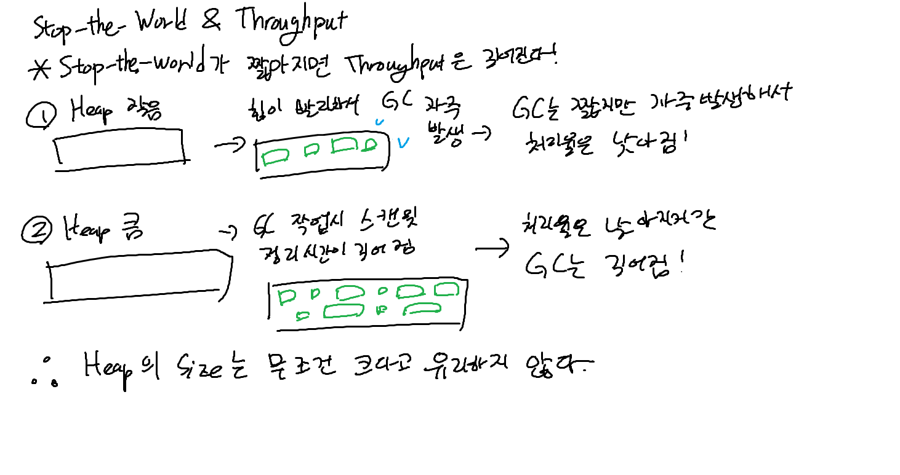
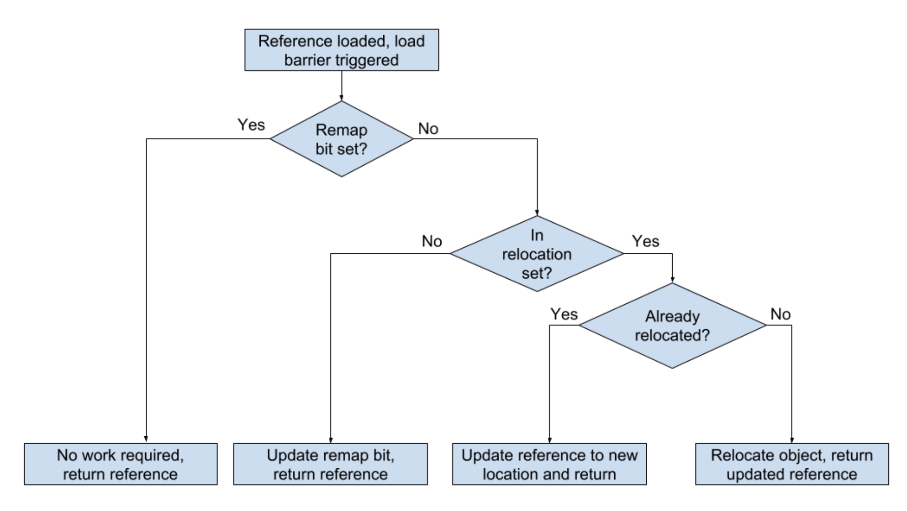

### Heap size에 따른 Stop-the-world와 처리율(Troughput)의 관계
- Heap size가 작을 경우
  1. Heap size가 작으므로 비교적 빨리 가득차게 된다
  2. 따라서 더 자주 GC가 발생한다
  3. GC당 Stop-the-world 시간은 짧아지지만, 자주 발생하게 되어 처리율은 낮아진다
- Heap size가 클 경우
  1. Heap size가 크므로 가득차는데 시간이 오래 걸린다
  2. 하지만 GC 작업 시 처리해야 할 메모리가 크므로, Stop-the-world 시간이 길어진다
  3. GC당 Stop-the-world 시간은 길어지지만, 자주 발생하지 않아 처리율은 높아진다
  
즉 Heap size는 무조건 크다고 좋지 않고, Stop-the-world 시간과 처리율을 고려해 적절한 값을 찾아야 한다

### G1 GC (Garbage First Garbage Collector)
- 메모리가 큰 multi processor 환경을 위해 설계된 GC
- 세부적인 설정 필요 없이, 중단 시간을 최소화하면서 높은 처리율을 목표로 함
  - 힙 크기가 최소 10GB 이상이며, JAVA 힙의 50% 이상이 live object로 채워질 때 사용
  - 시간이 지남에 따라 객체의 allocation(할당)과 promotion(GC동작시 살아남아 다른 메모리로 이동) 비율이 크게 달라질 때
  - 힙을 조각화
  - 수백 밀리초보다 길지 않은 stop-the-world 시간을 가지는 것을 목표로

#### 기본 개념
- Heap 영역을 old, young으로 나누어 관리하는 것은 다른 GC와 동일
- 일부 작업은 stop-the-world로 처리하지만, 시간이 오래 걸리는 작업은 애플리케이션과 병렬로 진행 (global marking 등)
- stop-the-world 시간을 줄이기 위해, GC의 공간 회수 작업을 단계적으로 병렬로 수행
- 이전 GC 작업의 결과와 Heap 상태를 사용하여, 자동으로 비용 모델을 구축하여, 최적의 IHOP 값을 찾아 계속 수정해 나감
  - IHOP : Initating Heap Occupancy Percent, GC를 시작하는 힙의 사용률, 초기값은 45%

#### 힙 레이아웃
- G1은 힙을 여러 region으로 나누어 관리
- 이 region 단위로 메모리의 역할이 정해지고, GC 과정에서 메모리 할당 혹은 회수의 단위가 됨
- region 보다 큰 객체를 저장할 때에는, 여러 region을 한번에 사용하고, 바로 old 영역에 할당됨
  - 이를 Humongous Region이라고 함
  - Humongous Region에 있는 객체는 오직 살아있는지 여부만 고려하며, 객체가 사용되지 않는다면 메모리 공간을 회수하기만 하고, 객체를 이동시키는 작업은 하지 않는다.

#### GC cycle
- G1의 GC는 크게 두 단계를 번갈아 가면서 수행함
  - young-only: young 영역의 객체를 old 영역으로 promotion
  - Space Reclamation: young, old 영역 모두에 있는 객체들을 상대로 메모리를 회수하는 과정

##### Young GC
- Old 영역의 점유율이 IHOP보다 높아졌을 때, Young-only GC가 시작됨
- Concurrent: normal young GC를 수행하면서, 다음 GC(Space Reclamation)를 위해 old 영역에서 leachable한 객체를 찾아 marking 단계를 수행  
marking은 Remark, Cleanup 단계에서 stop-the-world를 발생시킴
- Remark: 마킹을 마무리하고, 전역 참조 처리 및 클래스의 언로딩을 수행하고, 완전히 빈 영역은 회수하고 그렇지 않으면 내부 구조를 정리
- 이후 Old 영역에서 동시에 여유 공간을 회수할 수 있도록 정보를 계산
- Cleanup: GC의 동작과 Heap의 영역 상태를 고려해 계산한 정보를 갱신하고, Space Reclamation을 진행할지 여부를 결정  
Space Reclamation이 진행되지 않는다면, `single Prepare Mixed young collection`을 수행하며 종료

##### Space Reclamation
- Old 영역의 점유율이 IHOP보다 높아졌을 때, Space Reclamation이 시작됨
- Young, Old 영역 모두에 있는 객체들을 대상으로 메모리 회수를 수행

##### Marking Algorithm - Snapshot-At-The-Beginning (SATB)
- initial mark: 마킹 시작 시 힙의 가상 스냅샷을 찍음 (스냅샷 촬영 시 활성 상태였던 모든 객체는, marking 과정에서 활성 상태인 것으로 간주)
- root region scan: initial mark의 survivor region을 스캔하며, old 영역에 대해 reference를 찾아, reference되고 있는 객체를 mark  
- concurrent marking: 모든 java heap에서 접근 가능한 살아 있는 개체를 찾아 마킹한다
- remark: 남아 있는 SATB 버퍼를 비우고, 아직 추적하지 않는 생존 객체를 찾고, phantom referencesk soft references, weak reference 등의 reference object를 처리
- cleanup: 객체의 region의 생존정도를 측정하고 RSet을 비움

### ZGC
- JDK 11부터 제공되는 GC
- 조금 더 큰 메모리에서 효율적으로 GC하기 위한 알고리즘
- STW 시간을 최대한 적게 (10ms) 유지하고자 함
  - Marking을 진행할 때애만 STW 발생
- 메모리를 ZPage라는 논리적인 단위로 구분
  - small, medium, large로 구분됨
    - small: 2mb, 최대 256kb의 객체까지 저장
    - medium: 32mb, 최대 4mb의 객체까지 저장
    - large: xmb(가변), 최대 4mb 이상의 객체를 저장, 단 하나의 객체만 할당 가능
  - colered pointer를 사용하여, 객체의 상태를 추적하고, GC 과정을 최적화
    - 각각 1bit로 구성된 flag인 marked0, marked1, remapped, finalizable 로 구성되어 GC단계마다 다른 주소를 사용
    - finalizable: finalizer 을 통해서만 참조되는 값, garbage 여부 표기
    - remapped: 객체가 이동되었는지 여부를 판단
    - marked0, marked1: 객체의 상태를 추적
  - Load Barrier
    - heap으로부터 참조가 일어날 때마다 실행되는 코드
    - colored pointer를 확인하여, 객체의 상태를 확인하여 처리를 결정
    - marked0/1을 통해, 어떤 cycle의 마킹된 것인지 확인 가능
    - remapped를 통해, 객체가 리매핑된 것인지 확인 가능
    - finalizable은 garbage의 마킹에 사용, JVM Finalizer에서 사용
    - 

#### 처리 과정
- Coloring: Heap에 있는 객체 중 reachable, unreachable 객체를 탐핵해 마킹하는 작업
  1. stop-the-world를 발생시키고, 각 스레드가 자신의 로컬 변수를 스캔하고, 이를 통해 GC Root Set을 만든다  
  이때 찾은 객체의 mapped 플래그를 coloring 한다. 0과 1 플래그는 번갈아가며 사용된다  
  이와 동시에, 객체를 재배치할 새로운 ZPage를 만든다  
  이후 Load Barrier를 통해 객체의 상태를 확인하고, 살아 있는 객체라고 판단되면 mark stack에 기록한다
  2. mark stack에 있는 객체를 대상으로 marking, 혹은 remapping한다
  3. 마킹이 끝난 후 STW를 발생시켜서, soft reference, weak reference, phantom reference 등을 처리한다
- Relocation: Coloring 과정을 통해 식별한 객체의 정보를 기반으로, 참조가 끊긴 객체는 해제하고, 참조가 살아있는 객체는 새로 만들었던 Zpage로 이동시킨다
  1. 이전 사이클에서 식별했던 relocation set(=garbage 객체가 하나라도 있는 ZPage)을 초기화한다
  2. coloring 단계에서 식별한 relocation set을, STW를 발생시켜 새로운 ZPage에 배치해는 relocation을 진행한다  
  새로운 ZPage는 Coloring 단계에서 생성했던 그 ZPage이다
- Remapping: Relocation 단계에서 객체를 이동시킨 후, 이동된 객체의 참조를 업데이트한다
  - 객체가 이동되면서, Remapped 플래그가 활성화 된다
  - 이전 Relocation set의 주소와 새로운 주소를 이어주는 forwarding table을 할당하여, relocation된 객체에 접근할 수 있다
- Reclaimed: 객체를 옮겨서 텅 빈 Relocation Set을 회수한다

[출처](https://d2.naver.com/helloworld/0128759)
### Jenkins와 Github Action

#### Jenkins
- JAVA환경 (JVM)의 대표적인 CI/CD 툴
- CI/CD의 다양한 단계를 플러그인으로 모듈화하여, 이를 통해 파이프라인 구축 가능

##### Jenkins의 장점
- 사용자가 정의할 수 있는 범위가 넓어 유연성이 높음
- 제일 널리 사용되는 CI/CD 툴이라, 다양한 플러그인이 존재하고 학습자료가 많고 커뮤니티가 활발
- 로컬 서버에 설치할 수 있으므로, 보안 측면에서 유리하며 대규모 프로젝트에 적합

##### Jenkins의 단점
- 복잡한 설정이 필요하여, 러닝커브가 가파름
- 로컬 서버에 설치하여 사용하기 때문에, 서버 관리와 Jenkins의 유지보수가 추가로 필요함

##### Jenkins의 Plugin
- Credential Plugin: Jenkins에서 사용하는 인증 정보를 저장하는 플러그인
- Git Plugin: Git과 Jenkins를 연동하는 플러그인. Git Repository에 접근해 소스코드를 가져와 빌드할 수 있도록 함
- Pipeline Plugin: Jenkins에서 파이프라인을 구축할 수 있도록 하는 플러그인
- Docker Plugin: Docker agent를 사용해 Jenkins에서 docker를 사용하기 위한 플러그인

##### Pipeline
- CI/CD 파이프라인을 구현하기 위한 플러그인으 ㅣ집합
- Pipeline DSL를 통해 코드로 작성 가능
  - blue ocean: pipeline을 시각적으로 구성할 수 있도록 도와주는 플러그인
  - Git SCM: 프로젝트의 git repository에 jenkins file을 직접 작성하는 방식

###### Section
- agent: 작업을 실행할 노드(agent)를 지정
- post: 파이프라인 혹은 stage가 시작되기 이전 혹은 이후 추가로 실행되는 작업을 지정
- stage: 파이프라인에서 실행하는 작업들을 묶는 단위. stage가 하나 이상의 stage로 구성될 수도 있다  
- steps: stage 내부에서 실행되는 단계를 정의

###### Directives
- environment: key-value 형태로, 파이프라인 내부에서 사용하는 환경 변수를 설정
- options: 파이프라인의 옵션을 설정 (timeout, retry 등)
- parameters: 사용자가 제공하는 변수를 선언. pipeline내에서 한 번만 정의할 수 있음
- triggers: 파이프라인이 재트리거되는 방법을 정의
- tools: PATH에 설치할 설치도구를 정의 (maven, gradle, jdk)
- input: 파이프라인 실행 중 일시 중지하고 사용자의 입력을 기다리는 단계를 정의
- when: stage의 실행 조건을 정의

[출처](https://www.jenkins.io/doc/book/pipeline/syntax/)

#### Github Action
- Github에서 제공하는 CI/CD 서비스
- Event를 트리거로 하여, Workflow를 실행하는 방식
- Workflow는 하나 이상의 Job으로 구성되며, Job은 하나 이상의 Step으로 구성된다
- Workflow는 기본적으로 Github의 호스팅 가상 머신을 통해 실행된다.
  - 자체 호스팅 머신을 사용할 수도 있으며, 좀 더 넓은 범위의 사용자 정리가 가능하다

##### Github Action의 장점
- Github과 연동되어 있어, 소스코드와 CI/CD를 한 곳에서 관리 가능
- 다양한 이벤트를 트리거로 Workflow를 실행 가능
- Github의 호스팅 머신을 통해 작동하므로, CI/CD 툴을 위한 환경을 구성할 필요가 적음

##### Github Action의 단점
- Github를 사용하지 않는 프로젝트와 통합할 때 제한이 있을 수 있음
- Github의 호스팅 머신을 사용하기에, 사용자가 직접 제어할 수 있는 부분이 적음
  - 자체 호스팅 머신을 추가하여 사용할 수 있으나, 그래도 작동 시간 등의 제한이 존재함

##### Workflow syntax
- name: workflow의 이름
- on: workflow가 트리거되는 이벤트를 지정
  - push, pull_request, schedule, repository_dispatch 등의 이벤트를 지정할 수 있다
- permissions: workflow가 사용하는 권한을 지정
- env: workflow의 모든 단계에서 사용하는 환경 변수를 지정  
job, step의 하위에 정의하면 해당 job, step에서만 사용 가능
- defaults: workflow의 모든 작업에 지정되는 job의 기본 설정을 지정
- concurrency: workflow에 동시성 그룹을 지정해서, 동시성 그룹이 같은 워크플로우는 동시에 실행되지 않도록 제어
- jobs: workflow의 작업을 정의
  - job은 병렬로 실행되며, job은 하나 이상의 step으로 구성된다
  - step은 job 내에서 순차적으로 실행된다

[참고](https://docs.github.com/ko/actions/writing-workflows/workflow-syntax-for-github-actions)

