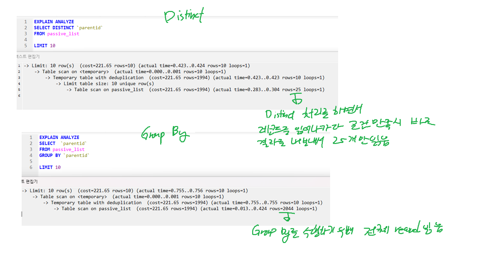

## Real MySQL 8.0 2

### 쿼리 작성과 최적화

#### SQL mode 변수
- `STRICT_ALL_TABLE` , `STRICT_TRANS_TABLE` : MySQL에서 INSERT나 UPDATE로 데이터를 추가하거나 변경할 때, 컬럼 타입과 저장되는 타입이 다를 경우 자동으로 타입 변경을 수행하는데, 타입 변경에 실패했을 시 에러를 발생시킬 것인지 결정  
전자는 모든 테이블에 대해 Strict mode를, 후자는 transaction이 지원되는 스토리지 엔진의 테이블에만 strict 모드를 적용
- `ANSI_QUOTES` : ANSI SQL 표준에 따라 `'`, `"`를 구분하는 모드
- `NO_ZERO_DATE` , `NO_ZERO_IN_DATE` : 0000-00-00 , 2000-00-00 등의 잘못된 날짜를 저장 불가능
- `ONLY_FULL_GROUP_BY` : GROUP BY 절에 있는 모든 컬럼이 SELECT 절에 있어야 함
- `PIPES_AS_CONCAT` : `||` 연산자를 `AND`와 동일하게 사용하지 못하도록 제한함
- `IGNORE_SPACE` : MySQL의 프로시저나 함수 이름 뒤의 공백을 무시하도록 함
- `PAD_CHAR_TO_FULL_LENGTH` : CHAR 타입의 컬럼값을 가져올 때 공백을 제거하지 않도록 함
- `NO_BACKSLASH_ESCAPES` : 백슬래시를 이스케이프 문자로 사용하지 않도록 함
- `REAL_AS_FLOAT` : REAL 타입을 FLOAT 타입으로 취급하도록 함 (원래는 DOUBLE로 취급)
- `ANSI` : 최대한 ANSI SQL 표준을 따르도록 함


#### MySQL의 연산자와 내장 함수
##### 문자열
- 문자열은 SQL 표준에서는 반드시 `'`를 사용해야 하지만, MySQL에서는 `"`도 사용 가능
- 또한 식별자를 감쌀 때 MySql은 \` 를 사용하고, SQL 표준은 `"`를 사용

##### 숫자
- 숫자는 따옴표 등으로 감싸지 않고 그대로 입력
- 따옴표로 감싼 경우에는 문자열로 인식
  - 단 비교대상이 숫자와 문자열로 다른 경우, MySQL은 자동으로 문자열을 숫자로 형변환을 해서 비교를 수행
  - 형변환을 하기 때문에, 문자열 index를 숫자로 비교할 경우 index를 사용하지 못함
```sql
SELECT * FROM `table` WHERE string_index = 1; -- index를 사용하지 못함
```
##### 날짜
- 문자열을 굳이 date 타입으로 변환하지 않아도, 정해진 날짜 포맷으로 입력하면 자동으로 DATE나 DATETIME으로 형변환 처리됨
- 수동으로 변환할 경우 다음과 같이 입력 : `STR_TO_DATE('2024-10-06', '%Y-%m-%d')`

##### Boolean
- Boolean 타입은 실제로는 TINYINT(1) 타입으로 저장됨
- TRUE나 FALSE로 값을 비교하거나 저장할 수 있지만, 실제로 true는 1, false는 0으로 저장됨
- 2 이상은 TRUE로 간주되지 않음

##### MySQL 연산자
- 동등 비교
  - `=` : 같은지 비교. Null이 있다면 결과값은 null이 리턴된다
  - `<=>` : Null-safe하게 비교
- 부정 비교
  - `!=`, `<>` : 같지 않은지 비교
- 논리 연산자
  - `AND`, `&&` : 논리곱
  - `OR`, `||` : 논리합
  - `NOT`, `!` : 부정
  - AND와 OR가 동시에 사용시 AND가 우선순위를 가짐
- 나누기와 나머지
  - `/` : 나누기
  - `%` : 나머지
- REGEXP 연산자
  - `REGEXP` : 정규표현식을 사용한 비교. `POSIX` 표준을 따름
  - WHERE 조건에 사용시 인덱스를 사용할 수 없다
- Like 연산자
  - `LIKE` : 패턴 매칭을 위한 연산자
    - `%` : 0개 이상의 문자열을 의미
    - `_` : 1개의 문자를 의미
  - REGEXP와 달리, 와일드카드 문자가 검색어 맨 뒤에만 존재한다면 인덱스 레인지 스캔을 사용할 수 있음
- Between 연산자
  - `BETWEEN` : 범위를 지정하여 비교
    - `A BETWEEN B AND C` : A가 B와 C 사이에 있는지 비교
      - 내부적으로 A >= B AND A <= C로 변환되어 실행
- IN 연산자
  - `IN` : 여러 값 중 하나와 일치하는지 비교
    - `A IN (B, C, D)` : A가 B, C, D 중 하나와 일치하는지 비교
      - 내부적으로 A = B OR A = C OR A = D로 변환되어 실행
    - 8.0버전부터는 IN 내에 튜플을 사용해도 인덱스를 사용할 수 있도록 개선됨
##### MySQL 내장 함수
- MySQL의 내장 함수이므로, 다른 DBMS에서는 기본적으로 호환되지 않음
- 기본적으로 제공하는 내장 함수와, 사용자가 추가 가능한 사용자 정의 함수가 존재


- Null 값 비교 : `IFNULL`, `ISNULL`
  - `IFNULL` : 첫 번째 인자가 NULL이면 두 번째 인자를 반환
  - `ISNULL` : 인자가 NULL이면 1을 반환
- 현재 시각 조회 : `NOW`, `SYSDATE`
  - `NOW` : 현재 시각을 반환. 단 하나의 SQL에서 모든 NOW 함수는 같은 값을 반환
  - `SYSDATE` : 현재 시각을 반환. 단 호출될 때마다 다른 값을 반환
    - 이러한 특성 때문에 레플리카 서버에서 문제가 생길 수 있고, index를 효율적으로 사용하지 못할 수 있다
    - `sysdate_is_now` 시스템 변수를 0으로 설정하면 NOW와 동일하게 동작
- 날짜, 시간 포맷 : `DATE_FORMAT`, `STR_TO_DATE`
  - `DATE_FORMAT` : 날짜나 시간을 원하는 포맷의 문자열로 변환
    - 시간 지정자는 `%`로 시작하며, 대소문자를 구분하며, 일반적인 시간 지정자와 비슷
  - `STR_TO_DATE` : 문자열을 날짜나 시간으로 변환
    - 첫 번째 인자는 변환할 문자열, 두 번째 인자는 변환할 포맷
- 날짜, 시간 연산 : `DATE_ADD`, `DATE_SUB`
  - `DATE_ADD`, `DATE_SUB` : 날짜나 시간에 일정 시간을 더하거나 뺄 때 사용
    - 첫 번째 인자는 날짜나 시간, 두 번째 인자는 더하거나 뺄 시간, 세 번째 인자는 시간 단위
- 타임스탬프 연산 : `UNIX_TIMESTAMP`, `FROM_UNIXTIME`
  - `UNIX_TIMESTAMP` : 날짜나 시간을 timestamp로 변환
  - `FROM_UNIXTIME` : timestamp를 날짜나 시간으로 변환
- 문자열 처리 : `RPAD`, `LPAD`, `TRIM`, `CONCAT`, `SUBSTRING`, `REPLACE`
  - `RPAD`, `LPAD` : 문자열을 오른쪽, 왼쪽으로 지정한 길이만큼 지정된 문자로 채움
  - `TRIM` : 문자열의 앞뒤 공백을 제거
  - `CONCAT` : 여러 문자열을 합침
  - `SUBSTRING` : 문자열의 일부를 추출
  - `REPLACE` : 문자열의 일부를 다른 문자열로 대체
- GROUP BY 문자열 결합 : `GROUP_CONCAT`
  - `GROUP_CONCAT` : GROUP BY로 묶인 결과를 문자열로 결합
    - 첫 번째 인자는 결합할 컬럼, 두 번째 인자는 구분자
- 값의 비교와 대체 : `IF`, `CASE`
  - `IF` : 조건에 따라 값을 반환
    - 첫 번째 인자는 조건, 두 번째 인자는 조건이 참일 때 반환할 값, 세 번째 인자는 조건이 거짓일 때 반환할 값
  - `CASE` : 조건에 따라 값을 반환
    - `CASE`로 시작하고, `END`로 끝남
    - `WHEN`으로 조건을 지정하고, `THEN`으로 반환할 값을 지정
    - `ELSE`로 조건에 맞는 값이 없을 때 반환할 값을 지정
- 타입 변환 : `CAST`, `CONVERT`
  - `CAST`, `CONVERT` : 데이터 타입을 변환
    - `CASE(값 AS 타입)`으로 사용
    - `CONVERT(값, 타입)`, `CONVERT(값 USING 문자집합)`으로 사용
- 이진값, 16진수 문자열 변환 : `BIN`, `HEX`
  - `BIN` : 숫자를 이진값으로 변환
  - `HEX` : 숫자를 16진수 문자열로 변환
- 암호화, 해시 함수 : `MD5`, `SHA1`, `SHA2`
  - `MD5`, `SHA1`, `SHA2` : 문자열을 암호화
    - `MD5`는 128비트 해시값을 반환
    - `SHA1`은 160비트 해시값을 반환
    - `SHA2`는 사용된 인자의 두 배의 길이를 반환
  - 이들은 비대칭형 암호화 알고리즘이고 중복 가능성이 낮아서, 해싱 함수처럼 사용 가능
  - 이 때, 해싱한 값을 바이너리나 16진수 문자열로 저장하면 그 길이를 줄일 수 있음
  - 함수 기반 인덱스를 사용해서 자동으로 해싱된 인덱스를 사용할 수 있음
- 처리 대기 : `SLEEP`
  - `SLEEP` : 지정한 시간만큼 대기
  - `BENCHMARK` : 지정한 횟수만큼 반복해서 처리 시간을 측정
- IP 주소 변환 : `INET_ATON`, `INET_NTOA`
  - `INET_ATON` : IP 주소를 숫자로 변환
  - `INET_NTOA` : 숫자를 IP 주소로 변환
- JSON FORMAT :
  - `JSON_OBJECT` : 키와 값을 JSON 객체로 변환
  - `JSON_ARRAY` : 값을 JSON 배열로 변환
  - `JSON_OBJECTAGG` : GROUP BY로 묶인 결과를 JSON 객체로 변환
  - `JSON_ARRAYAGG` : GROUP BY로 묶인 결과를 JSON 배열로 변환
  - `JSON_EXTRACT` : JSON 객체나 배열에서 특정 값을 추출
  - `JSON_PRETTY` : JSON을 pretty print
  - `JSON_STORAGE_SIZE` : JSON 데이터의 저장 크기를 반환
  - `JSON_CONTAINS` : JSON 객체나 배열에 특정 값이 포함되어 있는지 확인
  - `JSON_TABLE` : JSON 객체나 배열을 테이블로 변환

#### SELECT
- SELECT는 대개 다음과 같은 순서로 실행된다
  1. FROM: 데이터를 가져올 테이블을 지정하고, JOIN을 실행
  2. WHERE: 조건에 맞는 데이터를 추출
  3. GROUP BY: 그룹화
  4. DISTINCT: 중복 제거
  5. HAVING: 그룹화된 데이터에 조건을 적용
  6. ORDER BY: 정렬
  7. LIMIT: 결과의 개수를 제한
- ORDER BY만 존재하며 드라이빙 테이블을 먼저 정렬하고 JOIN하는 것이 유리한 경우, 드라이빙 테이블에서 먼저 ORDER BY를 실행하고 JOIN을 처리하는 경우도 있다

#### WHERE
- 적절한 index 사용을 위해서, where 절에서는 비교하는 상수 값을 형변환하고, 컬럼은 변경하지 않아야 한다
- 여러 조건문에 대해 short circuit evaluation이 사용되므로, 구체적이고 간단한 조건일수록 먼저, 서브쿼리가 있거나 복잡할수록 나중에 조건을 작성하는 쪽이 더 유리하다
  - index를 사용할 수 있는 조건이라면, 실행 계획 작성 시 알아서 우선 사용하므로 인덱스에 따른 순서는 신경쓰지 않아도 된다

#### LIMIT을 사용했을 때 DISTINCT와 GROUP BY의 차이
이전에 인덱스를 사용하지 않는 GROUP BY는 ORDER BY를 명시적으로 사용하지 않아서 DISTINCT와 내부적으로 동일하다고 메모했었는데, LIMIT를 사용할 경우에는 달라지게 된다  
GROUP BY를 사용할 경우, 쿼리의 결과를 풀 스캔하고, 이후 GROUP BY를 처리하고, 이후 LIMIT 처리를 수행한다  
반면 DISTINCT를 사용할 경우, 레코드를 읽어들이면서 동시에 DISTINCT 처리를 수행하고, 이 결과가 LIMIT에서 요구하는 개수를 만족할 경우 더 이상 테이블을 스캔하지 않고 결과를 내보낸다.  


#### LIMIT의 주의사항
- LIMIT는 결과를 제한하지만, 결과를 제한하기 위해 모든 데이터를 읽어들인 후에 결과를 제한한다
- 즉 LIMIT 0, 10과 LIMIT 100000, 10은 둘 다 레코드를 10개만 반환하지만, 전자는 10개만 읽고 후자는 100010개를 읽어야 한다
- 따라서 Paging을 할 경우 LIMIT만 사용하는 것이 아니라, 이전 값의 index나 order by에 사용된 컬럼을 활용해서, 다음 페이지의 시작 부분을 찾고 limit 0, n을 거는 것이 바람직하다

#### JOIN의 인덱스와 순서
- JOIN시 두 테이블의 조인 쿼리에서 사용되는 컬럼의 인덱스 여부에 따라, 드라이빙 테이블과 드리븐 테이블이 지정되는 경우가 달라진다
  - 양쪽 다 인덱스가 있는 경우, 테이블의 통계 정보에 따라 적절하게 선택된다
  - 한쪽에만 인덱스가 있는 경우, 없는 쪽이 드라이빙 테이블이 되고, 있는 쪽이 드리븐 테이블이 된다.  
이유는 드리븐 테이블이 드라이빙 테이블의 컬럼 수만큼 테이블에서 검색해서 레코드를 가져와야 하기 때문이다.  
드리븐 테이블에 인덱스가 없다면 계속해서 풀 스캔이 필요하기에 불리해진다
  - 두 테이블 모두 인덱스가 없다면, 옵티마이저가 적적하게 드라이빙 테이블을 선택하고(컬럼이 적은 쪽이 보통 선택됨), 해시 조인으로 처리된다


- 조인 조건의 두 컬럼의 자료형이 다르다면, 두 컬럼 중 한 쪽을 형변환해서 비교를 수행하기에 역시 인덱스를 제대로 사용할 수 없게 된다
  - 문자열과 숫자를 비교하거나
  - 같은 문자열이지만 문자 집합이나 콜레이션이 다르거나,
  - 같은 숫자지만 Signed와 Unsigned가 다르거나
- 