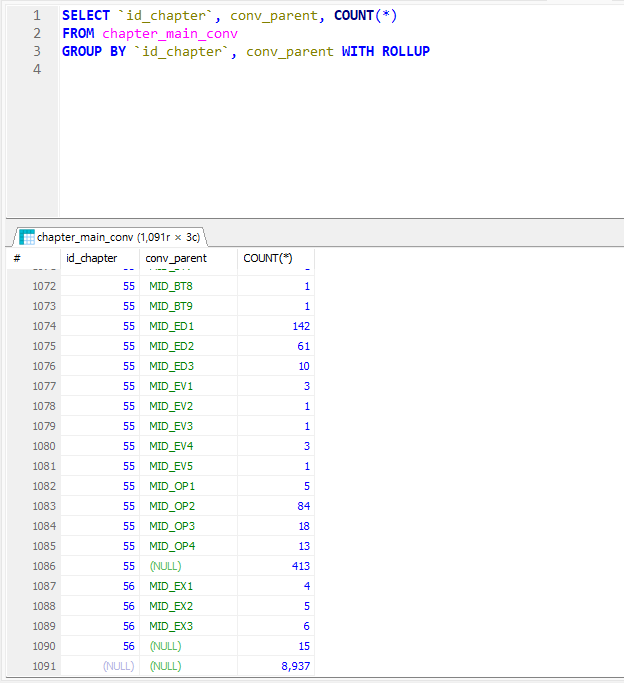
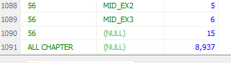

## Real MySQL 8.0 2

### 쿼리 작성과 최적화

#### Outer Join의 성능과 주의사항
- 아우터로 조인되는 테이블은 드라이빙 테이블로 선택되지 못해서 풀 스탠하여 조인될 확률이 높다
- 즉 이너 조인을 사용해도 되는 경우라면 아우터 조인을 사용하지 않는 쪽이 좋음
- 또한 outer join을 사용하면서 해당 테이블의 컬럼을 where 절에서 사용할 경우, 옵티마이저가 자동으로 이너 조인으로 변환해서 조인한다

#### JOIN 실행 계획에 따른 정렬 변화
- 기본적으로 쿼리의 결과는 드라이빙 테이블을 읽는 순서대로 정렬되기에, 네스티드 루프 조인을 실행 할 경우 드라이빙 PK의 index 순으로 정렬될 확률이 높다
- 단 실행 계획이 변경되면서 해시 조인으로 변경되어 드라이빙 테이블과 드리븐 테이블이 바뀐다면, 의도하지 않은 순서의 결과를 리턴할 수 있다
- 즉, 드라이빙 테이블의 PK로 반드시 정렬되지 않을 수 있으므로, 순서가 중요하다면 반드시 ORDER BY절을 생략해서는 안 된다

#### GROUP BY 
##### ROLL UP
- ROLL UP은 GROUP BY 절에 여러 개의 컬럼을 지정할 때, 지정된 컬럼들의 조합 각각에 대한 group by count 결과를 계산하는 기능
  
- 8.0부터는 그룹 레코드에 NULL 대신 사용자가 원하는 문자열을 지정하여 출력 가능
```sql
SELECT IF(GROUPING(`id_chapter`), "ALL CHAPTER", id_chapter) AS id_chapter,
       conv_parent, COUNT(*)
FROM chapter_main_conv
GROUP BY `id_chapter`, conv_parent WITH ROLLUP 
```


#### ORDER BY
- ORDER BY절이 없을 때 쿼리는 다음과 같은 순서로 정렬된다
  - 인덱스를 사용한 경우에는 인덱스 정렬 순서
  - 풀 테이블 스캔 실행 시, PK의 순서 (MyISAM의 경우는 테이블에 저장된 순서)
  - 임시 테이블을 거쳐 처리될 경우 예상할 수 없음
- ORDER BY 절이 없으면 쿼리의 실행 계획에 따라 결과 순서가 달라질 수 있으므로, 정렬이 필요하면 ORDER BY절을 사용하는 것이 좋다
- ORDER BY 뒤에 숫자를 입력하면, 해당 순번의 컬럼으로 정렬
- ORDER BY 뒤에 문자열 상수를 입력하면, 무시됨
- 8.0부터는, ORDER BY절에 함수 기반의 인덱스도 사용 가능

#### 서브쿼리
- SELECT 절의 서브쿼리 : 컬럼과 레코드가 하나인 결과를 반환해야 함. 단 레코드가 0건이라면 대신 NULL이 입력됨 (MySQL 에서)
- FROM절의 서브쿼리 : 5.6까지는 서브쿼리의 결과를 임시 테이블로 저장하여 처리했으나, 5.7부터는 FROM 절의 서브쿼리를 외부 쿼리로 병합하는 최적화를 진행  
- WHERE 절의 서브쿼리 : 
  - 동등, `<>` 비교 시 : 서브쿼리를 먼저 실행하여 상수 값으로 변환하고, 나머지 쿼리를 처리 (5.5부터)
  - IN 비고 시 : 세미 조인이라고도 함
    - 테이블 풀 아웃, 퍼스트 매치, 루스 스캔, 구체화, 중복 제거 중 제일 유리한 것을 선택
  - NOT IN 비교 시 : 안티 세미 조인이라고도 함
    - NOT EXIST, 구체화 중에서 최적화를 수행

#### CTE (Common Table Expression)
- 이름을 가지는 임시 테이블, SQL문 내에서 한 번 이상 사용될 수 있다
- 재귀적 반복 실행 여부를 기준으로, NON RECURSIVE와 RECURSIVE로 나뉨

##### 비 재귀적 CTE
- CTE 쿼리는 WITH절로 정의하고, 이후 SELECT문에서 참조
- 동일한 서브 쿼리를 반복해서 사용할 경우, 원래는 반복할 때마다 서브쿼리를 실행하나, CTE를 사용하면 한 번만 실행하고 재사용 가능
- CTE 임시 테이블은 다른 CTE 쿼리에서 참조하는 것도 가능
```sql
WITH cte AS (
    SELECT * FROM chapter_main_conv
)

SELECT * FROM cte;
```

##### 재귀적 CTE
- 재귀적 CTE는 반복적으로 자기 자신을 참조하는 CTE
- 비 재귀적 쿼리 파트와 재귀적 쿼리 파트로 나뉘어지며, 이 둘은 UNION, 혹은 UNION ALL로 연결되는 형태
```sql
WITH RECURSIVE cte (no) AS (
    SELECT 1
    UNION ALL
    SELECT (no + 1) FROM cte WHERE no < 5
)

SELECT * FROM cte;
```

- 다음과 같은 순서로 실행
  1. 비 재귀적 쿼리 파트 실행해 임시 테이블에 저장
  2. 재귀적 쿼리 파트 실행해 임시 테이블에 저장 (이 때, 임시 테이블은 비 재귀적 쿼리 파트의 결과를 참조)
  3. 재귀적 쿼리 파트의 결과가 0건이면 종료
  4. 재귀적 쿼리 파트의 결과가 1건 이상이면, 전 단계의 결과를 입력으로 사용해 2번으로 돌아가 반복
- CTE 임시 테이블의 구조는 비 재귀적 쿼리 파트의 결과로 결정
- 비 재귀적 쿼리 파트의 실행 때는, 직전 단계의 쿼리 파트의 결과만 재귀 쿼리의 입력으로 사용됨
- 재귀 종료 조건을 만족하지 못할 경우, 무한 루프에서 벗어날 수 있도록 최대 반복 실행 횟수를 제한하는 시스템 변수 `cte_max_recursion_depth`가 존재

#### 윈도우 함수
- 현재 레코드를 기준으로 연관된 레코드 집합에 대한 연산을 수행하는 함수
- 집계함수는 GROUP BY별로 하나의 레코드로 묶어서 출력하나, 윈도우 함수는, 조건에 일치하는 레코드 건수가 유지된다는 차이가 있음
- WHERE, FROM, GROUP BY, HAVING절이 실행된 수, 윈도우 함수가 실행되고, 이후 SELECT, ORDER BY, LIMIT절이 실행됨
- 윈도우 함수는 OVER절을 사용해 정의
```sql
SELECT
    id_chapter,
    conv_parent,
    RANK() OVER(PARTITION BY id_chapter ORDER BY conv_mid) AS cnt
    FROM chapter_main_conv;
```

##### OVER
- 윈도우 함수의 정의를 위해 사용
- OVER에 의해 만들어진 그룹을 윈도우, 혹은 파티션이라고 부름
- PARTITION BY : 파티션을 나누는 기준
- ORDER BY : 정렬 기준
- FRAME : 윈도우 함수의 범위를 지정
  - ROWS : 레코드의 위치를 기준으로 프레임 생성
  - RANGE : ORDER BY 컬럼을 기준으로 한 값의 범위로 프레이 ㅁ생성
  - 프레임에서 사용되는 키워드
    - UNBOUNDED PRECEDING : 프레임의 시작을 나타냄
    - UNBOUNDED FOLLOWING : 프레임의 끝을 나타냄
    - CURRENT ROW : 현재 레코드를 나타냄
    - n PRECEDING : 현재 레코드로부터 n개 이전 레코드를 나타냄
    - n FOLLOWING : 현재 레코드로부터 n개 이후 레코드를 나타냄
      - n : ROWS라면 레코드의 위치를 명시, RANGE라면 컬럼과 비교할 값을 명시
      - `ORDER BY date ROWS BETWEEN 1 PRECEDING AND 1 FOLLOWING` : 현재 레코드의 이전 레코드와 이후 레코드를 포함한 프레임을 생성
      - `ORDER BY date RANGE BETWEEN INTERVAL '1' DAY PRECEDING AND INTERVAL '1' DAY FOLLOWING` : 현재 레코드의 이전 날짜와 이후 날짜를 포함한 프레임을 생성

##### 윈도우 함수 종류
집계 함수  
- AVG : 평균값
- BIT_AND : 비트 AND 연산
- BIT_OR : 비트 OR 연산
- BIT_XOR : 비트 XOR 연산
- COUNT : 레코드 수
- JSON_ARRAYAGG : 결과를 JSON 배열로 생성
- JSON_OBJECTAGG : 결과를 JSON 객체로 생성
- MAX : 최대값
- MIN : 최소값
- STDDEV_POP, STDDEV, STD : 표준편차값
- STDDEV_SAMP : 표본 표준편차값
- SUM : 합계
- VAR_POP, VARIANCE : 분산값
- VAR_SAMP : 표본 분산값

비 집계 함수  
- CUME_DIST : 누적 분포값
- DENSE_RANK : 밀집 순위값 (GAP없음 : 동일한 값은 동일한 순위를 매기고, 다음 값은 해당 순위보다 1 높게 반환)
- FIRST_VALUE : 첫 번째 값
- LAG(col, N, default) : N번째 이전 레코드의 값
- LAST_VALUE : 마지막 값
- LEAD(col, N, default) : N번째 이후 레코드의 값
- NTH_VALUE : N번째 값
- NTILE : 전체 레코드를 N개의 그룹으로 나눔
- PERCENT_RANK : 백분율 순위값
- RANK : 순위값 (GAP 존재)
- ROW_NUMBER : 레코드 순번

#### Lock을 사용하는 SELECT
- FOR SHARE : 쿼리로 읽은 레코드에 대해 읽기 잠금을 검
- FOR UPDATE : 쿼리로 읽은 레코드에 대해 쓰기 잠금을 걸음
- JOIN 사용 시, 기본적으로는 읽은 모든 테이블에 대해 락이 걸린다
  - OF `table` 절을 추가해서 특정 테이블만 잠금을 걸 수 있다
- NOWAIT 옵션 : 해당 레코드에 대해 잠금을 걸 수 없을 때, 즉시 오류를 반환
- SKIP LOCKED 옵션 : 해당 레코드에 대해 잠금을 걸 수 없을 때, 해당 레코드를 건너뛰고 다음 레코드에 대해 잠금을 걸 수 있도록 함  
잠긴 레코드는 무시하고 잠기지 않은 레코드만 가져온 후 락을 건다  
따라서 Skip locked 옵션을 사용한 SELECT 절은 확정적이지 않은 (NOT-DETERMINISTIC) 쿼리가 된다 (다른 트랜잭션의 상태에 따라 다른 결과를 반환)

#### INSERT
- INSERT IGNORE : PK나 UK 제약 조건에 위배되는 레코드는 무시하고 나머지 레코드만 삽입
- INSERT ... ON DUPLICATE KEY UPDATE : PK나 UK 제약 조건에 위배되는 레코드는 UPDATE 절을 실행하고, 아닐 경우 INSERT 문을 실행

#### UPDATE/DELETE
- UPDATE ... ORDER BY ... LIMIT n : ORDER BY로 정렬된 n개의 레코드만 업데이트  
레플리케이션 서버에서는 값의 순서가 달라질수도 있으므로 ORDER BY를 사용한 레코드의 갱신에는 주의가 필요하다고 한다
- JOIN UPDATE : 두 개 이상의 테이블을 조인한 결과 레코드를 변경하거나 삭제  
  - 읽기 참조만 되는 테이블 쪽은 읽기 락이, 컬럼이 변경되는 테이블은 쓰기 잠금이 걸린다
  - 데드락을 유발할 가능성이 높으므로 웹 서비스용 데이터베이스에는 사용하지 않는 것이 좋음
```sql
UPDATE parent, child
SET parent.childName = child.childName
WHERE parent.childId = child.childId;
```

- JOIN DELETE : 조인의 결과를 활용해서 삭제. JOIN에 성공한 레코드에 대해 조건에 맞는 결과를 명시한 테이블에서 삭제
```sql
DELETE parent
FROM parent, child
WHERE parent.childId = child.childId AND child.childId = 1;
```
