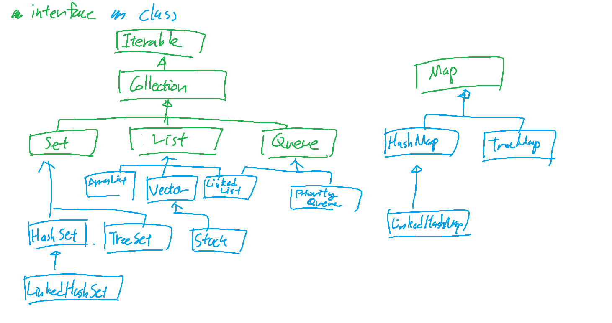

## 자바의 신 2

### Collection Framework



#### List
- 순서가 있는 데이터의 집합
- ArrayList, LinkedList, Vector, Stack 등의 구현체가 있다
  - Vector는 Thread-safe한 List
  - ArrayList는 Vector와 비슷하나 Thread-safe하지 않음
  - Stack은 Vector를 상속받아 구현된 클래스로 LIFO(Last In First Out) 구조
  - LinkedList는 이중 연결 리스트 구조로, 데이터의 추가, 삭제가 빠르다

##### ArrayList
- Serializable, Cloneable, Iterable, Collection, List, RandomAccess 인터페이스를 구현
  - Clonable: 객체를 복제할 수 있게 해주는 인터페이스
  - Iterable: 객체를 내부 요소를 반복할 수 있게 해주는 인터페이스
  - RandomAccess: 목록형 데이터에 빠르게 접근할 수 있도록 랜덤하게 접근할 수 있게 해주는 인터페이스

- 배열 기반의 List로, 생성 시 내부적으로 배열을 생성
- 배열의 크기를 초과할 경우, 새로운 배열을 생성하고 기존 배열의 데이터를 복사하는 방식으로 구현


- 생성자
  - ArrayList(): 초기 용량(capacity)이 10인 ArrayList 생성
  - ArrayList(int initialCapacity): 초기 용량이 initialCapacity인 ArrayList 생성
  - ArrayList(Collection<? extends E> c): 지정된 Collection 객체의 요소를 가진 ArrayList 생성
- 삽입 메소드
  - add(E e): 마지막에 요소 추가
  - add(int index, E element): 지정된 위치에 요소 추가
    - index가 size보다 크면 IndexOutOfBoundsException 발생
  - addAll(Collection<? extends E> c): 마지막에 Collection의 모든 요소 추가
  - addAll(int index, Collection<? extends E> c): 지정된 위치에 Collection의 모든 요소 추가
- 조회 메소드
  - size(): 요소의 개수 반환
  - get(int index): 지정된 위치의 요소 반환
  - indexOf(Object o): 지정된 객체의 위치 반환
  - lastIndexOf(Object o): 지정된 객체의 마지막 위치 반환
  - toArray(): Object 배열로 변환
  - toArray(T[] a): 지정된 배열 형식으로 요소를 복사
    - new T[0]으로 매개 변수를 전달하면, 객체의 size에 맞게 배열을 생성해서 반환해줌
- 삭제 메소드
  - clear(): 모든 요소 삭제
  - remove(int index): 지정된 위치의 요소 삭제 후, 삭제한 요소 반환
  - remove(Object o): 지정된 객체 삭제
  - removeAll(Collection<?> c): 지정된 Collection 객체에 있는 요소와 동일한 모든 요소 삭제
- 수정 메소드
  - set(int index, E element): 지정된 위치의 요소를 새로운 요소로 대체 후, 이전 요소를 반환

##### Stack
- Vector를 상속받아 구현된 클래스
  - Thread-safe한 List
  - Thread-safe할 필요가 없다면, ArrayDeque를 사용하면 됨
- LIFO(Last In First Out) 구조
- 메소드
  - empty(): Stack이 비어있는지 확인
  - peek(): Stack의 맨 위 요소 반환
  - pop(): Stack의 맨 위 요소를 반환하고, Stack에서 제거
  - push(E item): Stack의 맨 위에 요소 추가
  - search(Object o): Stack에서 지정된 객체의 위치 반환

#### Set
- 순서가 없는 데이터의 집합
- 중복을 허용하지 않음
- 값이 존재하는지 여부만 필요하거나, 여러 요소 중 중복을 제거할 때 사용
- HashSet, TreeSet, LinkedHashSet 등의 구현체가 있다
  - HashSet: 해시 테이블을 사용하여 구현된 Set
  - TreeSet: Red-Black 트리를 사용하여 구현된 Set. Tree를 사용하므로 요소는 정렬된 순서로 저장된다
    - Red-Black Tree : 이진 트리의 일종으로, 노드를 black, red중 하나로 지정하여 트리의 균형을 맞춘다  
또한 루트 노드와 NIL (null 리프 노드)는 블랙이며, 레드 노드는 레드 노트를 자식으로 가질 수 없다는 규칙을 가진다  
따라서 루트로부터 어떠한 리프까지 가는 경로중 가장 짧은 경로와 가장 긴 경로는 2배 이상의 차이가 날 수 없어서, 균형을 유지하게 된다고 한다  
이에 따라 삽입/삭제 시 O(logN)의 시간복잡도를 보증한다
  - LinkedHashSet: 해시 테이블과 연결 리스트를 사용하여 구현된 Set. 저장 순서에 따라 값이 정렬된다

##### HashSet
- 데이터가 같은 지 여부를 판단하기 위해 hashCode()와 equals() 메소드를 순서대로 호출하여 판단
- 생성자
  - HashSet(): 초기 용량(capacity)이 16, load factor가 0.75인 HashSet 생성
  - HashSet(int initialCapacity): 초기 용량이 initialCapacity인 HashSet 생성
  - HashSet(int initialCapacity, float loadFactor): 초기 용량이 initialCapacity, load factor가 loadFactor인 HashSet 생성
  - HashSet(Collection<? extends E> c): 지정된 Collection 객체의 요소를 가진 HashSet 생성
    - 로드 팩터 : 데이터의 개수 / 저장 공간 의 값  
데이터의 개수가 늘어나 로드 팩터보다 커지면, 저장 공간을 하나 추가하고 해시 재정리 작업을 처리하게 된다
- 메소드
  - add(E e): 요소 추가
  - clear(): 모든 요소 삭제
  - clone(): HashSet 객체를 복사하지만, 담겨있는 데이터는 복제하지 않음
    - 객체는 깊은 복사되지만, 담겨있는 객체는 얕은 복사가 된다는 뜻. 내부 객체까지 깊은 복사를 하려면 이하와 같이 처리해야 함
      - 내부 객체 클래스에 Cloneable을 구현해서 깊은 복사를 하도록 clone 메소드를 구현
      - 객체를 직렬화해서, 직접 하나씩 객체를 깊은 복사해서 목표 객체에 add해 준다
  - contains(Object o): 지정된 객체가 HashSet에 있는지 확인
  - isEmpty(): HashSet이 비어있는지 확인
  - iterator(): HashSet의 Iterator 반환
  - remove(Object o): 지정된 객체 삭제
  - size(): 요소의 개수 반환

##### Queue
- FIFO(First In First Out) 구조
- 인터페이스로, 구현체로는 LinkedList, PriorityQueue 등이 있다
  - LinkedList: List와 Queue, Deque의 기능을 모두 가지고 있는 클래스
  - PriorityQueue: 우선순위 큐로, 우선순위가 높은 요소가 먼저 나오는 큐

##### LinkedList
- List와 Queue, Deque의 기능을 모두 가지고 있는 클래스
  - List, Queue, Deque 인터페이스를 모두 구현하고 있다
- 생성자
  - LinkedList(): 빈 LinkedList 생성
  - LinkedList(Collection<? extends E> c): 지정된 Collection 객체의 요소를 가진 LinkedList 생성
- 삽입 메소드
  - addFirst(E e), offerFirst(E e), push(E e): 맨 앞에 요소 추가
  - add(E e), offer(E e), addLast(E e), offerLast(E e): 맨 뒤에 요소 추가
  - add(int index, E element): 지정된 위치에 요소 추가
  - set(int index, E element): 지정된 위치의 요소를 새로운 요소로 대체
  - addAll(Collection<? extends E> c): 지정된 Collection 객체의 요소를 LinkedList에 추가
  - addAll(int index, Collection<? extends E> c): 지정된 위치에 지정된 Collection 객체의 요소를 추가
- 조회 메소드
  - getFirst(), peekFirst(), peek(), element() : 맨 앞 요소 반환
  - getLast(), peekLast(): 맨 뒤 요소 반환
  - get(int index): 지정된 위치의 요소 반환
  - indexOf(Object o): 지정된 객체의 위치 반환, 없을 시 -1 리턴
  - lastIndexOf(Object o): 지정된 객체의 마지막 위치 반환, 없을 시 -1 리턴
  - contains(Object o): 지정된 객체가 LinkedList에 있는지 확인
- 삭제 메소드
  - remove(), removeFirst(), poll(), pollFirst(), pop() : 맨 앞 요소 삭제 후 리턴
  - pollLast(), removeLast(): 맨 뒤 요소 삭제 후 리턴
  - remove(Object o), removeFirstOccerence(Object o): 지정된 객체 중 제일 앞의 객체 삭제
  - remove(int index): 지정된 위치의 요소 삭제
  - removeLastOccurrence(Object o): 지정된 객체 중 제일 뒤의 객체 삭제
- Iterator 객체
  - listIterator(int index): 지정된 위치부터 시작하는 ListIterator 반환
  - descendingIterator(): 역순으로 Iterator 반환

#### Map
- key-value 쌍으로 이루어진 데이터 구조
- 이하와 같은 특징을 가진다
  - key, value는 반드시 존재한다
  - key는 중복될 수 없다
  - value는 중복될 수 있다
- 주요 메소드
  - put(K key, V value): key-value 쌍 추가
  - putAll(Map<? extends K, ? extends V> m): 매개변수로 입력된 Map의 모든 요소를 추가
  - get(Object key): key에 해당하는 value 반환
  - remove(Object key): key에 해당하는 key-value 쌍 삭제
  - Set<K> keySet(): key 집합을 Set 자료형으로 반환
  - Collection<V> values(): value 집합을 Collection 자료형으로 반환
  - Set<Map.Entry<K, V>> entrySet(): key-value 쌍 집합을 (=Entry) Set 자료형으로 반환

- 주로 HashMap, TreeMap, LinkedHashMap이 사용된다
##### HashTable
- HashMap과 동일한 기능을 가지지만, Thread-safe함
- HashMap은 AbstractMap을 상속받아 구현되어 있지만, HashTable은 Dictionary 클래스를 상속받아 구현되어 있다
- Collection 프레임워크가 도입되기 전부터 존재하던 클래스라, 컬렉션 프레임워크의 명명법을 따르지 않는다
- 하위호환을 위해 설계만 일부 변경되어 남아있는 클래스라, HashMap을 대신 사용하는 것을 권장한다고 함
- HashMap과의 차이점
  - HashMap은 null key를 허용하지만, HashTable은 허용하지 않는다
  - HashMap은 비동기적이지만, HashTable은 동기적이다
    - 동기적인 ConcurrentHashMap이 Collection 프레임워크에 존재하므로 해당 자료형을 사용하는 것을 권장한다
  - HashMap은 Iterator를 사용할 수 있지만, HashTable은 Enumeration (Not fail-fast Enumeration)을 사용해야 한다
    - Enumeration은 Iterator의 이전 버전이다
    - Not fail-fast Enumeration : 컬렉션의 내용이 변경되어도 예외를 발생시키지 않는다

##### HashMap
- key-value 쌍으로 이루어진 데이터 구조
- 삽입된 순서를 보장하지 않는다
- 생성자
  - HashMap(): 16개의 저장 공간을 갖는 HashMap 생성
  - HashMap(int initialCapacity): 초기 용량을 지정한 HashMap 생성
  - HashMap(int initialCapacity, float loadFactor): 초기 용량과 load factor를 지정한 HashMap 생성
  - HashMap(Map<? extends K, ? extends V> m): 지정된 Map의 요소를 가진 HashMap 생성

##### TreeMap
- Key를 기준으로 정렬된 Map
- Key-Value 삽입 시마다 정렬하므로, 삽입 시에는 O(log n)의 시간복잡도를 가진다

### Thread
- 프로세스 : 운영체제로부터 자원을 할당받은 작업의 단위
  - 메모리에 올라가지 않은 정적인 상태인 "프로그램"을 실행하면, 메모리에 올라가서 동적인 상태가 되고, 이를 프로세스라고 한다
  - 운영체제는 프로세스마다 독립된 메모리 영역을 할당하므로, 프로세스 간에는 서로의 메모리에 접근할 수 없다
- 스레드 : 프로세스가 할당받은 자원을 이용하는 실행의 단위
  - 프로세스의 자원을 공유하며, 프로세스에 정의된 절차에 따라 실행되는 특정한 작업
  - 스레드는 프로세스 내의 공유 자원 (Code, Data, Heap)을 다른 스레드와 공유하여 사용하므로, 프로세스 내의 스레드들은 서로 독립적이지 않다 (스레드는 각각 stack만 독립적으로 가진다)

#### Runnable 인터페이스와 Thread 클래스
- Java에서 Thread를 생성하기 위해서는, Runnable 인터페이스를 구현하거나, Thread 클래스를 상속받아 run() 메소드를 오버라이딩해야 한다
- 스레드를 시작하는 start 메소드를 실행하면, 구현한 run 메소드가 실행된다
```java
public class MyThread extends Thread {
    public void run() {
        System.out.println("MyThread is running");
    }
}

public class MyRunnable implements Runnable {
    public void run() {
        System.out.println("MyRunnable is running");
    }
}

public class Main {
    public static void main(String[] args) {
        MyThread myThread = new MyThread();
        myThread.start();
        MyRunnable myRunnable = new MyRunnable();
        new Thread(myRunnable).start();
    }
}
```

- 한 번에 스레드를 여러 개 실행하면, 이들은 순차적으로 실행되지 않으며 동시에 실행된다
  - 이에 따라 발생하는 것이 동시성 문제

#### Thread의 주요 메소드
- Static 메소드
  - sleep(long millis): 현재 스레드를 지정된 시간만큼 멈춘다
  - yield(): 현재 스레드를 실행 가능한 다른 스레드에게 양보한다
  - dumpStack(): 현재 스레드의 stack trace를 출력한다
  - activeCount(): 현재 실행 중인 스레드의 수를 반환한다
  - currentThread(): 현재 실행 중인 스레드 객체를 반환한다
- 스레드 통제 메소드
  - join(): 현재 스레드가 중지할 때까지 대기
  - join(long millis): 현재 스레드가 지정된 시간만큼 대기
  - interrupt(): 스레드를 중단시킨다
  - getState(): 스레드의 상태를 반환
    - NEW: 스레드가 생성되었지만, start() 메소드가 호출되지 않은 상태
    - RUNNABLE: 실행 중 또는 실행 가능한 상태
    - BLOCKED: 스레드가 실행 중지 상태이고, 모니터 락이 풀리기를 기다리는 상태
    - WAITING: 스레드가 대기중인 상태
    - TIMED_WAITING: 스레드가 지정된 시간 동안 대기 중인 상태
    - TERMINATED: 스레드가 종료된 상태
  - isAlive(): 스레드가 실행 중인지 여부를 반환
  - isInterrupted(): 스레드가 중단되었는지 여부를 반환 (interrupt() 메소드 호출로 중단되었는지 확인)
  - interrupted(): 스레드가 중지되었는지 확인
  - checkAccess(): 현재 수행중인 스레드가 해당 스레드를 수정할 권한이 있는지 여부를 확인
- non static 메소드
  - run(): 스레드가 실행할 작업을 정의
  - start(): 스레드를 실행
  - getId(): 스레드의 고유 식별자를 반환
  - getName(): 스레드의 이름을 반환
  - setName(String name): 스레드의 이름을 설정
  - getPriority(): 스레드의 우선순위를 반환
  - setPriority(int newPriority): 스레드의 우선순위를 설정
  - isDaemon(): 스레드가 데몬 스레드인지 여부를 반환
  - setDaemon(boolean on): 스레드를 데몬 스레드로 설정
    - 데몬 스레드란 수행 여부에 상관없이 JVM이 종료될 수 있는 스레드
  - getState(): 스레드의 상태를 반환
  - getStackTrace(): 스레드의 스택 트레이스를 반환
  - getThreadGroup(): 스레드의 스레드 그룹을 반환

#### Syncronized
- Java에서는 멀티 스레드 환경에서의 동시성 문제를 해결하기 위해, synchronized 키워드를 제공한다
- synchronized 키워드는, 메소드에 선언하거나, 메소드 내에 특정 부분만 감싸는 방식으로 사용할 수 있다
```java
int count = 0;
Object lock = new Object();
public synchronized void method() {
    count++;
}

public void method2() {
    synchronized(this) {
        count++;
    }
}

public void method3() {
    synchronized(lock) {
        count++;
    }
}
```

- Synchronized 키워드를 사용하면, 해당 메소드 또는 블록을 한 번에 하나의 스레드만 실행할 수 있도록 한다
- Synchronized 키워드를 사용하면, 동시성 문제를 해결할 수 있지만, 성능 저하를 가져올 수 있다
  - Synchronized 키워드를 사용하면, 해당 메소드 또는 블록을 실행하는 스레드가 끝날 때까지 다른 스레드는 대기해야 하기 때문
  - 이를 해결하기 위해, ReentrantLock 클래스를 사용할 수 있다
  - 메소드 내에서 반드시 동시성을 지켜야 할 부분만 synchronized 키워드를 사용하는 것이 좋다
- 메소드를 Synchronized할 때, 같은 객체를 참조해야만 유효하다
  - 두 개의 스레드가 서로 다른 객체를 참조한다면, Synchronized를 사용하지 않는 것과 동일하다

##### ReeentrantLock
- Syncronized 키워드와 비슷한 기능을 제공하지만 (자동으로 lock이 잠기고 풀림), 더 세밀한 제어가 가능하다
- lock 풀링을 지원하고, 타임 아웃을 지정 가능하며, condition을 지원해서 대기 중인 스레드를 선별적으로 깨울 수 있다
- 주요 메소드
  - lock(): lock을 획득
  - unlock(): lock을 해제
  - tryLock(): lock을 획득하려 시도 (lock pooling)
  - tryLock(long timeout, TimeUnit unit): lock을 획득하려 시도하되, 지정된 시간 동안 대기
  - isLocked(): lock이 획득되었는지 여부를 반환
```java
ReentrantLock lock = new ReentrantLock();
int count = 0;
lock.lock();
try {
    count++;
} finally {
    lock.unlock();
}
```

- condition은 스레드의 종류에 따라 구분된 waiting pool에서 따로 기다리도록 하여, 선별적으로 락의 해제를 통지할 수 있다고 한다

```java
ReentrantLock lock = new ReentrantLock();
Condition condition = lock.newCondition();

lock.lock();
try {
    condition.await();
} finally {
    lock.unlock();
}
```

- 또한, ReentrantLock은 공정한 lock 획득 방식을 지원한다
  - 공정한 lock 획득 방식은, 가장 오래 기다린 스레드가 먼저 락이 풀리는 방식
  - 다른 스레드에게 우선순위가 계속 밀려 자원을 오랜 기간 할당받지 못하는 기아 현상을 방지할 수 있음
  - 이를 위해, ReentrantLock 생성 시, 생성자에 true를 전달하면 된다
```java
ReentrantLock lock = new ReentrantLock(true);
```

#### Object 클래스의 wait(), notify(), notifyAll() 메소드
- wait(): 스레드를 일시 정지시키고, 다른 스레드가 notify() 또는 notifyAll() 메소드를 호출할 때까지 기다리게 한다
- wait(long timeout): wait() 메소드와 동일하지만, 지정된 시간이 지나면 스레드가 다시 실행된다
- notify(): wait() 메소드로 일시 정지된 스레드 중 하나를 runnable하게 만든다
- notifyAll(): wait() 메소드로 일시 정지된 모든 스레드를 runnable하게 만든다

#### ThreadGroup
- 스레드 그룹은 스레드를 묶어서 관리할 수 있는 단위이다
- 트리 구조를 가진다
- 주요 메소드
  - activeCount(): 활성화된 스레드의 수를 반환
  - activeGroupCount(): 활성화된 스레드 그룹의 수를 반환
  - enumerate(Thread[] list): 스레드 그룹에 속한 스레드를 배열에 담아 반환
  - enumerate(ThreadGroup[] list): 스레드 그룹에 속한 스레드 그룹을 배열에 담아 반환
  - getName(): 스레드 그룹의 이름을 반환
  - getParent(): 스레드 그룹의 부모 스레드 그룹을 반환
  - list(): 스레드 그룹에 속한 스레드와 스레드 그룹의 정보를 출력
  - setDaemon(boolean daemon): 스레드 그룹에 속한 스레드들을 데몬 스레드로 지정
