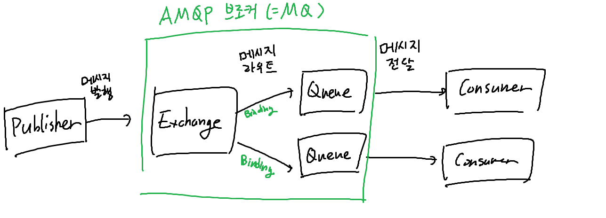
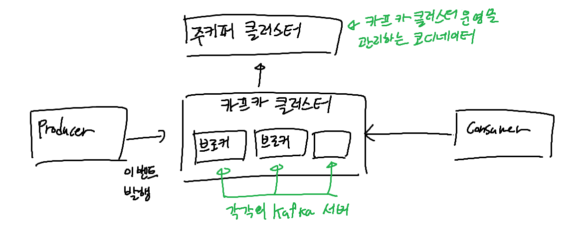

### Message Queue

#### 메시지 지향 미들웨어 (Message Oriented Middleware)
- 애플리케이션 간 비동기적 데이터 통신을 위한 미들웨어
  - 미들웨어 : 애플리케이션들을 연결해 서로 데이터를 주고받을 수 있게 해주는 소프트웨어
- 메시지를 통해, 여러 분산된 시스템을 연결해주는 역할을 담당해서, 소프트웨어간 결합성을 낮추고, 실시간으로 비동기식으로 데이터를 교환할 수 있도록 하는 소프트웨어를 의미

- 특징
  - 비동기 통신 : 메시지를 전달하는 시스템은 메시지를 전달받는 시스템의 상태와 관계없이 메시지를 전달할 수 있음
  - Queue, Broadcast, Multicast 등의 방식으로 메시지를 전달
    - Queue : 메시지를 순차적으로 전달
    - Broadcast : 메시지를 한번에 모든 시스템에 전달
    - Multicast : 메시지를 일부 시스템에 전달
  - 메시지를 발행하는 퍼블리셔와, 메시지를 소비하는 컨슈머로 구성

#### 메시지 큐
- 메시지 지향 미들웨어를 구현한 시스템
- producer와 consumer 사이의 메시지를 전달하는 매개체 역할을 함
  - producer, consumer로 구성되어, producer가 메시지를 큐에 넣고, consumer가 큐의 메시지를 꺼내어 처리하는 방식
- 비동기로 요청을 처리하고 queue에 저장해서, consumer의 병목현상을 줄일 수 있음
- 장점
  - 비동기 : 요청을 큐에 저장하고, consumer가 처리할 수 있을 때 처리
  - 비동조 : producer와 consumer를 분리할 수 있다 (결합성을 낮춤)
  - 과잉 : 정상적인 메시지 송/수신이 실패할 경우 재시도 가능
  - 보증 : 메시지가 처리되었음을 보장할 수 있다
  - 확장성 : producer, consumer를 유동적으로 추가할 수 있다
  - 탄력성 : consumer가 처리할 수 없을 때, 큐에 메시지를 저장하고, 나중에 처리 가능

##### 메시지 브로커와 이벤트 브로커
- 데이터를 운반하는 방식에 따라, `메시지 브로커`와 `이벤트 브로커` 로 나뉜다
- 메시지 브로커
  - producer가 메시지를 생성하여 브로커에게 보내고, consumer가 브로커로부터 메시지를 받아 처리
  - consumer가 메시지를 처리하면, 짧은 시간 내에 메시지는 큐에서 삭제됨
  - consumer와 브로커의 결합이 상대적으로 높고, 한번 처리한 메시지는 삭제되므로 장애 발생시 메시지가 유실될 수 있음
- 이벤트 브로커
  - 애플리케이션, 서비스, 시스템 간 이벤트를 교환하는 역할을 함
  - 특정 조건을 만족하면, 이벤트를 발생시키고, 이벤트를 구독하는 시스템이 이벤트를 받아 처리
  - producer가 조건을 감지하여 이벤트를 생성하여 브로커에게 보내고, 브로커는 이를 적절한 큐 혹은 토픽에 저장
  - subscriber는 자신이 구독한 큐나 토픽에서 이벤트를 가져와 처리
  - 구독자가 필요한 경우 이벤트를 나중에 다시 가져올 수 있음

#### RabbitMQ
- AMQP(Advanced Message Queuing Protocol) 프로토콜을 구현한 오픈소스 메시지 브로커
  - AMQP : 메시지 지향 미들웨어를 위한 표준 프로토콜
  - 
  - publisher가 보낸 메시지를, exchange가 받아 정의해 놓은 binding에 따라 메시지를 라우팅함
- exchange
  - 라우팅하는 방법에 따라 4가지 타입으로 나뉨
  - direct, fanout, topic, headers
  - Direct : binding key와 라우팅 키가 일치하는 큐로 메시지 전달
    - binding key는 하나의 큐에 여러개를 설정할 수 있으며, 여러 큐가 같은 키를 가질 수 있음
  - Topic : 라우팅 키의 패턴을 이용해 메시지를 라우팅
    - 라우팅 키는 `.`으로 구분되며, `*`는 하나의 단어, `#`는 0개 이상의 단어를 의미
      - ex) `hero.infantry` 라우팅 키를 가진 메시지는, `#`, `hero.*`로 라우팅 가능하지만, `hero.cavalry`로는 라우팅하지 않는다
  - Headers : 메시지의 헤더를 이용해 라우팅
    - 프로듀서에서 정의한 header의 key-value 쌍과 컨슈머가 정의한 key-value 쌍이 일치할 때 메시지를 전달
    - binding key를 무시하고 헤더값만 비교하며, `x-match`헤더를 `all`, `any`로 설정해서 AND, OR 조건 설정 가능
  - Fanout : 모든 큐에 메시지를 전달
- 기본적으로 메시지 브로커라서 영속성을 가지고 있지 않지만, 영속성을 위해 `Message Durability` 설정 가능
  - 메시지를 디스크에 저장하고, 브로커가 다운되어도 메시지를 보존할 수 있음
  - 단, 메시지를 디스크에 저장하는 도중 서버가 다운되었다면 일부 데이터가 소실될 수 있음
- 전달에 실패한 메시지가 dequeue되지 않도록, 메시지를 성공적으로 전달받았는지를 메시지 확인 가능
  - 이 경우 리스터에서 ACK 처리 필요
  - ACK를 받지 못한 메시지를 다른 소비자에게 전달하는 것도 가능
  - 

#### Kafka
- 분산 이벤트 스트리밍 플랫폼으로 이벤트 브로커
  - 이벤트 스트리밍 플랫폼 : 이벤트 스트림을 처리하고, 저장하고, 전달하는 플랫폼
- pub-sub 모델의 메시지 큐 형태로 동작
  
- 카프카 클러스터
  - 카프카 브로커의 모임
  - 확장성을 위해 여러 대의 브로커로 구성 가능하고, 필요에 따라 브로커를 추가하는 것이 손쉬움
  - 하나의 브로커가 다운되어도 다른 브로커가 메시지를 처리할 수 있음
- 브로커
  - 카프카 서버
  - producer에게 받은 이벤트를 저장하고 관리하는 역할
- zookeeper
  - 카프카 클러스터의 메타데이터를 관리하는 역할
  - 브로커의 상태, 토픽의 상태, 컨슈머 그룹의 상태 등을 관리
- producer
  - 이벤트를 생성하고, 브로커에게 이벤트를 전달하는 클라이언트 애플리케이션
  - 메시지는 batch 처리가 가능
  - 전송 시 `Acks` 옵션을 통해 메시지 전송 확인을 설정할 수 있
    - 0 : 메시지 전송 확인을 하지 않음
    - 1 : 리더 브로커에게 메시지 전송 확인을 요청
    - all : 리더 브로커와 팔로워 브로커에게 메시지 전송 확인을 요청
- 토픽
  - 이벤트를 구분하는 단위
  - 1개 이상의 파티션으로 구성
  - 메시지를 전송하거나 소비할 때 토픽을 지정해야 함
- partition
  - 이벤트를 저장하는 물리적인 단위
    - 메시지는 삭제되지 않고 저장되며, 보존기간을 설정해서 삭제할 수도 있음
  - 파티션 내부는 순서가 보장되며, 각 파티션은 순차적으로 저장
    - 단 하나의 토픽에 파티션이 2개 이상일 경우, round-robin 혹은 hash값을 통해 파티션을 정하는 방식으로 저장되므로, 토픽의 순서는 보장되지 않음
  - 파티션은 여러 브로커에 분산 저장될 수 있음
  - 토픽을 파티션으로 나눔으로서, 데이터의 분산 저장과 이벤트 스트림의 병렬 처리가 가능
- offset
  - partition 내에 저장된 메시지의 상대적 위치를 나타내는 값
  - 컨슈머가 메시지를 읽을 때, 읽은 메시지의 offset을 기록하여, 다음에 읽을 메시지의 위치를 기억

##### 카프카를 사용하는 이유
- 다중 프로듀서, 다중 컨슈머가 상호간섭 없이 이벤트를 처리할 수 있어서 애플리케이션간 결합도가 적음
- 디스크 기반으로 이벤트 데이터를 저장하기 떄문에, 영속성이 보장됨
  - 컨슈머 서버가 다운되거나 일정 시간만 가동될 경우, 이벤트가 저장되기 때문에 이벤트를 기록했다가 컨슈머 작동 시 한번에 처리하는 것이 가능
  - 장애 발생 시 유실된 이벤트를 재처리할 수 있음
- batch 기능, 파티션 개념을 통해 동시 처리량을 증가시킬 수 있음
  - 프로듀서는 이벤트를 batch로 묶어서 보낼 수 있음 
  - 컨슈머는 최소 크기만큼 이벤트를 한번에 가져와 처리할 수 있고, partition의 개수만큼 병렬로 이벤트를 처리할 수 있음
- 확장성이 높음
  - 브로커, 컨슈머, 파티션 추가가 자유로음
- 고가용성
  - 토픽은 파티션 단위로 쪼개어 클러스터의 각 서버에 분산 저장되고, 복제설정을 통해 서버 장애 시에도 큰 문제 없이 서비스 가능
  - replication을 통해 리더 파티션과 팔로워 파티션을 구성하여, 리더 파티션에 문제가 생겼을 때 팔로워 파티션을 리더로 승격시켜 서비스 가능

### In-memory Database
- 디스크 대신 메모리에 데이터를 업로드하여 사용하는 데이터베이스
- 기존 데이터베이스는 자주 불러오는 데이터만 메모리에 저장하여 사용하나, 인메모리 데이터베이스는 모든 데이터를 메모리가 보유
- 장점
  - 데이터에 접근할 때 디스크에 접근하지 않으므로 응답시간이 짧다
- 단점
  - 메모리는 휘발성이므로, 데이터를 디스크에 백업하기 전에 서버가 다운되면 데이터가 유실될 수 있다
  - 속도를 위해 데이터를 압축하지 않으므로, 상대적으로 사용하는 공간이 크다
  - RAM 용량이 부족하면, 가상 메모리를 쓰게 되어 성능이 저하될 수 있다
- 데이터 인덱스 접근에 T tree를 사용한다
  - B 트리와 유사하나, 리프 노드가 논리적 주소를 저장하는 B 트리와 달리 T 트리는 메모리의 실제 주소를 직접 포인팅한다
    - 논리적 주소를 실제 주소로 변환하는 작업이 필요하지 않으므로, 빠르게 데이터에 접근 가능하고 메모리 사용량도 적다
- 대표적으로 Redis, Memcached가 있는데, 특수한 경우가 아니라면 Redis를 사용하는 편이 좋다고 한다
  - 쓰기를 제외한 대부분의 작업이 Redis가 더 빠르고, 다양한 기능을 제공하며 조작이 유리하기 떄문

#### Redis
- 다양한 용도에 효과적으로 사용하기 위한 오픈소스 인메모리 데이터베이스

- 장점
  - 다양한 자료구조와 데이터 용량을 지원
    - key와 value의 이름을 512MB까지 사용 가능
    - set, hash, list, string 등 다양한 데이터 구조
  - 다양한 삭제 정책 지원
    - memcached는 LRU만 지원하지만, Redis는 LRU, LFU, TTL 등 다양한 삭제 정책을 지원
      - LRU: 가장 오랫동안 사용되지 않은 데이터를 삭제
  - 디스크 영속화 지원
    - 메모리를 디스크에 백업해서, 서버 다운 후 재부팅하여도 복구 가능
  - Replication 지원
  - Transaction 지원
  - pub/sub 메시징 큐 기능을 지원해서 메시지 큐로 사용 가능
- 단점
  - RDB 작업 (데이터를 디스크에 저장하는 작업)의 시간이 오래 걸려, 장애의 원인이 될 수 있음
  - 메모리를 최대 2배로 사용함
    - snapshot을 저장할 때 자식 프로세스를 만든 후 메모리 페이지를 복사해서 사용하기 때문
  - 트래픽이 몰리면 응답속도가 불안정해진다

#### Memcached
- 명료하고 단순한 것이 특징
- 정적이고 작은 데이터들의 집합을 캐싱하는데 특히 효과적이다

- 장점
  - 정적 데이터 캐싱에 효과적
    - 내부 메모리 구조가 단순해서, 작고 불변인 데이터를 다룰 때 효과적
      - String 자료구조만 사용 가능
    - 직렬화된 데이터를 저장할 때 효율이 높다
    - 트래픽이 몰려도 응답 속도가 안정적으로 유지되며, 메모리 파편화가 적다
      - slab 할당자를 이용해 메모리를 할당하기 때문 (재할당이 적다)
        - slab 할당자: 메모리를 할당할 때, 미리 할당해 놓은 작은 메모리 조각을 요청에 따라 할당하는 방식
  - 멀티스레드 지원
    - 컴퓨팅 자원을 추가하는 것만으로 스케일 업 가능
    - 단 데이터 손실 가능
    - Redis도 6.0부터는 일부 멀티스레드를 사용한다고 한다 (IOThreadMain: 네트워크를 읽고, 전송하는 부분에서)
- 단점
  - 메모리의 변경이 잦을 경우, 메모리 파편화가 발생하기 쉽다고 한다
  - String 자료형만 지원