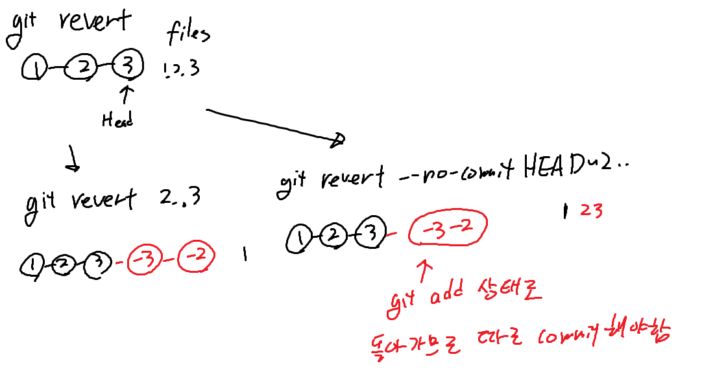

### JAVA 7의 변경점
- 숫자 표기
  - 2진수 표기 시 `0b` 사용 가능 (예: `int a = 0b1010;`)
- switch문에서 String 변수를 사용 가능
- 다이아몬드 연산자
  - 컬렉션 생성 시, 선언할 때 제네릭 타입을 선언했으면 생성자는 생략 가능
  - `List<String> list = new ArrayList<>();` `<>`를 다이아몬드라고 부른다
- try-with-resources
  - AutoClosable을 구현한 클래스라면, 자원을 사용한 후에 자동으로 close()를 호출해준다
  - `try (자원 생성) { }` 형태로 사용
- catch문에서 여러 Exception 처리 가능
  - `catch (Exception1 | Exception2 e) { }` 형태로 사용

- Fork Join
  - 한 작업을 여러 작업으로 나누어 병렬로 처리하는 프레임워크
  - 작업을 충분히 작아질 때까지 절반으로 나누고, 작은 작업들을 병렬로 처리한 뒤 결과를 합친다
- NIO.2
  - 파일 입출력을 위한 새로운 API
    - NIO의 File 클래스는, 심볼릭 링크, 파일 속성, 권한에 대한 기능이 없고, 파일 삭제를 실패했을 때 예외를 발생시키지 않으며, 파일이 변경되었는지 확인이 어려움
  - Path, Files, FileSystem, FileAttribute, FileVisitor 등의 클래스 제공
 

### JAVA 8의 변경점
- Optional 추가
  - nullable한 객체를 감싸는 래퍼 클래스
    - 이를 통해 nullable한 객체를 다룰 때 발생하는 NullPointerException을 방지
  - `Optional.ofNullable()`로 객체를 감싸고, `isPresent()`, `get()`으로 객체를 다룸
    - `Optional.of()`는 객체가 null이 아닌 경우에만 객체를 감싸고, null인 경우 예외를 발생
    - `isPresent()`는 Optional 객체가 비어 있는지 확인 (비어있는 것과, null이 들어있는 것은 다름)
    - `get()`은 객체를 반환
- interface에 default method를 사용 가능
  - default method는 인터페이스에 구현을 제공하는 메소드
- 날짜와 관련된 클래스가 개선 
  - Date, Calander -> LocalDate, LocalTime, LocalDateTime, ZonedDateTime
    - 불변 객체로 변경되었고, 모든 객체가 연산용 메소드를 가지고 새로운 불변 객체를 리턴
  - SimpleDateFormat -> DateTimeFormatter
    - 스레드 안전하고, 불변 객체로 변경
  - TimeZone -> ZoneId, ZoneOffset
    - TimeZone이 지역정보와 시간차 정보를 모두 가지고 있었던 반면, ZoneId는 지역정보만 가지고 있고, ZoneOffset은 시간차 정보만 가지고 있음
  - Calander -> ChronoField, ChronoUnit
    - Calander는 월이 0부터 시작하는 등의 문제가 있었음
    - ChronoField, ChronoUnit은 불변 객체로 변경되었고, 월이 1부터 시작하도록 변경
    - 속성값들이 정수에서 Enum으로 변경
- 병렬 배열 정렬
  - 배열 정렬 시 멀티스레드로 수행
  - 일정 이상의 크기를 가진 배열부터는 병렬 정렬이 더 빠름
- StringJoiner
  - 문자열의 배열을 특정 포맷으로 연결할 때 사용
  - `StringJoiner sj = new StringJoiner(", ", "[", "]");` -> `sj.add("a").add("b").add("c");` -> `sj.toString();` -> `[a, b, c]`

#### Lambda Expression
- 함수형 프로그래밍을 지원하기 위해 추가
- 자바의 메소드를 간결하게 함수처럼 표현
- 익명 함수라고도 불림
- TDA 원칙을 지원하기 위해 자주 사용된다고 함
```java
// 기존 방식
new Thread(new Runnable() {
    @Override
    public void run() {
        System.out.println("Hello World");
    }
}).start();

// 람다식
new Thread(() -> System.out.println("Hello World")).start();
```


##### 함수형 인터페이스
- 람다식을 사용하기 위한 인터페이스로, 추상 메소드 단 하나만 선언됨
- `@FunctionalInterface` 어노테이션을 사용하여 함수형 인터페이스임을 명시할 수도 있음 (단 하나의 추상 메소드만 선언하도록 강제)
```java
@FunctionalInterface
public interface Calculator {
    public int calculate(int a, int b);
}

Caculater add = (a, b) -> a + b;
Caculater substract = (a, b) -> a - b;

System.out.println(add.calculate(1, 2)); // 3
System.out.println(substract.calculate(1, 2)); // -1
```

##### TDA - Tell, Don't Ask 원칙
- 객체의 상태를 물어보지 말고, 객체에게 해달라고 요청하라
- 객체의 상태를 물어보고, 그 상태에 따라 다른 행동을 하는 것은 객체의 캡슐화를 깨는 행위
  - 따라서, 행위를 요청하면 객체가 알아서 판단 후 행동하도록 해야 한다
```java
// violate the Tell, Don't Ask principle

public class Hero {
    private int hp;
    private int mp;
	private Spell spell;
	
    public Hero(int hp, int mp) {
        this.hp = hp;
        this.mp = mp;
    }
	
	public void castSpell() {
		//spell 객체에게 mpCost를 물어보고, mpCost에 따라 다른 행동을 하는 것은 객체의 캡슐화를 깨는 행위
		if(mp >= spell.mpCost) {
            mp -= spell.mpCost;
            spell.cast(this);
        } else {
            System.out.println("Not enough MP");
        }
    }
}

public class Spell {
	String name;
	int mpCost;
	
    public void cast() {
      System.out.println("Spell " + name + " casted");
    }
}

// follow the Tell, Don't Ask principle

public class Hero {
    private int hp;
    private int mp;
	private Spell spell;
    
    public Hero(int hp, int mp) {
        this.hp = hp;
        this.mp = mp;
    }
	
	public boolean hasEnoughMP(int mpCost) {
		return mp >= mpCost;
    }
	
	public boolean consumeMP(int mpCost) {
		if(hasEnoughMP(mpCost)) {
            this.mp -= mpCost;
            return true;
        }
        return false;
    }
    
    public void cast() {
		// 하위 객체에게 행동을 요청
		spell.cast(Hero hero);
    }
}

public class Spell { 
	private String name;
    private int mpCost;
    
    public void cast(Hero hero) {
		// 하위 객체가 행동의 판단을 내림
        // 상위 객체의 상태 변경 또한 상위 객체에서 책임지고 처리한 뒤 결과만 반환함
        if(hero.consumeMP(mpCost)) {
            printCast();
        } else {
            System.out.println("Not enough MP");
		}
    }
	
	public void printCast() {
		System.out.println("Spell " + name + " casted");
    }
}
```

#### Stream
- 연속된 데이터의 흐름을 처리할 때 사용

- 스트림 생성, 중개 연산, 종단 연산 세 부분으로 나뉘어진다
  - 스트림 생성: 데이터 소스로부터 (컬렉션) 스트림을 생성
    - 배열은 Arrays.stream(list) 메소드로 스트림 생성
  - 중개 연산: 스트림을 변환하여 새로운 스트림을 생성
    - 중개 연산은 여러 개를 연결하여 사용 가능
  - 종단 연산: 스트림의 요소를 소모하며 결과를 생성
- 스트림은 순차적으로 데이터를 처리
- 스트림의 메소드
  - `filter()`: 조건에 맞는 요소만 필터링
  - `map()`: 요소를 다른 요소로 변환
  - `forEach()`: 요소를 하나씩 꺼내서 작업 수행
  - `flatMap()`: 여러 개의 스트림을 하나의 스트림으로 연결 (ex. 중첩된 리스트를 평탄화)
  - `sorted()`: 요소를 정렬
  - `anyMatch()`, `allMatch()`, `noneMatch()`: 요소들이 조건에 맞는지 검사
  - `reduce()`: 요소를 하나로 줄여나가는 연산
  - `distinct()`: 중복 요소 제거
  - `collect()`: 요소를 수집해서 원하는 형식으로 리턴

#### 메소드 참조
- 람다식이 하나의 메소드만 호출하는 경우, 메소드 참조로 대체 가능
- `::` 연산자를 사용하여 메소드 참조를 사용
  - `System.out::println`은 `x -> System.out.println(x)`와 동일
- 메소드 참조의 유형
  - 정적 메소드 참조: `클래스명::메소드명`
  - 인스턴스 메소드 참조: `참조변수명::메소드명`
    - ex: `System.out::println`
  - 특정 유형의 임의의 객체에 대한 인스턴스 메소드 참조: `클래스명::메소드명`
    - ex: `String::compareToIgnoreCase`
  - 생성자 참조: `클래스명::new`

### Git의 명령어 정리

#### reset
- 특정 시점의 commit으로 HEAD를 이동시키는 명령어
- reset의 옵션
  - `--soft`: HEAD만 이동하고, index와 워킹 디렉토리는 그대로 유지
  - `--mixed`: HEAD를 이동하고, index는 초기화되지만 워킹 디렉토리는 그대로 유지
  - `--hard`: HEAD를 이동하고, index와 워킹 디렉토리 모두 초기화
- 커밋 내역을 삭제하고 Head 위치를 이동시키므로, 주로 로컬 저장소에서 사용한다


#### revert
- 특정 commit을 취소하는 명령어
- 단, revert는 Head를 이동하지 않고, 취소하고자 하는 commit을 새로운 commit으로 생성
  - 따라서, revert를 실행하면 새로운 commit이 생성되고, 이 commit은 이전 commit을 취소하는 commit이 된다
- revert의 옵션
  - `--no-commit`: 여러 커밋에 대해 revert를 실행하고, 마지막에 한 번에 commit
  - `--no-edit`: revert를 실행하고, commit 메시지를 수정하지 않음
- revert는 원격 저장소에 push하여 다른 사람들과 공유할 수 있다

  

#### Cherry-pick
- 다른 branch의 commit을 현재 branch로 가져오는 명령어
  - merge를 사용하면 branch 전체를 가져오지만, cherry-pick은 특정 commit만 가져올 수 있다
- cherry-pick의 옵션
  - `-n`: cherry-pick을 실행하고, commit을 생성하지 않음
  - `-e`: cherry-pick을 실행하고, commit 메시지를 수정
  - `-x`: cherry-pick을 실행하고, commit 메시지에 원본 commit의 정보를 추가


#### rebase
- 현재 branch의 commit을 다른 branch의 commit 위로 올리는 명령어
- rebase는 commit을 합치거나 순서를 변경할 수 있어, branch의 commit을 깔끔하게 관리할 수 있다
- rebase의 옵션
  - `-i`: commit을 합치거나 순서를 변경할 수 있는 대화식 rebase
    - `pick`: commit을 그대로 가져옴
    - `drop`: commit을 버림
    - `edit`: commit을 수정
    - `reword`: commit 메시지를 수정
    - `squash`: commit을 합침 (rebase하는 커밋은 스쿼시할 수 없음)


