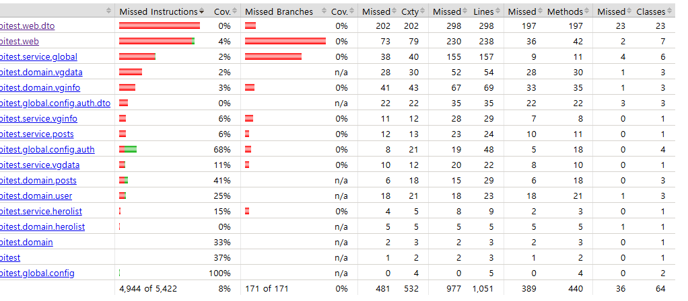

### Apache & Nginx
- 웹 서버란?
  - 클라이언트로부터 HTTP 요청을 받아 정적 파일을 제공하는 서버
  - 동적 컨텐츠를 요청받았을 때, WAS(Web Application Server)에 요청을 전달하고, WAS가 처리한 결과를 클라이언트에게 반환하는 역할도 수행
- WAS(Web Application Server)란?
  - 웹 서버와 달리, 동적 페이지를 제공하는 서버
  - HTTP 프로토콜을 기반으로, HTTP 요청을 받았을 때, 서버의 애플리케이션을 실행하여 결과를 반환
#### Apache
- 스레드/프로세스 기반으로 여러 요청을 처리
  - 요청이 들어올 때마다 HTTP 요청을 처리하는 스레드를 하나씩 할당하여 처리하는 방식
  - 클라이언트 접속 시마다 스레드를 생성하므로, 자원을 많이 소모한다
  - 또한 스레드의 최대 개수는 제한되어 있으므로 (스택 사이즈에 따라 달라지지만), 동시 접속자 수가 많아지면 서버가 응답하지 않게 된다

- PreFork MPM (다중 프로세스) 방식
  - 요청이 들어올 때마다, 아파치 프로세서로부터 자식 프로세스를 생성하여 처리
  - 하나의 자식 프로세스는 하나의 스레드를 갖게 됨
  - 스레드 간 공유하는 자원이 없으므로 안정성이 높지만, 메모리 소모가 큼
- Worker MPM (다중 스레드) 방식
  - 요청이 들어올 때마다, 자식 프로세스에서 스레드를 생성하여 처리
  - 스레드 간에는 메모리 공유가 가능하므로, PreFork MPM 방식보다 메모리 소모가 적음
- 동적 컨텐츠 처리가 가능
  - mod_php, mod_perl, mod_python 등을 사용하여 PHP, Perl, Python 등의 스크립트 언어를 사용할 수 있음

- 클라이언트 하나마다 프로세스 혹은 스레드를 생성해야 하기 때문에, 많은 클라이언트가 접속할 경우 서버의 부하가 커짐
  - 스레드의 수가 늘어나면 스레드 별로 가지는 메모리 스택의 크기만큼 메모리를 소모하게 됨
  - 또한 스레드의 수가 많으면, 컨텍스트 스위치 시 경합이 발생하게 되어 성능이 저하됨
  - 1만개 이상 동시 접속 (C10K 문제)에 대응하기 어려움
  - httpd 2.4 버전부터는 non-blocking I/O를 지원하여 C10K 문제에 대응

#### C10K 문제를 해결하기 위해 제시되었던 방법들 
- 기본적으로는 I/O시 요청을 보내면, 응답이 올 때까지 대기하는 방식 (Blocking I/O)
  - 대기하는 동안 스레드는 차단되어 대기 상태가 됨
- non-blocking I/O
  - 요청을 보냈을 때, 응답을 기다리는 동안 스레드가 차단되지 않음
  - 요청을 보낸 후에 다른 작업을 수행하다가 응답이 오면 처리하는 방식
  - I/O 작업이 진행되는 동안에, 물리적으로 대기하지 않고 다른 작업을 수행
- asynchronous I/O (비동기 IO)
  - 논리적으로 I/O 작업을 요청하고, I/O 작업이 완료되면 알림을 받아 처리하는 방식
  - 응답을 기다리지 않으며, 응답에 대한 처리를 할 수도 있고 하지 않을 수도 있다
    - 보통은 콜백 함수나 이벤트 핸들러를 등록해 결과를 처리

- blocking/nonblocking은 요청을 보내고 상대가 처리하는 동안, 자신이 물리적으로 제어권이 있는지의 여부를 의미하는것
  - 내가 강제로 기다림을 당하는가?
  - 블로킹이라면 제어권을 넘겨주지 않고 작업이 끝나고 넘겨주고, 아니라면 자기 작업은 계속 하는데 제어권만 넘겨줌
- synchronous/asynchronous는 요청을 보내고 상대가 처리하는 동안, 자신이 응답을 기다리는지의 여부를 의미하는것
  - 내가 상대의 응답을 기다려 주는가?
  - 동기라면 작업 요청을 보낸 프로세스가 작업 완료 여부를 확인하고, 아니라면 작업 요청을 받은 커널이 콜백 등으로 작업 완료를 통지

#### Nginx
- C10K 문제를 해결하기 위해 개발된 웹 서버
- Event-Driven (이벤트 기반) 방식
  - 고정된 수의 프로세스를 생성
  - 커넥션은 이벤트 핸들러를 통해 비동기적으로 처리
  - 스레드/프로세스의 수가 적으므로 컨텍스트 스위칭에서의 오버헤드가 적음
  - 현재 작업에 상관없이 모든 IO를 이벤트 루프로 처리하기 때문에, 하나의 프로세스로 더 많은 요청을 처리할 수 있음
- 단, 동적 컨텐츠는 자체적으로 처리할 수 없다
  - FastCGI, uWSGI, SCGI 등의 프로토콜을 사용하여 동적 컨텐츠를 처리

### jacoco library
- java 코드의 커버리지를 측정하는 라이브러리
  - 코드 커버리지 : 테스트 코드가 실제 코드를 얼마나 실행했는지를 나타내는 지표
- 코드 커버리지의 측정 기준
  - 함수 커버리지 : 프로그램 내의 함수가 한번 이상 실행되었는지 여부
  - 라인 커버리지 : 프로그램 내의 각 구문이 한번 이상 실행되었는지 여부
  - 브랜치 커버리지 : 프로그램 내의 모든 조건식이 true/false 모두 실행되었는지 여부
  - 조건 커버리지 : 프로그램 내의 조건문 내 모든 개별 조건식이 true/false 모두 실행되었는지 여부

```java
public void function test(int x, int y) {
	if(x > 0 && y > 0) {
		System.out.println("x, y are positive numbers");
    } else {
		System.out.println("x, y are not positive numbers");
    }
}

// 브랜치 커버리지의 경우, (x > 0 && y > 0)가 true/false를 모두 만족하면 되므로 다음과 같은 조건만 만족하면 100% 커버리지를 달성할 수 있음
// x, y : (1,1), (-1, 1)
// 조건 커버리지의 경우 (x > 0)와 (y > 0)이 각각 true/false를 모두 만족하면 되므로 다음과 같은 조건을 만족하면 100% 커버리지를 달성할 수 있음
// x, y : (1,1), (-1, 1), (1, -1)
```

#### Jacoco 사용법
- build.gradle에 jacoco 플러그인 추가
```gradle
plugins {
    id 'jacoco'
}
jacoco {
    toolVersion = "0.8.9"
}

test {
    finalizedBy jacocoTestReport
}

jacocoTestReport {
    dependsOn test

    reports {
        xml.required.set(true)
        html.required.set(true)

        // Qclass 패키지를 제외하는 부분
        def Qdomains = []
        for (qPattern in "**/QA".."**/QZ") {
            Qdomains.add(qPattern + "*")
        }

        afterEvaluate {
            classDirectories.setFrom(files(classDirectories.files.collect {
                fileTree(dir: it,
                        exclude: [] + Qdomains)
            }))
        }
        
        // xml, html 파일 생성 위치
        xml.destination file("${buildDir}/jacoco/index.xml")
        html.destination file("${buildDir}/jacoco/index.html")
    }
}

// 커버리지 조건을 설정하는 부분
jacocoTestCoverageVerification {
  violationRules {
    rule {
      element = 'CLASS'

      limit {
        counter = 'BRANCH'
        value = 'COVEREDRATIO'
        minimum = 0.90
      }
    }
  }
}
```

#### Github Action을 사용해 PR시 커버리지 리포트 생성
```yaml
name: Jacoco Coverage
id: jacoco
uses: madrapps/jacoco-action@v2
with:
  title: "Coverage Report"
  paths: "build/reports/jacoco/test/jacocoTestReport.xml"
  min-coverage-overall: 80//프로젝트 전체 커버리지 최소 비율
  min-coverage-changed-files: 80// 변경된 파일의 커버리지 최소 비율
```

- 개인프로젝트가 다 gradle 4로 되어 있어서 작은 프로젝트 하나를 rewrite해서 테스트 필요
  - gradle 4.10.2 -> 8.10.2
  - java 8 -> 21
  - spring boot 2.1.9 -> 3.3.4

[참고](https://docs.gradle.org/current/userguide/jacoco_plugin.html)  
[참고- 코드 커버리지 툴 적용기](https://sungsan.oopy.io/1d6e3f0c-7a3e-48f2-bb62-ad0e37e3c888)


