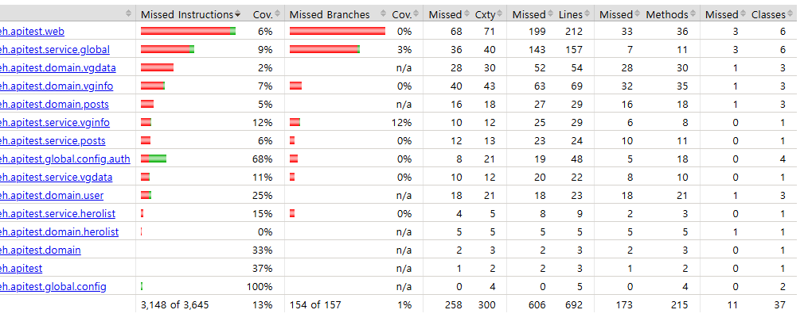
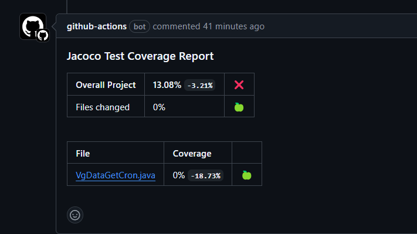

### Jacoco Coverage Report 생성해서 PR시 리포트 추가하기
- 사이드 프로젝트를 활용해서 테스트 케이스를 리팩토링하고 Jacoco Coverage 추가하여 PR에 적용

#### Gradle 세팅
```groovy
plugins {
    id 'jacoco'
}

jacoco {
    toolVersion = "0.8.9"
}

test {
    useJUnitPlatform()
    // 테스트시에 report도 같이 작성
    finalizedBy jacocoTestReport
}

jacocoTestReport {
    dependsOn test

    reports {
        xml.required.set(true)
        html.required.set(true)
        
        
        def Qdomains = []
        for (qPattern in "**/QA".."**/QZ") {
            Qdomains.add(qPattern + "*")
        }

        //Qclass와 dto 패키지를 제외
        afterEvaluate {
            classDirectories.setFrom(files(classDirectories.files.collect {
                fileTree(dir: it,
                        exclude: [
                                "**/dto/*",

                        ] + Qdomains)
            }))
        }

        // xml, html 파일 생성 위치 설정
        xml.destination file("${buildDir}/jacoco/jacocoTestReport.xml")
        html.destination file("${buildDir}/jacoco/html")
    }
}

// 커버리지 기준을 설정
jacocoTestCoverageVerification {
    violationRules {
        rule {
            // 커버리지를 체크하는 기준
            element = 'CLASS'

            limit {
                //측정의 최소 단위
                counter = 'BRANCH'
                // 측정 단위
                value = 'COVEREDRATIO'
                minimum = 0.80
            }
        }
    }
}
```
- element
  - BUNDLE : 전체
  - PACKAGE : 패키지
  - SOURCEFILE : 소스 파일
  - CLASS : 클래스
  - METHOD : 메소드
  - GROUP : 그룹
- counter
  - INSTRUCTION: 명령어 수
  - LINE: 라인 수
  - BRANCH: 분기 수
  - COMPLEXITY: 사이클로매틱 복잡도
    - 분기의 수 - decision point의 수 + 1
  - METHOD: 메소드 수
  - CLASS: 클래스 수
- value
  - COVEREDRATIO: 커버 비율
  - MISSEDCOUNT: 빠진 수
  - COVEREDCOUNT: 커버 수
  - TOTALCOUNT: 전체 라인 수

- 특정 어노테이션이 달린 클래스와 메소드는 제외할 수 있음
  - 어노테이션 명에 `Generated`가 달린 어노테이션이 달린 클래스는 제외됨
  - 따라서 Lombok으로 생성되는 클래스에 @Generated가 달리도록 `lombok.config`에 `lombok.addLombokGeneratedAnnotation = true`를 추가함
  - 이외 수동으로 어노테이션을 추가해도 문제 없음 (단, 비즈니스 코드에 추가해야 한다는 단점이)


#### JUnit5로 테스트 코드 일부 리팩토링
- 기존 프로젝트의 테스트 코드는 JUnit4로 일부만 작성되어 있어서, 테스트에 사용할 수 있도록 JUnit5로 변경
- 테스트 시 별개의 H2 데이터베이스를 사용할 수 있도록 설정
  - `application-test.yaml`을 추가하고 H2 데이터베이스 세팅 구성
  - 테스트 클래스에 `@TestPropertySource` 어노테이션을 추가해서, 다른 설정 파일을 사용하도록 선언함
    - yaml 설정 파일을 사용할 때에는 다음과 같이 선언해야 한다고 함 
    - `@TestPropertySource(properties = {"spring.config.location = classpath:application-test.yaml"})`
- `@DataJpaTest` 어노테이션을 사용하여 JPA테스트를 진행할 경우, queryDSL 관련 빈은 자동으로 잡아주지 않음
  - queryFactory는 공통적으로 추가해야 하므로, 전용 test config 클래스를 생성해서 거기에 선언하고 해당 클래스를 포함할 것을 선언
  - queryFactory를 사용한 Repository도 자동으로 주입되지 않으므로, `@Import`를 사용해 수동으로 선언
  - `@Import({TestQueryDslConfig.class, PostsQueryRepository.class})`
- 웹 Controller를 테스트하는 경우에는, service와 repository는 mockbean으로 정의해서, 내부 구현은 테스트하지 않도록 함
  - `given(postsService.findbyId(1L)).willReturn(postsResponceDto);`

#### 커버리지 리포트 생성
- gradle-verification-test로 테스트를 진행하면, 자동으로 커버리지 리포트가 생성됨
- html 리포트로 웹 브라우저로 확인 가능



#### 생성한 xml 커버리지 리포트를 사용해 pr시 리포트 추가
- github action을 사용해서, `jacoco-report` job을 사용해서 PR시 리포트 추가
  - PR시 트리거되므로 빌드 후에 test를 실행해서 그 결과 xml 파일만 사용
```yaml
   - name: Jacoco Test Coverage Report
   uses: madrapps/jacoco-report@v1.6.1
   with:
     title: 'Jacoco Test Coverage Report'
     paths: ${{ github.workspace }}/build/jacoco/jacocoTestReport.xml
     token: ${{ secrets.GITHUB_TOKEN }}
     min-covorage-overall: 0
     min-coverage-changed-files: 0
```

