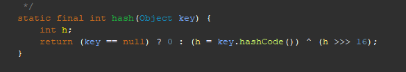

### varchar?

#### 임의로 생성했을 때 기본값을 255로 주는 이유는?
- varchar는 MySQL 5.0.3 이전까지는 최대 255바이트였음
- 또한 varchar는 가변길이 타입으로, InnoDB에서는 실제 저장되는 데이터에 길이에 따라 저장공간이 변함
  - char는 고정길이 타입으로, 정해진 길이만큼 공간을 차지함
  - 다만, 중간 연산에 사용되는 MEMORY 엔진에서는 varchar도 고정된 사이즈를 사용한다고 한다 (그래서 varchar의 길이는 스키마에 맞도록 정하라고 한다)
- 실제로는 저장되는 데이터의 길이 + 데이터의 길이 정보를 나타내는 바이트 크기만큼 저장공간을 차지함
  - 저장되는 데이터의 길이가 255 이하라면, 이 길이 정보는 1byte로 저장됨
  - 저장되는 데이터의 길이가 256 이상이라면, 이 길이 정보는 2byte로 저장됨
- 따라서, 테이블의 스키마에서 정한 varchar의 길이 값에 따라서 길이 정보를 저장할 크기를 예약함
- 길이를 255이하에서 256이상으로 변경할 경우에는 위 이유 때문에 데이터 구조를 바꿀 수밖에 없다고 함

### HashTable, HashMap, ConcurrentHashMap

#### HashTable
- 모든 메소드에 synchronized 키워드가 붙이는 방식으로 thread-safe를 보장
- key, value에 null을 허용하지 않음

#### HashMap
- HashTable과 동일한 기능을 제공하지만, thread-safe를 보장하지 않음
- key, value에 null을 허용함

#### 왜 HashMap은 null을 허용하는데 HashTable은 허용하지 않는가?
- 우선 HashMap과 HashTable은 둘 다 주어진 key에 대해서 hashcode() 메소드를 통해 버킷 인덱스를 구해서 매핑해 주는 자료구조다
- 그런데 key가 null이면?? hashcode() 메소드를 호출할 수 없다
  - 그래서 HashTable은 key가 null임을 허용하지 않음
  - HashMap은 key가 null일 경우, 이를 예외로 처리하고 대신 인덱스 `(int) 0`에 매핑함  
    
  HashMap의 경우 static final method로 `hash()` 메소드를 만들어서, null에 대한 예외처리를 한 후, 클래스 내의 다른 메소드에서 이 `hash` 메소드를 호출하여 key의 해시값을 가져옴  
  HashTable의 경우 해시 값이 필요한 경우 그냥 key.hashCode()를 호출함
- value가 null일 경우는 값을 삽입하고 찾는 과정 자체에는 문제가 없는데, get의 return value의 일관성을 위해 막은 것 같음

##### 왜 HashMap은 hashcode() 값을 가공하는 hash()메소드를 갖는가?
- NullPointException을 방지하기 위해서라고 생각했는데, 메소드를 자세히 보면 `h ^ (h >>> 16)`라는 연산을 수행함
- 이는 해시 테이블의 해시 충돌을 방지하기 위해서 해싱 값을 가공해서 상위 비트만 다르고 하위 비트가 같은 케이스를 줄이기 위한 것이다
  - 해싱 값의 하위 비트가 동일하다는 뜻은, 해당 값들은 공통된 약수를 가진다는 뜻이다
    - 좋은 해싱 함수는 이렇게 하위 비트가 유사하게 나오는 경우를 줄여 주지만, 해시 함수의 품질과 속도는 trade-off 관계에 있다
  - 보통 이러한 경우 해시 충돌을 막기 위해서, 해시 테이블의 크기를 소수로 설정한다
  - 그러나, JAVA의 HashMap은 해시 테이블의 크기를 2의 제곱수로 설정한다
  - 따라서, 해싱 값의 하위 비트가 동일한 경우를 줄이기 위해서, `h ^ (h >>> 16)` 연산을 수행함으로서, 상위 16비트와 하위 16비트를 XOR 연산함으로서 동일한 하위 비트가 중복되게 나오는 경우를 방지하는 것이다
    - 주석을 읽어보면, 해당 방식이 해시 충돌을 유의미하게 줄일 수 있으면서 적은 연산만을 수행한다고 한다
  

#### ConcurrentHashMap
- key, value에 null을 허용하지 않음
- thread-safe를 보장하면서, HashTable보다 더 좋은 성능을 제공함
  - 메소드 전체에 비용이 큰 synchronized 키워드를 사용하지 않고 필요한 부분에만 synchronized 블록을 사용함
  - 각각의 노드(key-value pair)에 대해서, 해당 노드를 감시 객체로 하는 synchronized 블록을 생성하는 방식으로 개별 node마다 lock을 걸어서 동시성을 제어함
  - 또한, HashTable과 달리, ConcurrentHashMap은 읽기 연산에 대해서는 lock을 걸지 않음

