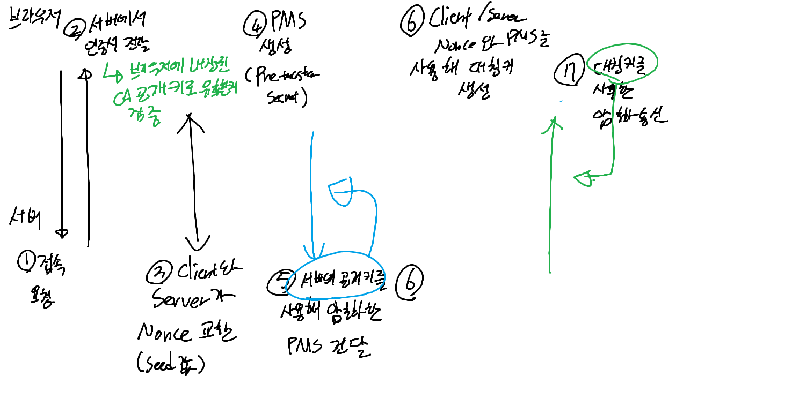

### HTTP란?
- HyperText Transfer Protocol의 약자로, 웹 서버와 웹 클라이언트 간의 통신을 위한 프로토콜
- 애플리케이션 계층 프로토콜로, 실제 데이터 전송은 TCP/IP 프로토콜을 사용한다
  - TCP 프로툐콜의 상위 계층에 HTTP 프로토콜이 위치

#### HTTP 특징
- 비연결성 : 클라이언트와 서버가 한 번 연결을 맺은 후, 클라이언트 요청에 대해 서버가 응답을 보내고 연결을 끊는다
- 무상태성 : 서버는 클라이언트의 상태를 보존하지 않는다. 클라이언트의 이전 요청과 현재 요청이 서로 독립적이다
- 단방향성 : 클라이언트가 서버에 요청을 보내면 서버가 응답을 보내는 방식으로 동작한다

#### 동작 과정
1. 웹 브라우저가 URL을 받아서, DNS 서버에게 해당 URL의 IP 주소를 요청
2. 받은 IP 주소로 웹 서버에게 요청을 보낸다
3. 웹 서버와 TCP 연결을 시도
4. 클라이언트가 서버에게 요청을 보낸다
5. 서버가 클라이언트에게 응답을 보낸다
6. 클라이언트가 서버로부터 받은 응답을 브라우저에 표시
7. 서버와 클라이언트의 연결을 끊는다

#### 버전별 특징
- HTTP/0.9 : GET 메서드만 지원하며, 헤더가 없음
- HTTP/1.0 
  - Header 추가
  - Versioning 추가 : HTTP 요청 시 사용 프로토콜의 버전을 명시
  - Status Code 추가
  - Content-Type 헤더 추가
  - Post와 Head 메서드 추가
- HTTP/1.1 : HTTP/1.0의 shorted-lived connection 방식 때문에 커넥션 오픈 - 요청 전송 - 대기 - 응답 수신 - 커넥션 종료를 반복하는 문제를 해결하기 위해서 나옴
  - Persistent Connection : 매번 커넥션을 열고 닫는 것이 아니라, 한 번 연결을 맺은 후 여러 요청과 응답을 주고 받을 수 있음 (handshake를 줄여 속도 향상)
    - `Connection: keep-alive` 헤더를 추가해서 사용 가능
  - Pipeline : 한 번에 여러 요청을 보내고, 보낸 순서대로 응답을 받는 방식
  - Domain Sharding : 여러 도메인을 사용해서 병렬로 요청을 보내는 방식
    - Host 헤더 추가 : 하나의 서버에 여러 도메인이 연결되어 있을 때, 어떤 도메인으로 요청을 보내는지 명시
  - Continue 상태 코드 추가 : 클라이언트가 서버에게 요청 본문을 보낼 때, 서버가 요청을 수락했는지 확인하기 위한 상태 코드
  - Chunked Transfer Encoding : 서버가 클라이언트에게 데이터를 전송할 때, 데이터를 여러 조각으로 나누어 전송
  - PUT, PATCH, DELETE, CONNECT, OPTIONS, TRACE 메서드 추가
- HTTP/2 : HTTP/1.1의 성능 문제를 해결하기 위해 나온 버전
  - Multiplexed Streams : 한 커넥션에 여러 개의 메시지를 동시에 주고 받을 수 있음
    - 또한 요청의 응답을 비동기적으로 처리 가능
  - Automatic Compression : 요청과 응답의 헤더를 Gzip으로 압축해서 전송
  - Stream Prioritization : 요청에 우선순위를 부여해서 중요한 요청을 먼저 처리
  - Server Push : 서버가 클라이언트의 요청 없이 데이터를 보낼 수 있음
  - Header Compression : 헤더를 압축해서 전송
  - Binary 프로토콜 : HTTP/1.1은 텍스트 기반 프로토콜이었지만, HTTP/2는 바이너리 기반 프로토콜

#### Request
- 클라이언트가 서버로 보내는 요청 메시지
- 요청 메시지는 크게 세 부분으로 구성
  - Start Line : 요청 메서드, 요청 URL, HTTP 버전
  - Header : 요청에 대한 부가적인 정보
  - Body : 요청에 대한 데이터
```text
GET /index.html HTTP/1.1 // Start Line
Accept: text/html
Accept-Language: ko
Host: www.example.com
```

```text
POST /index.html HTTP/1.1 // Start Line
Accept: text/html
Accept-Language: ko
Host: www.example.com
Content-Type: application/json
Content-Length: 17  // Header
// header와 body 사이에는 빈 줄이 존재
{"test" : "test"} // Body
```

##### Request Method
- GET : 리소스를 요청
- HEAD : GET과 동일하지만 응답 본문을 포함하지 않음 (헤더만 리턴함)
- POST : 서버에게 처리할 데이터를 전송
- PUT : 서버에게 요청 메시지의 본문을 저장
- PATCH : 리소스의 일부를 수정
- TRACE : 메시지가 서버로 도달하는 과정까지를 추적 (서버에게 메시지가 도달했을 때의 요청 패킷 내용을 응답받음)
- OPTIONS : 서버가 지원하는 메서드를 요청
- DELETE : 서버에게 리소스 삭제 요청

#### Response
- 서버가 클라이언트로 보내는 응답 메시지
- 응답 메시지 또한 크게 세 부분으로 구성
  - Start Line : HTTP 버전, 상태 코드, 상태 메시지
  - Header : 응답에 대한 부가적인 정보
  - Body : 응답에 대한 데이터
```text
HTTP/1.1 200 OK // Start Line
Content-Type: text/html
Content-Length: 35 // Header

<html><body><h1>It works!</h1></body></html> // Body
```

##### Status Code
- 1xx : 정보 응답
- 2xx : 성공
- 3xx : 리다이렉션 완료
  - 300 : 해당 요청이 여러 리소스를 가지고 있어서 클라이언트가 선택할 수 있음 (리소스 리스트를 응답)
  - 301 : 요청한 리소스가 새로운 URL로 영구히 이동
  - 302 : 요청한 리소스가 일시적으로 새로운 URL로 이동
- 4xx : 클라이언트 오류
  - 400 : 잘못된 요청
  - 401 : 권한이 없음
  - 403 : 금지됨
  - 404 : 찾을 수 없음
  - 405 : 허용되지 않는 메서드
- 5xx : 서버 오류
  - 500 : 서버 내부 오류
  - 501 : 클라이언트가 서버의 능력을 넘는 요청을 함
  - 502 : 게이트웨이 오류
  - 503 : 서비스를 사용할 수 없음
  - 504 : 게이트웨이 시간 초과
  - 505 : HTTP 버전이 지원되지 않음

### HTTPS란?
- HyperText Transfer Protocol Secure의 약자로, HTTP의 보안이 강화된 버전
- HTTP는 평문 통신이기 때문에 중간에 누군가 네트워크를 가로채면 내용이 노출될 수 있음
- HTTPS는 SSL(Secure Socket Layer) 또는 TLS(Transport Layer Security) 프로토콜을 사용하여 데이터를 암호화
  - 모든 HTTP의 request와 response 데이터를 암호화하여 보안을 유지
  - 즉 기본 HTTP의 계층이 HTTP -> TCP -> IP 였다면, HTTPS는 HTTP -> SSL/TLS -> TCP -> IP로 변경
- HTTPS 웹 트랜잭션의 과정
  1. 443포트를 사용해 TCP 연결
  2. SSL 핸드셰이크를 통해 이하의 과정을 수행
     1. 클라이언트가 서버에게 자신의 암호 후보를 보내고 인증서를 요청
     2. 서버가 클라이언트에게 선택한 암호와 인증서를 전달
        - 클라이언트는 신뢰할 수 있는 인증서 기관 리스트를 가지고 있고, 받은 인증서가 그 리스트에 있는지를 확인하여 인증서의 유효성을 검증
     3. 클라이언트가 서버의 인증서를 확인하고 서버의 공개키를 사용해 pre-master secret을 암호화하여 서버에게 전달
     4. 서버는 pre-master secret을 자신의 개인키로 복호화하여 master secret을 생성
     5. 클라이언트와 서버는 master secret을 사용하여 세션 키를 생성
     6. 세션 키를 사용해 대칭키 암호화를 사용하여 데이터를 주고받음
     7. 세션이 종료되면 세션 키는 폐기되고 다음 세션에는 새로운 세션 키를 사용

 

    
### 웹 소켓
- 단방향으로만 통신하는 HTTP와 달리, TCP를 사용해 양방향 통신이 가능한 프로토콜
  - 빠른 반응 시간이 필요하거나 (실시간 채팅 등), 지속적인 상태의 업데이트가 필요할 때 사용한다
  - 즉 polling(주기적으로 서버에 요청을 보내는 방식)을 짧은 주기로 필요로 한다면 웹 소켓을 사용하는 것이 좋을 수 있다
- 소켓 통신을 하기 위해서는 소켓 통신이 가능한지 확인하는 핸드셰이크 과정을 거침
  - 클라이언트가 서버에게 웹 소켓 연결을 요청
    - `Upgrade: websocket`, `Connection: Upgrade`, `Websocket` 헤더를 포함한 요청을 보냄
  - 웹 소켓 통신이 가능하다면 서버는 101 Switching Protocols 상태 코드를 응답
    - `Upgrade: websocket`, `Connection: Upgrade`, `Sec-WebSocket-Accept` 헤더를 포함한 응답을 보냄
    
