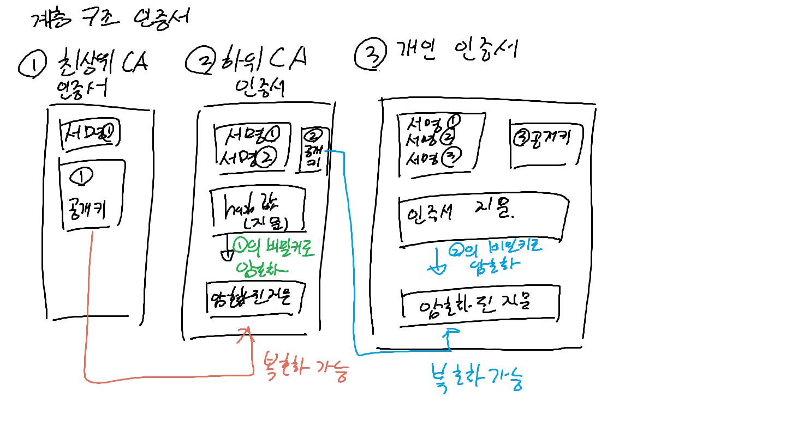

### Certificate Authority
- 신뢰 가능한 기관 : 최상위 인증 기관이라고도 불리고, Root CA라는 인증서를 발급하는 기관임
  - Root CA
  - VeriSign, GeoTrust 등이 있음
  - 해당 기관들은 기관만의 고유한 비밀 키를 소유하고 있고, 이에 대응하는 공개 키를 배포함
  - 이런 신뢰 가능한 기관의 공개 키는, 브라우저나 운영체제에 내장되어 있음
- 인증서의 계층 구조
  
- 하위 CA를 두어 3계층으로 두는 이유는?
  - 비밀키가 유출될 경우 Revoke하기 쉽게 하기 위해서라고 함

#### 인증서의 내용
- 버전
- 일련번호
- 인증서 서명의 암호화 알고리즘
- 인증서 서명 값
- 발행 기관
- 유효기간
- 발행 대상 (도메인)
- 대상의 공개 키와 알고리즘
- SHA-256 지문
  - 인증서의 내용을 해시한 값
  - 공개 키

#### 왜 본문 내용을 암호화할때는 생성된 세션값으로 대칭키를 쓸까?
- 비대칭키 (공개키) 암호화는 대칭키에 비해 자원의 사용이 많음
- 따라서 최초로 비밀 값을 주고받을때만 비대칭키를 사용하고, 이후에는 대칭키를 사용함

### 테스트란?
- 코드의 품질을 보장하기 위한 작업으로, 코드의 동작이 의도한 대로 동작하는지 검증하는 행위

#### 단위 테스트
- 소스 코드의 특정 모듈이 의도된 대로 작동하는지 확인하는 테스트
- 보통 레이어 단위(서비스, 컨트롤러, DAO)나 클래스 단위로 테스트를 수행한다
- 모듈은 다른 모듈의 의존성을 가지는 경우가 많기 때문에, 테스트에서는 그 의존성을 가짜 객체로 대체하여 테스트를 수행할 수도 있다
  - 다른 모듈에서의 행동을 가짜 객체로 대체함으로서, 해당 테스트가 원하는 모듈에서의 행동만을 테스트할 수 있게 한다
- 따라서 테스트 준비가 쉽고, 테스트의 실행 속도도 빠르다
- 또한 테스트의 결과가 일관적이기 때문에, 테스트를 자동화하기에 적합하다
- 그러나 모듈들이 연관되었을 때 발생하는 문제는 찾을 수 없다

#### 통합 테스트
- 모듈들의 조합이 의도한 대로 작동하는지 확인하는 테스트
- 개발자가 변경할 수 없는 부분까지 포함하여 테스트를 수행한다
  - 외부 라이브러리, 데이터베이스 등등
- 여러 연관 모듈의 초기화까지 처리해야 하기 때문에, 단위 테스트에 비해 테스트 준비가 번거롭고, 테스트이 중복이 발생할 확률이 높다
- 또한 단위 테스트보다 더 많은 자원을 필요로 하기 때문에, 단위 테스트보다 더 많은 시간과 자원이 소요된다
- 그러나 단위 테스트만으로는 발견하기 어려운 문제 (모듈간 조합 시 발생하는 문제, 외부 라이브러리를 호출했을 때 발견하는 문제 등)를 발견할 수 있다
- MockMVC 등을 사용한다
    - Spring MVC 컨트롤러를 테스트하기 위한 라이브러리로, 서버를 띄우지 않고도 컨트롤러를 테스트할 수 있다

#### E2E (End to End) 테스트

- 애플리케이션의 흐름을 처음부터 끝까지 테스트하는 테스트
- 유닛 테스트나 통합 테스트가 성공한다고 하더라도, 애플리케이션의 동작까지 모두 정상적으로 동작함을 보증할 수는 없기 때문에 E2E 테스트가 필요하다
- 실제 사용자의 입장에서 사용 시나리오를 테스트함으로서, 애플리케이션이 제대로 동작함을 보장
- 다만 테스트의 비용이 많이 발생하게 되므로, 테스트의 대상을 선정하는 것이 중요하다
  - 테스트 환경 구축을 실제와 동일하게 구축해야 하기 때문

#### 테스트 주도 개발 (TDD)
- 코드를 작성하기 전에 테스트 코드를 먼저 작성하고, 이후 테스트를 통과하는 코드를 작성하는 개발 방법론
- 장점
  - 테스트 코드를 먼저 작성하므로, 개발자는 코드가 어떻게 동작해야 하는지 명확하게 인지할 수 있다
  - 깔끔한 코드를 작성하기 용이함
  - 프로덕션 코드를 작성한 이후 테스트 코드를 작성하는 것은 귀찮을 수 있음
- TDD의 개발 순서
  1. 실패하는 작은 단위 테스트 작성
  2. 테스트를 통과하는 프로덕션 코드를 우선 작성
  3. 모든 테스트를 통과했으면 그 다음 단계의 테스트 코드 작성
  4. 새로운 테스트를 통과하기 위해 프로덕션 코드를 수정
  5. 1~4를 반복하여 모든 성공/실패 테스트 코드 작성
  6. 완성된 프로덕션 코드의 중복을 제거하며 리팩토링
- TDD의 구현 순서
  - Repository -> Service -> Controller 순으로 구현해 나간다
  - Repository 계층의 테스트는 인메모리 기반의 데이터베이스를 사용하여 통합 테스트로 진행한다
  - Service 계층의 테스트는 Mock 객체를 사용하여 단위 테스트로 진행한다
  - Controller 계층의 테스트는 MockMVC를 사용하여 단위 테스트로 진행한다

### Restful API

####  API란?
- Application Programming Interface
- 애플리케이션이 다른 애플리케이션과 통신하기 위해 따라야 하는 규칙

#### REST API란?
- Representational State Transfer
- 소프트웨어 아키텍쳐의 한 형식으로, 자원을 이름으로 구분하여 해당 자원의 상태를 주고받는 것

  - URI를 통해 자원을 명시
  - HTTP Method를 통해 자원을 처리

- Rest의 구성 요소
  - 자원 : 해당 소프트웨어가 관리하는 모든 것
  - 자원에 대한 행위 : HTTP Method로 표현
  - 자원에 대한 행위의 내용 : 페이로드로 표현
- Rest의 특징
  - Uniform Interface : URI로 지정한 자원의 대한 조작을 통일되고 한정적인 인터페이스로 수행
  - Stateless : 상태 정보를 따로 관리하지 않음
  - Cacheable : HTTP 표준을 그대로 사용하므로 HTTP가 가진 캐싱 기능 적용 가능
  - Client-Server : REST 서버는 API 제공, 클라이언트는 사용자 인터페이스 제공하여 각각의 역할을 확실히 구분해서 서로간의 의존성이 낮음
  - Layered System : REST 서버는 다중 계층으로 구성될 수 있어서 보안, 로드 밸런싱, 암호화 계층을 추가하여 구조상의 유연성을 둘 수 있음
  - Code-On-Demand (Optional) : 서버로부터 스크립트를 받아서 실행할 수 있어서 클라이언트의 기능을 확장할 수 있음
- 장점
  - HTTP 프로토콜 인프라를 그대로 사용하므로 REST API 사용을 위한 별도의 인프라가 필요 없음
  - HTTP 표준 프로토콜을 사용하는 모든 플랫폼에서 사용 가능
  - Hypermedia API를 제공하여 API가 자기 설명적이어서 의도하는 바를 쉽게 이해할 수 있음
  - 서버와 클라이언트의 역할이 명확하게 분리됨
- 단점
  - 표준이 존재하지 않아 설계할 때 따로 정의가 필요함
  - HTTP Method가 제한적이기 때문에, 행위에 대한 정의가 부족할 수 있음

- REST API에서 자주 사용되는 설계 규칙
  1. URI에 정보의 자원을 표현
    - 자원은 소문자 명사로 표현
  2. 마지막에 슬래시(/)를 사용하지 않는다
  3. 언더바 대신 하이픈을 사용한다
  4. 행위는 HTTP Method로 표현 (URI에는 행위를 표현하지 않는다)
  5. 파일의 확장자는 URI에 포함하지 않는다
  6. 슬래시는 계층 관계를 나타내는데 사용한다
- Method별 행위 정의
  - GET : 조회
  - POST : 생성
  - PUT, PATCH : 수정
    - PUT : 전체 수정
    - PATCH : 부분 수정
  - DELETE : 삭제

#### RESTful API란?
- REST 스타일을 구현한 웹 서비스
  - REST의 설계 규칙을 준수하여 REST API를 만든 것
  - 두 개의 서로 다른 시스템이 인터넷을 통해 통신하기 위한 인터페이스

- 주요 구성 요소
  - 헤더 : 요청 메시지에 대한 연결 유형, 프록시, 메타데이터를 과닐
  - 데이터
  - 메소드
  - 엔드포인트 : 데이터의 위치를 정의하는 URL