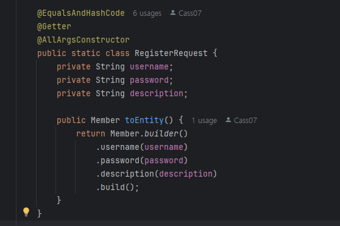
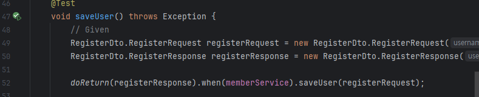

### Spring Boot 테스트 생성 시 발생했던 문제 정리

#### H2 Dababase를 data.sql, schema.sql로 초기화했는데 발생했던 오류
- schema.sql로 초기화했는데 엔티티와 테이블 매칭할 때 자동으로 생성한 테이블이 없다는 오류가 발생
    - `ddl-auto`설정은 `none`으로 하여서, ddl로 자동으로 테이블을 생성하지 않는 상태
    - 처음 schema.sql을 mysql 생성문 그대로 설정하였음
        ```sql
        DROP TABLE IF EXISTS member;
        CREATE TABLE member (
                                `member_id` INT(10) PRIMARY KEY NOT NULL AUTO_INCREMENT,
                                `username` VARCHAR(20) NOT NULL,
                                `password` VARCHAR(128) NOT NULL,
                                `last_logged_at` DATETIME ,
                                `is_deleted` TINYINT(1),
                                `description` MEDIUMTEXT,
                                `created_at` DATETIME,
                                `modified_at` DATETIME,
                                `modified_by` VARCHAR(20)
        );
        ```
    - H2 database에서는 table명이 자동으로 대문자로 변경되어서, `member` 테이블이 아닌 `MEMBER` 테이블로 생성되었음
    - 그런데 엔티티 설정 시, `@Table(name = "member")`로 설정했기 때문에, `MEMBER` 테이블과 매칭되지 않음
    - 해결방법이 아래 세 가지가 있음
      - `DATABASE_TO_UPPER=false` 설정을 추가하여, 대소문자 구분을 하지 않도록 설정
        - 테이블 명과 컬럼 명이 무조건 소문자로 변경됨
        - 컬럼 명에 대문자를 써야 할 필요가 생길 수도 있으므로, 사용하지 않음
      - 엔티티에서 Table명을 `@Table` 어노테이션에 명시하지 않으면, 알아서 `member`혹은 `MEMBER` 테이블을 찾아보게 됨
        - 그러나 엔티티와 테이블의 명확한 매칭을 위해서 table명과 column명을 어노테이션에 명시하기로 했으므로 불가능
      - schema.sql에서 테이블 명을 큰따옴표로 감싸면, 적은 그대로의 테이블 명으로 생성됨
    - `"member"`로 변경하니 스키마는 정상적으로 적용되나, data.sql의 데이터 초가화가 이루어지지 않았음
      - `INSERT`문의 경우에도 위와 같이 테이블 명이 대문자로 변경되기 때문에, `"member"`로 변경해주어야 함
      - `INSERT INTO "member" ~` 로 변경하여 정상적으로 적용


- `ddl`이 none이 아닌 경우 (update, create, create-drop), 다음과 같은 순서로 테이블 초기화가 진행된다고 함
  - `schema.sql`이 실행되고, `data.sql`이 실행된다
  - `ddl = update`면 entity 와의 차이점이 있으면 변경된 내용을 반영한다
  - `ddl = create, create-drop`면 테이블을 드랍하고 다시 생성한다 (즉 data.sql의 데이터도 삭제됨)
  - `defer-datasource-initialization = true`라면, data.sql이 이 시점에 실행된다 (이 옵션은 `ddl`이 `none`이 아닌 경우에만 사용 가능)

- 즉, ddl의 관리를 자동으로 맡기면서 data.sql의 데이터를 생성하기 위해서는 `defer-datasource-initialization`을 true로 설정해줘야 함

#### Strict stubbing argument mismatch 오류
- mock 객체로 service의 메소드를 stubbing했을 때 발생
```java
doReturn(registerResponse).when(memberService).saveUser(registerRequest);

ResultActions resultActions = mockMvc.perform(post("/api/v1/users")
	.contentType(MediaType.APPLICATION_JSON)
	.content(objectMapper.writeValueAsString(registerRequest)));
```
- registerResponse, registerRequest 객체를 원하는 값으로 미리 초기화시켜 두고 stubbing의 인자로 사용하는데, 이후 mockMvc에서 perform을 하면서, 두 객체의 argument가 다르기 때문에 발생하는 오류라고 함
- mockMvc에서 perform을 하면서, objectMapper를 이용해서 registerRequest 객체를 json으로 변환하는데, 이후 controller에서 json으로 받아서 다시 객체로 변환하기 때문에, 동일한 내용의 서로 다른 객체가 된 것
  - stubbing할 때 받는 객체를 특정 객체가 아닌 any(class)로 받아서, 해당 클래스의 객체기만 해도 통과하도록 변경하면 됨
    - `doReturn(registerResponse).when(memberService).saveUser(any(RegisterDto.RegisterRequest.class));`
  - 동일한 객체를 받는 것을 보장하고 싶다면, stubbing할 때 객체를 받아서 비교하는 과정을 거치기 때문에, hashCode, equals()를 구현해 주면 동일한 내용의 같은 객체를 넣어도 통과할 수 있다
    
    이렇게 Lombok의 `@EqualsAndHashCode`를 이용해서 HashCode, Equals를 오버라이드하면
    
    객체를 비교하도록 stubbing하고 같은 내용의 다른 객체를 넣어도 테스트가 통과한다

### Spring에서 Rest API Prefix를 설정하는 법
1. `@RequestMapping("prefix")`를 붙인 Custom Annotation을 만들어 이를 구현하거나, Class를 만들어 상속
   - 클래스를 상속을 사용하기에는 상속 관계로 두기 애매하니까, 속성을 의미하는 어노테이션을 사용하는 것이 더 좋을 것으로 생각됨
2. `server.servlet.context-path`를 application.properties에 설정
   - 이유는 모르겠으나 Test 클래스에서 제대로 적용되지 않음?
   - MockMvc를 사용할 때 context path가 자동으로 설정되지 않기 때문
3. Spring Data Rest를 사용할 경우, `spring.data.rest.base-path`를 설정
   - 의존성이 추가로 필요하다는 단점이 있음  
어노테이션을 사용하는 방법이 원하는 컨트롤러에만 적용할 수 있고, 테스트 클래스에서 context path를 수동으로 설정하지 않아도 되기에 해당 방식을 사용하기로 함

### `Cannot deserialize from~` 오류
- request body를 deserialize할 때 발생하는 오류
  - cannot deserialize from object value (no delegate- or property-based creator)
  - spring에서 request body를 deserialize할 때, 기본 생성자가 없는 경우에 발생하는 오류
  - Spring 에서 RestController를 사용해서 request body를 deserialize할 때, 기본적으로 jackson 라이브러리를 사용함
  - 기본 생성자가 없는 경우, jackson이 객체를 생성할 때 어떤 생성자를 사용할지 알 수 없기 때문에 DTO의 빈 생성자가 필요하다고 함
