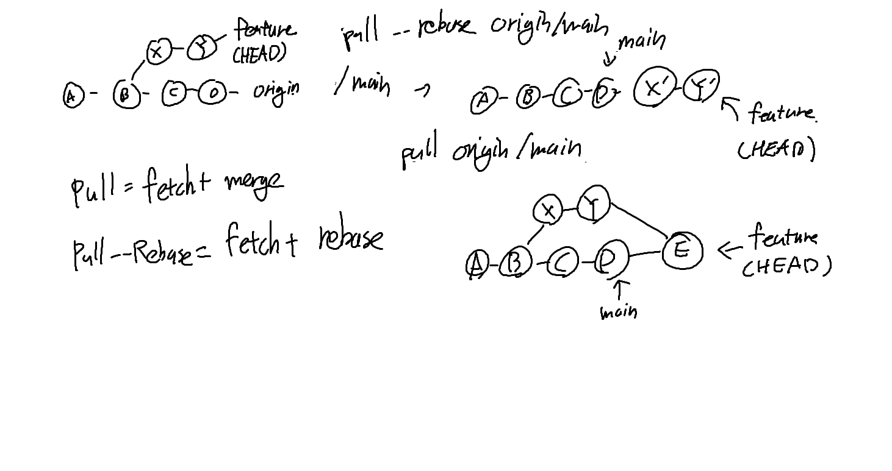

### Git Pull과 Pull-rebase
- 리모트 저장소의 변경 사항을 로컬 저장소로 가져오는 명령어지만, 두 명령어는 리모트 저장소의 기록을 관리할 떄 큰 차이가 있음
- main이나 production, develop 브랜치 같이 공통으로 사용하는 브랜치라면, 최대한 pull rebase 사용을 권장한다고 함 (이력 관리 문제)

#### Git Pull
- `git fetch`와 `git merge`를 한 번에 실행하는 명령어
  - `git fetch`: 리모트 저장소의 변경 사항을 로컬 저장소로 가져옴
  - `git merge`: 가져온 변경 사항을 현재 branch에 병합
- 일반적으로는 차이가 없지만, 이전 리모트 브랜치에서의 변경 사항과 충돌이 발생할 경우 다음과 같은 작업이 발생함
  - 로컬 저장소에서의 변경점과 리모트 저장소에서의 변경점을 병합합
    - 충돌이 발생하면 충돌 해결을 먼저 해 줘야 함
  - 이후 병합이 완료되고, 새로운 커밋이 생성됨
- 장점
  - 모든 작업의 이력 커밋이 사라지지 않고 남음
  - 오류가 발생했을 때, 따라서 이력을 추적하기 쉬움
- 단점
  - 리모트 브랜치에서의 작업이 빈번해지면, 이력이 복잡해짐

### Git Pull-rebase
- `git fetch`와 `git rebase`를 한 번에 실행하는 명령어
  - `git rebase`: 가져온 변경 사항을 현재 branch에 적용
- 리모트 저장소의 변경 커밋을 그대로 가져오고, 현재 브랜치의 커밋을 리베이스하게 됨
  - 따라서, 리모트 저장소의 변경 사항이 현재 브랜치의 최상단에 적용 (리모트 저장소의 변경 사항은 새로운 커밋이 되는 것과 마찬가지므로, 커밋의 해시는 달라짐)
  - 병합이 발생하지 않으므로, 브랜치의 변경 이력이 일직선이 됨
- 장점
  - 이력이 깔끔해짐
- 단점
  - 이력을 추적하기 어려움

