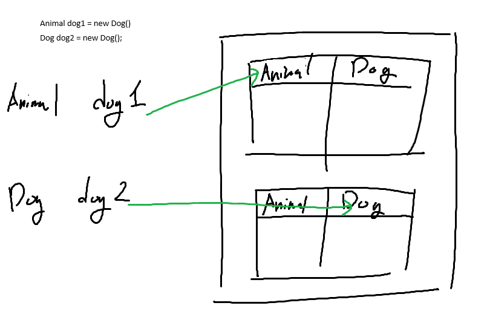

### 자바 객체지향의 원리와 이해
#### 객체지향의 추상화는 모델링과 같다
- 객체지향에서의 추상화란, 구체적인 것을 분해해서 관심 영경에 있는 특성만을 남겨 재조합하는 것
- 이렇게 정의한 클래스를 통해 생성한 객체를 인스턴스라고도 하고, 각각의 객체는 고유하다 (동일한 인스턴스 변수들을 지닌 다른 객체가 없다는 뜻은 아님)
#### 상속은 재사용 + 확장
- 상속은 두 객체가 부모자식의 상속 관계를 맺는다고 표현하기보다는, 하위 클래스가 상위 클래스를 구체화했다고 표현하는 쪽이 더 맞다
- 하위에서 상위로 갈 수록 더 추상화, 일반화되었다고 표현, 하위 클래스로 갈수록 더 구체화, 특수화되었다고 표현
- 그래서 java에서의 키워드도 extend(확장)으로 표현
- 보통 `하위 클래스 is a 상위 클래스`로 표현하는데, `하위 클래스 is a kind of 상위 클래스`로 표현하는 것이 더 정확

#### 인터페이스는 클래스가 할 수 이쓴 기능을 구현하도록 강제
- 인테피이스는, `클래스 is able to 인터페이스`로 표현
- 그래서 JAVA의 기본 인터페이스의 이름도 `able`로 끝나는 경우가 대부분임
  - Serializable, Cloneable, Runnable, Comparable, Iterable ...
- 리스코프 치환 원칙에 따라서 (하위 클래스는 상위클래스다), 상위 클래스는 상속시켜줄 속성이 많을수록 좋고
- 인터페이스는 인터페이스 분할 원칙에 따라서, 최대한 작은 단위로 나누어서 구현하는 것이 좋다

#### 상속받은 클래스를 인스턴스화할 때
- 인스턴스화한 클래스는 힙 영역에 생성되는데
  - 상속받은 클래스라면, 해당 클래스와 해당 클래스가 상속받은 클래스 모두 힙 영역에 위치하게 된다
  - 처음에 객체의 클래스를 어떻게 선언했냐에 따라서, 해당 객체의 참조 변수가 가리키는 클래스는 갈리게 됨  

  - 그래서 같은 생성자를 사용해 객체를 생성했더라도, 인스턴스의 클래스에 따라 다르게 동작할 수 있음
    - 위 예시에서 Dog 클래스가 추가로 구현한 메소드나 속성은, Animal 클래스의 인스턴스에서는 사용할 수 없음
    - 단, 오버라이딩의 경우, 하위 클래스에서 재정의한 것이 덮어씌워지기 때문에, 하위 클래스의 메소드가 호출됨

