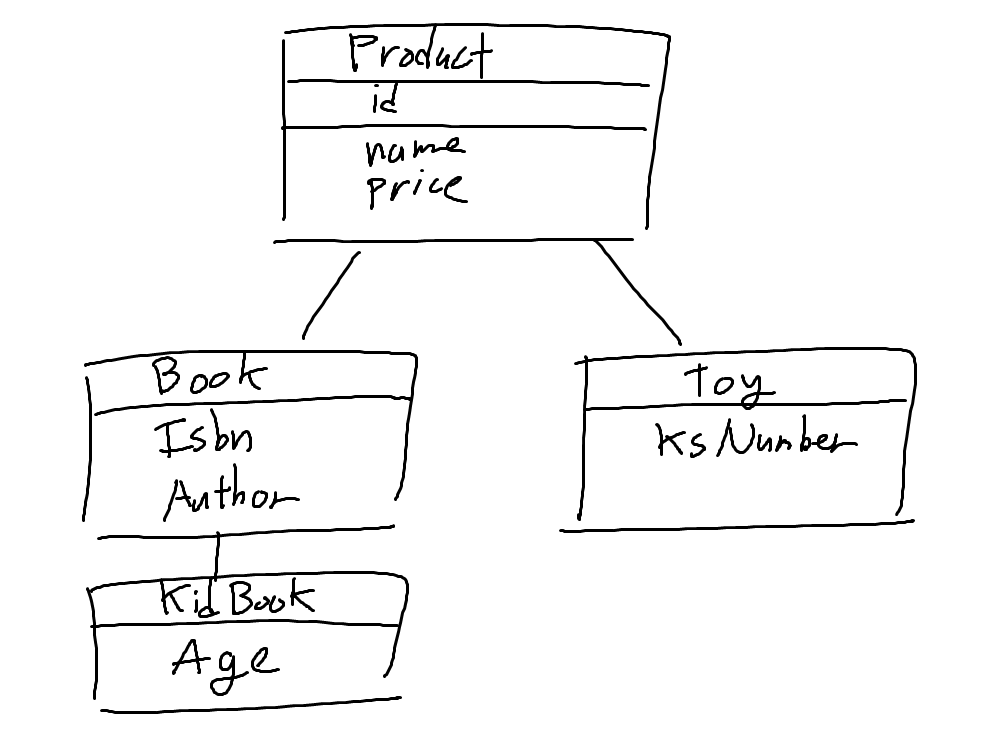
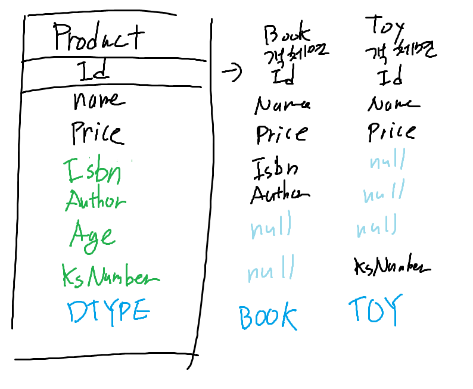
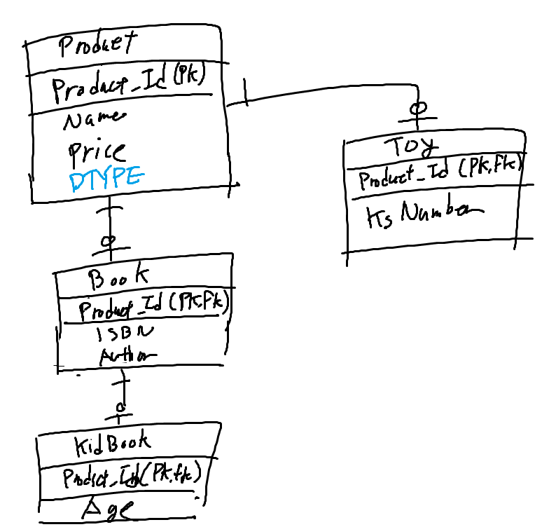
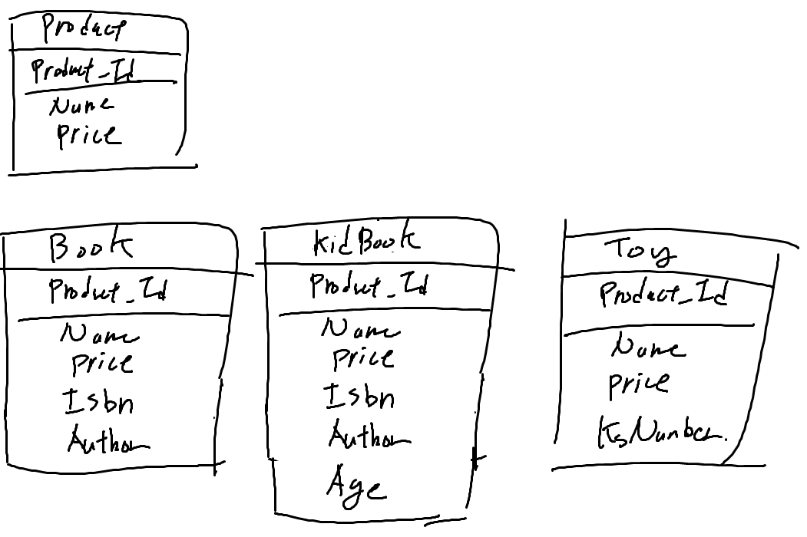

### JPA에서의 상속관계
- 관계형 데이터베이스를 객체지향적으로 사용하기 위해 만들어진 것이 JPA니까, 당연히 JPA로 상속관계를 표현할 수 있다
- 근데 데이터베이스에는 상속이 없음... 공통되는 속성과 공통되지 않는 속성을 별개의 테이블로 분리하여 정규화하면 표현은 가능할 것 같은데, JPA에서 지원하는지 궁금해서 찾아봄
- JPA에서는 상속관계를 표현하기 위해 3가지 방법을 제공한다고 함
  - 단일 테이블 전략
  - 조인 전략
  - 구현 클래스마다 테이블 전략

- 프로젝트의 Product 클래스가, 이후 추가 요구사항에 의해서 다음과 같이 변경해야 한다고 가정함
  - 다른 추가적인 정보를 가지지 않는 일반적인 상품을 표현하는 Product 클래스
  - ISBN 과 글쓴이 정보를 가지는 Book 클래스
    - 소비 연령 정보를 가지는 어린이 책 KidBook 클래스
  - KS 인증 정보를 가지는 장난감 TOY 클래스



- 테이블에서 상속 관계를 매핑하기 위해 추가적으로 구분자 컬럼이 추가되는 경우가 있는데, JPA에서의 해당 컬럼의 컬럼명의 기본값은 `DTYPE`임
- 이외에도, `@Inheritance` 어노테이션을 사용하여 상속 전략을 지정할 수 있음

#### 단일 테이블 전략
- 말 그대로, 상위 클래스를 상속받은 하위 클래스들의 정보까지 전부 하나의 테이블에 저장하는 것
  - 모든 자식 클래스의 속성을 포함하는 컬럼을 하나의 테이블에 저장
- `@Inheritance(strategy = InheritanceType.SINGLE_TABLE)`로 조인 전략이 `단일 테이블 전략`임을 명시
- `@DiscriminatorColumn` 어노테이션을 사용하여 구분자 컬럼을 지정
  - `name`: 구분자 컬럼의 이름
  - `discriminatorType`: 구분자 컬럼의 타입
- 장점 
  - 테이블이 하나이기 때문에, 조인이 필요 없어 성능이 좋음
  - 조회 쿼리가 간단함
  - JPA가 알아서 테이블의 컬럼을 엔티티의 속성에 매핑해주기 때문에, 구분자 컬럼만 추가해 주면 추가적인 설정이 필요 없음
- 단점
  - 테이블을 정규화할 수 없음
  - 자식 엔티티가 매핑한 컬럼은 모두 null을 허용해야 함
  - 테이블의 컬럼 개수가 많아짐

- 테이블의 구조

- JPA로 구현
```java
@Entity
@Inheritance(strategy = InheritanceType.SINGLE_TABLE)
@DiscriminatorColumn(name = "DTYPE")
public class Product {
    @Id
    @GeneratedValue
    private Long id;
    private String name;
    private int price;
}

@Entity
@DiscriminatorValue("BOOK")
public class Book extends Product {
    private String author;
    private String isbn;
}

@Entity
@DiscriminatorValue("KIDBOOK")
public class KidBook extends Book {
    private String age;
}

@Entity
@DiscriminatorValue("TOY")
public class Toy extends Product {
    private String ksNumber;
}
```

#### 조인 전략
- 상위 클래스와 하위 클래스를 각각의 테이블로 만들고, 조인을 사용하여 연결하는 전략
  - 상위 클래스의 인스턴스 변수는 하위 객체들의 공통적인 컬럼이므로, 공통되는 컬럼은 상위 클래스의 테이블에 저장
  - 하위 클래스의 인스턴스 변수는 각각의 테이블에 저장
  - id, DTYPE을 복합키로 생각할 수 있으니까, 제 2 정규형을 만족하는 것으로 볼 수 있을 것 같다
- 장점
  - 제일 정규화된 형태임
  - 전체 테이블 조회 시 성능이 좋음 (union이 필요하지 않음)
  - 외래키 제약조건을 활용하여 무결성을 보장할 수 있음
  - 저장공간 효율이 높음
- 단점
  - 조회 시 조인이 필요하므로 성능이 떨어짐
  - 단일 테이블 전략에 비해 조회 쿼리가 복잡함
  - INSERT시 INSERT SQL이 2번 이상 호출됨 (성능 저하)

- 테이블의 구조

- JPA로 구현
```java
@Entity
@Inheritance(strategy = InheritanceType.JOINED)
@DiscriminatorColumn(name = "DTYPE")
public class Product {
    @Id
    @GeneratedValue
    private Long id;
    private String name;
    private int price;
}

@Entity
@DiscriminatorValue("BOOK")
public class Book extends Product {
    private String author;
    private String isbn;
}

@Entity
@DiscriminatorValue("KIDBOOK")
public class KidBook extends Book {
    private String age;
}

@Entity
@DiscriminatorValue("TOY")
public class Toy extends Product {
    private String ksNumber;
}
```

#### 구현 클래스마다 테이블을 만드는 전략
- 슈퍼타입인 최상위 클래스는 테이블을 만들지 않고, 서브타입인 하위 클래스만 테이블을 만드는 전략
- 장점
  - 하위타입만 명확하게 구분해서 처리 가능
  - 각각의 컬럼 수가 많지 않으면서 한 번만 INSERT하면 됨
- 단점
  - 여러 자식 타입 테이블을 한번에 조회하려면 UNION 연산을 사용해야 해서, 성능이 느려짐
  - 여러 자식 타입 에티블을 통합해서 쿼리하기 어려움
  - PK 전략을 Auto_Increment로 사용하기 어려움

- 테이블의 구조

- JPA로 구현
```java
@Entity
@Inheritance(strategy = InheritanceType.TABLE_PER_CLASS)
public abstract class SuperProduct {
    @Id
    @GeneratedValue
    private Long id;
    private String name;
    private int price;
}

@Entity
@DiscriminatorValue("PRODUCT")
public class Product extends SuperProduct {

}

@Entity
@DiscriminatorValue("BOOK")
public class Book extends Product {
    private String author;
    private String isbn;
}

@Entity
@DiscriminatorValue("KIDBOOK")
public class KidBook extends Book {
    private String age;
}

@Entity
@DiscriminatorValue("TOY")
public class Toy extends Product {
    private String ksNumber;
}
```

#### SecondaryTable
- 하나의 엔티티에 여러 테이블을 매핑하는 방법
- `@SecondaryTable` 어노테이션을 사용하여, 하나의 엔티티가 두 개 이상의 테이블과 매핑되었음을 선언
- `@Column` 어노테이션의 `table` 속성을 사용하여, 어떤 테이블에 속한 컬럼인지 명시
- 단점
  - 무조건 1:1 관계여야 함
  - 조회 시 무조건 두 테이블을 모두 조인함 (하나만 조회 X)
- 왠만하면 SecondaryTable을 사용하는 것보다는, 1대1 관계를 맺는 것이 더 좋다고 함
  - 둘 중 필요한 하나만 조회할 수도 있으니까
- 근데 왜 쓸까?
  - JPA의 상속 전략과 테이블의 정규화 사이에서 타협하면서, 일부 상속 단계는 단일 테이블 전략으로 묶고, 일부는 조인으로 표현하고 싶을 때 사용한다고 함
    - 단일 테이블 전략과 조인 전략을 원래는 섞어서 사용할 수 없기 때문에

```java
@Entity
@Table(name = "PRODUCT")
@SecondaryTable(name = "BOOK",
    pkJoinColumns = @PrimaryKeyJoinColumn(name = "PRODUCT_ID"))
public class Book {
    @Id
    @GeneratedValue
    @Column(name = "PRODUCT_ID")
    private Long id;
    private String name;
    private int price;
	
	@Column(table = "BOOK", name = "AUTHOR")
    private String author;
	@Column(table = "BOOK", name = "ISBN")
    private String isbn;
}

```

#### MappedSuperclass
- 상속관계 매핑이 아니라, 공통 매핑 정보가 필요할 때 사용
  - 객체지향에서 상속을, 공통 속성을 재사용하기 위해 사용하는 경우와 비슷
- 테이블과 매핑되지 않고, 자식 클래스에 매핑 정보만 제공
  - 테이블과 매핑되지 않고 객체를 만들 일도 없으므로 abstract class로 선언하는 것이 일반적
  - 보통 공통 속성들을 모아서 만들어서 상속받아 사용하며, 엔티티의 등록일, 수정일, 등록자, 수정자 등을 자주 사용함
- 장점
  - 공통 매핑 정보를 상속받아서 사용할 수 있음
- 단점
  - 자식 클래스에게 공통되는 컬럼의 정보만 제공하고, 정규화는 되지 않음

- JPA로 구현
```java
@MappedSuperclass
public abstract class SuperProduct {
    private String createdBy;
	private LocalDateTime createdDate;
}

@Entity
@Inheritance(strategy = InheritanceType.JOINED)
@DiscriminatorColumn(name = "DTYPE")
public class Product extends SuperProduct {
    @Id
    @GeneratedValue
    private Long id;
    private String name;
    private int price;
}

@Entity
@DiscriminatorValue("BOOK")
public class Book extends SuperProduct {
    private String author;
    private String isbn;
}

@Entity
@DiscriminatorValue("KIDBOOK")
public class Toy extends SuperProduct {
    private String ksNumber;
}
```