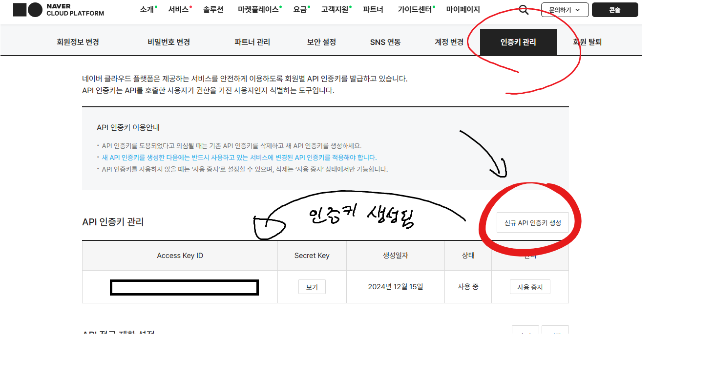
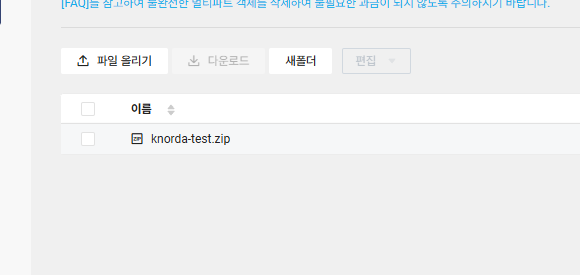
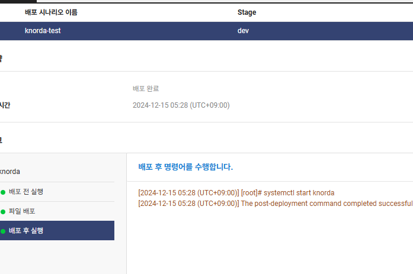
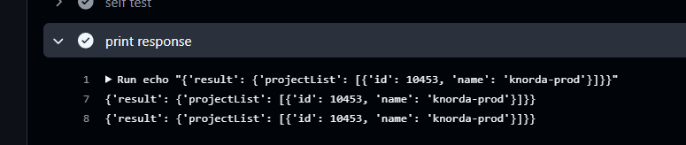
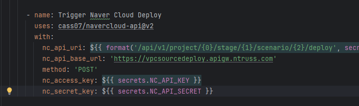
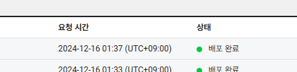

### Naver Cloud 환경에서의 CD 도입 1

#### CD 구현 예상 과정
- 우선 무중단 배포나 Docker 등을 사용하지 않고 "자동배포" 그 자체만 우선 구현
  - AWS의 Code Deploy와 비슷한 서비스로 SourceDeploy를 사용하면 될 것 같음?
- 이후 docker를 사용해서 Docker Image를 생성해서, 이를 Container Registry에 업로드하고, 서버에서 이미지를 pull해서 배포하는 방식으로 변경
- 이후 Jenkins 서버를 추가하여 파이프라인 구축?

#### CD 과정
- 소스코드를 Github의 배포 branch(main)에 push
- Github Action을 통해 테스트를 수행하고, 빌드 파일을 생성
- 빌드한 파일을 Object Storage에 업로드
- Naver Cloud의 SourceDeploy를 통해 Object Storage에 업로드된 파일을 서버에 다운로드하고, 시나리오를 수행
  - jar 파일을 실행하는 service를 등록하여, 이를 restart하는 방식으로 구현

#### 왜 service를 등록하는가?
- 계속 백그라운드에서 실행되는 프로세스이기 때문인 것도 있고, 서버가 재시작되거나 프로세스가 의도하지 않게 종료되었을 때 다시 실행되도록 하기 위함
- `systemctl`을 사용하여 서비스 유닛을 관리할 수 있음
- `.service` 파일을 생성하여 서비스 유닛의 설정을 정의하고, 이를 등록하면 서비스 유닛이 등록됨
- `etc/systemd/system` 디렉토리에 `.service` 파일을 생성하고, `systemctl enable` 명령어를 통해 서비스 유닛을 등록하면, 서버가 재시작될 때마다 서비스 유닛이 실행됨
```text
# unit : 서비스 유닛의 설명과 의존성을 정의
[Unit]
Description=My Service # 서비스 유닛의 설명
After=networking.service # 서비스 유닛이 실행되기 전에 실행되어야 하는 서비스 유닛

[Service]
User=root # 서비스 유닛을 실행할 사용자
ExecStart=/usr/bin/java -jar /path/to/jar # 서비스 유닛을 실행할 명령어
Restart=on-failure # 서비스 유닛이 실패할 경우 재시작
RestartSec=60 # 재시작 시간 간격

[Install]
WantedBy=multi-user.target # 서비스 유닛을 등록할 타겟
```

#### sourceCode를 빌드할 때
- 기존 로컬 테스트 시에만 주입했던 설정값들을 빌드 시에 주입해 줘야 함
- 실제 설정 값을 github secret에 등록하고, `application.yaml` 파일을 빌드 시에 github secret 값으로 변경하는 작업 필요
- github action에서 주입
```yaml
- name: Update secrets
  uses: microsoft/variable-substitution@v1
  with:
    files: ./src/main/resources/application.yaml
  env:
    env.dir: ${{ secrets.REAL_ENV }}
    env.dir.2: ${{ secrets.REAL_ENV_2 }}
#......
```
- 빌드할 때 테스트를 통과해야 빌드가 가능한데, 이미 테스트에 통과한 코드만 PR되는데, 굳이 테스트가 또 돌아갈 필요가 있나?

#### SourceDeploy의 시나리오
- jar 파일 다운로드 전
  - 기존 jar service를 stop
  - `systemctl stop my-service`
- jar 파일 다운로드 후
  - 새로운 jar service를 start
  - `systemctl start my-service`

#### github Action에서 Object Storage 사용
- 우선 Object Storage에 버킷 생성
- 포털 우측 상단 - 마이페이지 - 계정관리 - 인증키 관리 탭 에서 API 인증 키 생성
  
- Object Storage는 S3 CLI와 호환된다고 하니, 아마 S3 github action을 사용해도 될듯??
  - Github Action에서 사용하기 위해서 key, secret 등록
```yaml
- name: Deliver to AWS S3 Bucket
  uses: prewk/s3-cp-action@v2
  with:
    aws_access_key_id: ${{ secrets.AWS_ACCESS_KEY_ID }}
    aws_secret_access_key: ${{ secrets.AWS_ACCESS_KEY_PASS }}
    source: './jar_file.zip'
    aws_s3_endpoint: 'https://kr.object.ncloudstorage.com'
    dest: 's3://bucket_name/'  
```
- S3 CLI 기반 github action 을 사용하여 Object Storage에 파일을 업로드


#### 서버에서 service 등록
- service 등록을 위해 `.service` 파일을 생성
```text
[Unit]
Description=knorda
After=network.target

[Service]
User=root
ExecStart=/bin/bash -c "exec java -jar /path/to/jar"
Restart=on-failure
RestartSec=60

[Install]
WantedBy=multi-user.target
```

#### SourceDeploy 세팅
- 에이전트 설치
  - [설치 가이드](https://guide.ncloud-docs.com/docs/ko/devtools-devtools-4-4)
- 배포 프로젝트 생성
- server 배포 시나리오 생성
  - 배포 전략과 Object Storage에서의 배포 파일 설정
  - 배포 명령어 설정에서 배포 전, 파일 배포 위치, 배포 후 명령어 설정
- 배포 시나리오 실행
  


#### SourceDeploy 배포 트리거링을 자동화하기 위해 API 사용
- [API 가이드](https://api.ncloud-docs.com/docs/devtools-sourcedeploy)

- Authentication 세팅
  - Request Header에 정보 추가 필요
  - `x-ncp-apigw-timestamp` - 현재 시간 timestamp
  - `x-ncp-iam-access-key` - API Access Key
  - `x-ncp-apigw-signature-v2` - Signature
    - request Body를 Secret key로 암호화한 값
    - `HMAC-SHA256` 알고리즘으로 해싱한 후, Base64로 인코딩
      - body : request Method + space + URI + new line + timestamp + new line + access key
- NC API를 호출할 때 공통적으로 사용할 수 있도록 github action tool을 만드는 게 나을 것 같음??
- NC cli가 있긴 한데, 패키지 관리자로 관리를 안하는것같음 (???) 그래서 사용하려면 매 번 수동으로 패키지를 갱신시켜야 하는 것 같은데...


#### Naver Cloud API Github Action 만들기
- 필요한 스펙
  - 필요한 입력 값들
    - API BASE URL : `https://sourcedeploy.apigw.ntruss.com/api/v1`,... 
    - API URL
    - Method
    - Timestamp
    - Access Key
    - Secret Key
  - 필요한 출력 값
    - Signature Value
  - 필요한 작업
    - Timestamp를 생성하여 가지고 있음
    - 입력값을 사용해 `HMAC-SHA256` 알고리즘으로 해싱한 후, Base64로 인코딩하여 Signature Value 생성
    - Request Header에 필요한 값들을 추가하여 API 호출
    - response값이 있다면 받아와서 적절하게 출력 혹은 가공
- 대충 설계
  - shell script에서 timestamp를 생성함
  - python으로 입력값을 넣으면 Signature Value를 생성하도록 코드 작성
    - sh 환경에서 `HMAC` 일고리즘으로 해싱하긴 빡세니까...
  - shell script에서 python 코드를 실행하여 Signature Value를 받아옴
  - shell script에서 curl을 사용하여 API 호출

##### Python으로 Signatyre Value 생성, request 코드 작성
- Java로 하기에는 너무 무거우니까 Python으로 만듬
  - python은 인터프리터 언어라서 빠르게 코드를 작성할 수 있음
  - 또한, shell script를 사용하기 유리하고 requests 모듈로 빠르게 API를 호출 가능해서 python을 사용함
  - [code] (https://github.com/Cass07/navercloud-api/blob/main/ApiRequest.py)
  - 필요한 값을 받아서 body 생성 후, `HMAC-SHA256` 알고리즘으로 해싱한 후, Base64로 인코딩하여 Signature Value 생성
- requests 모듈을 사용해서, 그냥 request 보내고, response value 받는 것까지 python에서 처리하도록 함
```python
def _send_request(self):
  headers = {
      'Content-Type': 'application/json; charset=UTF-8',
      'X-ncp-apigw-timestamp': self.timestamp,
      'X-NCP-IAM-ACCESS-KEY': self.api_key,
      'X-NCP-APIGW-SIGNATURE-V2': self._make_signature(),
  }
  
  request_data = requests.get(self.api_base_url + self.api_uri, headers=headers)
  
  print("response_code : ", request_data.status_code)
  
  result = request_data.json()
  return result
```

##### Python 프로젝트를 Docker로 빌드
- requests 모듈이 `importlib.metadata` 종속성 오류를 뱉어서 (python은 조금밖에 안 써봐서 정확한 이유를 모르겠음??), 해당 모듈을 사용하지 않는 3.7 버전으로 낮춰서 이미지를 만듬
```dockerfile
# 3.7 python 이미지로 python 프로젝트를 빌드함
FROM python:3.7 AS builder

# 작업 디렉토리를 기본 /app 으로 설정함
ADD . /app
WORKDIR /app

# 추가로 필요한 종속성 requests, importlib-metadata를 app 디렉토리에 설치함
RUN pip install --target=/app requests importlib-metadata

# SSL certificates 등등이 있어 Requests가 HTTPS를 사용할 수 있는 python3 이미지를 사용함
# https://github.com/GoogleContainerTools/distroless
FROM gcr.io/distroless/python3-debian10
# 빌드한 이미지를 복사하고, 작업 디렉토리를 /app으로 설정함
COPY --from=builder /app /app
WORKDIR /app
ENV PYTHONPATH /app

# python 코드를 실행함
CMD ["/app/main.py"]
```

##### action.yml 파일에 action 정보 작성
- name, description, inputs, outputs, runs, branding 정보를 작성

##### Github Action 테스트 코드를 작성
- python 코드를 실행하고, response 값을 받아오는지 확인하는 테스트 코드 작성
```yaml
name: Integration Test
on:
  push:
    branches:
      - test-nc-api
jobs:
  build:
    runs-on: ubuntu-latest
    steps:
      - uses: actions/checkout@v4

# 생성한 액션에 변수를 설정하여 실행
      - name: self test
        id: self-test
        uses: cass07/navercloud-api@v1
        with:
          nc_api_uri: '/api/v1/project'
          nc_api_base_url: 'https://vpcsourcedeploy.apigw.ntruss.com'
          method: 'GET'
          nc_access_key: ${{ secrets.NAVER_CLOUD_API_ACCESS_KEY }}
          nc_secret_key: ${{ secrets.NAVER_CLOUD_API_SECRET_KEY }}
# response 값을 출력
      - name: print response
        run: |
          echo "${{ steps.self-test.outputs.response_body }}"
          echo "${{ env.response_body }}"
```

  
 
#### SourceDeploy API를 사용해 배포 트리거링 플로우 정리
[sorucedeploy api 배포 시작 doc](https://api.ncloud-docs.com/docs/devtools-sourcedeploy-deploy)
- 배포 과정은 생성한 배포 시나리오를 시작하기만 하면 됨

- 배포 시작 api 명세 
  - `POST {SOURCEDEPLOY_API_URL}/project/{projectId}/stage/{stageId}/scenario/{scenarioId}/deploy`
    - projectId : 배포 프로젝트 ID
    - stageId : 배포 스테이지 ID
    - scenarioId : 배포 시나리오 ID
  - 위 값은 콘솔에서는 확인 불가능하고, Rest API를 통해서 확인 가능
    - 근데 콘솔 Rest API 호출값에서도 확인이 가능하다
- 명세에 맞게 input을 설정하고 run하면, triggering 됨


 


#### 정리 - Naver Cloud CD Action flow

```yaml
name: Naver Cloud CD Test

on:
  push:
    branches:
      [ "branch_to_CD" ]

jobs:
  build:
    runs-on: ubuntu-latest

    steps:
      # 소스코드를 checkout해서 Github Action에서 사용할 수 있도록 가져옴
      - name: Checkout code
        uses: actions/checkout@v3

      # JDK 21을 사용할 수 있도록 설정
      - name: Set up JDK 21
        uses: actions/setup-java@v3
        with:
          distribution: 'temurin'
          java-version: '21'

      # production secret을 yaml 파일에 주입
      - name: Add application properties secret
        uses: microsoft/variable-substitution@v1
        with:
          files: ./src/main/resources/application.yaml
        env:
          encrypt.salt: ${{ secrets.ENCRYPT_SALT }}
          spring.datasource.url: ${{ secrets.DB_URL_PROD }}
          spring.datasource.username: ${{ secrets.DB_USERNAME_PROD }}
          spring.datasource.password: ${{ secrets.DB_PASS_PROD }}
          server.port: ${{ secrets.SERVER_PORT_PROD }}

      # test secret을 yaml 파일에 주입
      - name: Add application test properties secrets
        uses: microsoft/variable-substitution@v1
        with:
          files: ./src/test/resources/application-test.yaml
        env:
          encrypt.salt: ${{ secrets.ENCRYPT_SALT }}

      # gradlew에 실행 권한을 부여
      - name: Grant execute permission for gradlew
        run: chmod +x gradlew

      # gradle을 사용해 프로젝트 빌드
      - name: Build with Gradle
        uses: gradle/gradle-build-action@67421db6bd0bf253fb4bd25b31ebb98943c375e1
        with:
          arguments: build
          
      # 빌드된 jar 파일을 zip으로 압축
      - name: Zip the build file
        run: zip -r -qq -j ./knorda-test.zip ./build/libs/knorda-0.0.1-SNAPSHOT.jar

      # S3 CLI를 사용하여 Object Storage에 zip 파일을 업로드
      - name: Deliver to Naver Cloud
        uses: prewk/s3-cp-action@v2
        with:
          aws_access_key_id: ${{ secrets.NC_API_KEY }}
          aws_secret_access_key: ${{ secrets.NC_API_SECRET }}
          source: './knorda-test.zip'
          aws_s3_endpoint: 'https://kr.object.ncloudstorage.com'
          dest: ${{ secrets.NC_BUCKET_DIR }}

      # Naver Cloud API를 사용하여 SourceDeploy에 배포 시작
      - name: Trigger Naver Cloud Deploy
        uses: cass07/navercloud-api@v2
        with:
          nc_api_uri: ${{ format('/api/v1/project/{0}/stage/{1}/scenario/{2}/deploy', secrets.NC_PROJECT_ID, secrets.NC_STAGE_ID, secrets.NC_SCENARIO_ID) }}
          nc_api_base_url: 'https://vpcsourcedeploy.apigw.ntruss.com'
          method: 'POST'
          nc_access_key: ${{ secrets.NC_API_KEY }}
          nc_secret_key: ${{ secrets.NC_API_SECRET }}
```