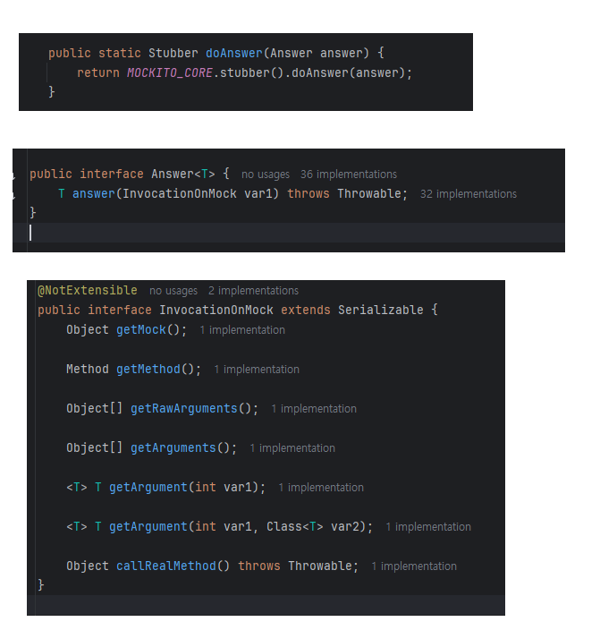
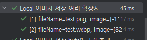

#### Callback 템플릿 패턴을 이용한 코드의 mocking
```java
// 테스트할 코드
public class ProductImageFacade {
    // 의존성 객체 정의
    
	@Transactional
	public ProductImageDto.ImageResponse registerImage(int productId, ProductImageDto.ImageRequest imageRequest,
		String loggedInMember) {
		return namedLockManager.executeWithNamedLock(LOCK_NAME + productId, 20,
			() -> registerImageInternal(productId, imageRequest, loggedInMember));
	}

	public ProductImageDto.ImageResponse registerImageInternal(int productId,
		ProductImageDto.ImageRequest imageRequest,
		String loggedInMember) {
		Product product = productService.findById(productId);
		if (!product.getMember().getMemberName().equals(loggedInMember)) {
			throw new ProductNotOwnedByLoggedInMemberException();
		}
		if (product.getImageUrl() != null) {
			throw new ProductImageAlreadyExistException();
		}

		String imageUrl = localImageStore.storeImage(imageRequest.getImage(), imageRequest.getImageName());

		product.updateImage(imageUrl);
		return ProductImageDto.ImageResponse.of(productService.save(product));
	}
}
```
- Facade 객체에서 Lock을 걸기 위해, 콜백 메소드 패턴을 사용한 NamedLockManager를 만들어서 적용함
- Facade 객체의 테스트를 진행할 때, NamedLockManage도 다른 서비스와 마찬가지로 mocking해서 Facade 내부의 비즈니스 로직만 테스트하는 것이 맞다고 생각함
- `namedLockManager.executeWithNamedLock(~, () -> registerImageInternal(~));`를 호출했을 때, 껍데기인 `executeWithNamedLock`만 모킹하고, `registerImageInternal`는 실제 로직을 그대로 수행시키고자 함
- 그런데 기존의 doReturn 메소드를 사용한 방법으로는 어떻게 mocking할지 잘 생각이 되지 않음
- 검색해 보니, doAnswer 메소드를 사용하라고 함

##### Mockito 의 doAnswer, doReturn, doThrow, doNothing 메소드
- doReturn: 모킹한 메소드가 호출될 때, 특정 값을 반환하려고 하는 경우
  - `doReturn(반환객체).when(모킹객체).모킹메소드();`
  - `when(모킹객체.모킹메소드()).thenReturn(반환값);`
- doThrow: 모킹한 메소드가 호출될 때, 예외를 발생시키려고 하는 경우
  - `doThrow(예외객체).when(모킹객체).모킹메소드();`
  - `when(모킹객체.모킹메소드()).thenThrow(예외객체);`
- doAnswer: 객체에서 모킹한 메소드가 호출될 때, 일부 사용자 지정 작업을 수행해야 할 때 사용
  - doAnswer 메소드는 매개 변수로 Answer 객체를 받는데, 이는 doAnswer 메소드에서 리턴할 값을 커스텀할 수 있게 하는 함수형 인터페이스임
    - Answer 객체의 매개 변수는 InvocationOnMock 객체이며, 이 객체는 모킹 메소드의 인자를 가져올 수 있음
    
  - `doAnswer(리턴값을 커스텀해주는 람다식).when(모킹객체).모킹메소드();`
- doNothing: 모킹한 메소드가 호출될 때, 아무것도 하지 않으려고 하는 경우


- 즉, 모킹된 메소드의 리턴 값이 단순 객체가 아니라 복잡한 처리가 필요할 경우, doAnswer를 사용하면 된다

##### doAnswer 메소드를 사용한 NamedLockManager 모킹
```java
doAnswer(invocationOnMock -> {
	// NamedLockManager의 executeWithNamedLock 메소드의 3번째 인자인 NamedLockCallback 객체를 가져옴
    NamedLockManager.NamedLockCallback<ProductImageDto.ImageResponse> callback = invocationOnMock.getArgument(2);

	// 해당 콜백 객체의 doInLock 메소드를 호출하여, registerImageInternal 메소드를 실제로 실행하고 그 결과 값을 리턴하도록 함
    return callback.doInLock();
	// 이후 when을 통해 executeWithNamedLock 메소드를 호출했을 때, 원하는 매개 변수가 들어왔을 때, doAnswer 내의 람다 메소드의 결과값을 리턴하도록 모킹
}).when(namedLockManager).executeWithNamedLock(eq("product_image_" + productId), eq(20L), any());
```

#### 하나의 테스트 메소드에서 여러 개의 테스트 케이스를 실행하는 방법
- 이미지의 헤더 검사를 하는 메소드에서, 여러 확장자의 이미지 헤더에 대한 테스트를 수행하고자 하는데, 이를 위해 중복된 내용의 테스트 메소드를 여러 개 만드는 것은 비효율적이라 생각함
- 찾아보니, 테스트 메소드에 매개 변수를 설정하고 여러 매개 변수에 대한 테스트를 수행하는 방법이 있었음

##### ParameterizedTest
- 테스트를 여러 주어진 Argument를 사용해서 수행할 수 있게 해 주는 어노테이션
- 기존에 사용했던 `@Test` 어노테이션과 동일한 방법으로 붙여주면 됨
- 대신 설정으로 하나 이상의 argument를 제공하도록 해 줘야 함
- `@ValueSource`, `@EnumSource`, `@MethodSource`, `@CsvSource`, `@CsvFileSource`, `@ArgumentsSource` 등의 어노테이션을 사용하여 argument를 제공할 수 있음

```java
// method를 사용해서 Argument Stream을 제공하도록 함
private static Stream<Arguments> provideExtension() {
    return Stream.of(
        arguments("test.png", new byte[] {(byte)0x89, (byte)0x50, (byte)0x4E, (byte)0x47, (byte)0x0D,
            (byte)0x0A, (byte)0x1A,
            (byte)0x0A, (byte)0x00}),
        arguments("test.webp", new byte[] {0x52, 0x49, 0x46, 0x46,
            0x00, 0x00, 0x00, 0x00,
            0x57, 0x45, 0x42, 0x50,
            0x00, 0x00, 0x00, 0x00})
    );
}

// ParameterizedTest 어노테이션을 붙이고, 아래에 MethodSource 어노테이션을 붙여셔, 매개변수를 어떻게 제공할 것인지 명시
@ParameterizedTest
@MethodSource("provideExtension")
void test(String filename, byte[] header) {
    // 테스트 코드
}
```

- 두 개의 argument에 대해서 테스트가 수행됨
- [참고](https://junit.org/junit5/docs/current/user-guide/#writing-tests-parameterized-tests-consuming-arguments)
