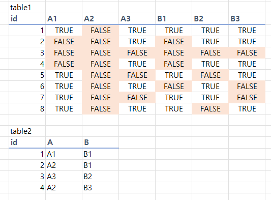
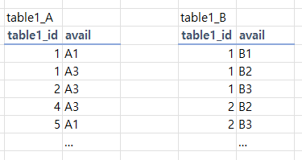
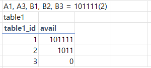
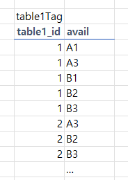

#### 데이터 테이블 설계 트러블슈팅

- 컬럼별로 속성들에 대한 존재 여부를 저장하는 table1
- 컬럼별로 해당 컬럼이 어느 속성을 가지는지 저장하는 table2


- problem : table2가 가지는 값처럼, 주어진 여러 속성에 대해 해당 속성이 모두 true인 table1의 id list를 찾아야 함

##### 케이스 1
- 위 이미지와 동일한 테이블 구조를 유지
- 조건문을 사용해서, 동적 쿼리를 작성
  - ex) `SELECT * FROM table1 WHERE A1 = true AND B1 = true`
- 컬럼명의 경우 preparedStatement를 사용하여 동적으로 바인딩할 수 없으므로, 동적 쿼리를 사용해야 한다
  - 존재하는 모든 속성에 대한 조건문과, 그에 따른 동적 쿼리를 작성


- 장점
  - 기존 테이블의 구조를 변경할 필요 없음
  - 조회 시 자원 소모가 제일 적음
- 단점
  - 동적 쿼리를 생성하기 위한 긴 if문이 필요해짐
  - 속성 추가에 자유롭지 못함
    - 속성이 추가되면 테이블과, 동적 쿼리 생성 로직을 전부 수정해야 함


##### 케이스 2

- 테이블1의 속성을 그룹별로 테이블을 나누고, 이를 정규화함
- 속성별 테이블을 join하고, 그룹별로 원하는 속성이 모두 존재하는 row를 찾음
  - ```sql
    SELECT * FROM table1_A
    LEFT JOIN table1_B
    ON table1_A.table1_id = table1_B.table1_id
    WHERE table1_A.avail = 'A1' AND table1_B.avail = 'B1'
    ```
    
- 장점
  - 속성 추가에 자유로움
    - 단, 속성 그룹이 추가된다면 새로운 그룹 테이블을 생성해야 할 필요가 있음
- 단점
  - 속성의 종류가 많아지면 다중으로 join하게 되어, 성능 저하가 발생할 수 있음
    - 각 속성별 테이블에서 필터링한 후 join을 걸면 일부 해결가능
  - 기존 table_1에서 컬럼별 사용 가능한 속성을 조회할 때, 여러 테이블을 조회해야 함

##### 케이스 3

- 각 속성의 사용 가능 여부를 bit로 압축 표현하여 저장 (2진수로 표현함)
- 조회 시에는 AND 연산을 조건문으로 사용
  - `SELECT * FROM table1 WHERE avail & 100100 > 0`

- 장점
  - 테이블의 컬럼 수를 줄일 수 있고, join 연산 또한 필요로 하지 않음
- 단점
  - 모든 row에 대해서 비트 연산을 수행해야 하므로, 성능 저하가 발생함 (analyze 해 본 결과 다른 두 방법에 비해 코스트가 엄청 큼)
  - 조회한 데이터를 사용하기 위해 비즈니스 로직 내에서 매번 추가적인 연산이 필요함
  - 속성 추가 자체는 자유롭지만, 해당 컬럼의 자료형에 따라서 최대로 사용할 수 있는 수는 제한됨

#### 생각
- 원칙적으로는 케이스 2가 가장 이상적인 테이블 설계라고 생각
- 단, 속성이 수정될 예정이 전혀 없다면, 케이스 1이 제일 효율적이라고 생각
- 3의 경우에는 데이터 압축에는 유리하나, 검색에는 유리하지 못한 것으로 생각됨


#### 번외
- 만약 속성에 그룹이 존재하지 않고 독립적이며, 하나의 컬럼이 가지고 있을 수 있는 속성 수에 제한이 없다면, 어떻게 설계해야 좋을까?
- M:N 관계를 사용하는 `게시판 태그` 등에서 자주 보이는 문제



- group by, having을 사용하면 일단 간단하게 구할 수 있다
  - tag 테이블에서 원하는 tag만 가지고 있는 모든 row를 찾는다
  - id로 group_by하고, count(tag)가 tag의 수와 같은 row를 찾는다
  - ```sql
    SELECT id, count(id) as cnt FROM table1Tag
    WHERE avail IN ('A1', 'A3')
    GROUP BY id
    HAVING cnt = 2
    ```
- 하지만 이는 tag의 수가 많아지면 성능 저하가 발생할 수 있음
- group by, having 연산이 코스트를 소모함
  - where 절 조건으로 필터링한 테이블을 임시 테이블로 만들고, 거기서 group by, having을 수행하기 때