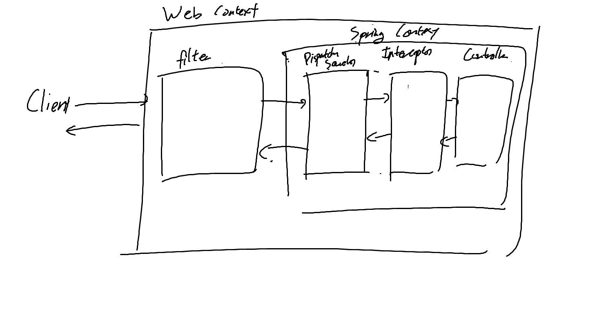

#### Filter와 Interceptor의 차이, 주된 사용처

- Filter는 Spring Context 외부의 요소
  - Web Context/ Servlet단에서 제공한다
    - Spring Context는 모르고, Web Container가 관리해준다
    - 단, `DeligatingFilterProxy`를 통해서 스프링 빈을 주입받을 수는 있다
    - 그런데? Spring Boot는 Web Container가 세트인데??
      - 그래서 Spring Boot는 서블릿 컨테이너까지 제어할수있다. 그래서 프록시 없이도 빈을 주입받을 수 있음
  - Dispatcher Servlet에 요청이 전달되기 전 후의 처리를 함
  - filter 인터페이스는 세 개의 메소드를 지님
    - `init` : 필터 객체를 초기화하는 메소드
    - `doFilter` : HTTP 요청을 받아 Dispatcher Servlet으로 전달하기 전 가공하는 실제 로직
      - `다음 필터 체인으로 전달하기 전 로직` ~ `chain.doFilter()` ~ `나갈때 로직`
    - `destroy` : 필터 객체를 제거하고 사용하는 자원을 반환

- Interceptor는 Spring Context 내부의 요소
  - Dispatcher Servlet이 컨트롤러를 호출하기 전의 요청/ 후의 응답을 참조하거나 가공하는 기능
  - HandlerInterceptor 인터페이스는 세 개의 메소드를 지님
    - `preHandle` : 컨트롤러가 호출되기 전에 실행되는 로직
    - `postHandle` : 컨트롤러가 호출된 후의 로직 (뷰 렌더링 전)
      - 그래서 컨트롤러에서 예외가 발생하면 호출되지 않는다
    - `afterCompletion` : 뷰 렌더링 후 호출된다
      - 예외가 발생하더라도 반드시 호출됨
      - 인터셉터의 처리 중 사용한 리소스를 반환할 때 사용하기 적합하다고함

- 즉
  - Filter는 스프링 컨텍스트와 무관하게 전역적인 처리가 필요할 때
    - 공통적인 인증/인가, 모든 request의 로깅, 인코딩, Spring과 분리된 기능
  - Interceptor는 클라이언트에 요청에 따라 컨트롤러의 전후처리를 할 때 사용한다
    - 세부적인 인증.인가, 특정 API에 대한 로깅, Controller로 넘겨주는 데이터의 가공
      - `preHandle`을 사용하면 API의 처리 결과에 상관없이 모든 Request를 로깅할 수 있고
      - `postHandle`을 사용하면 exception이 발생하지 않은 결과만 로깅하는데 그 결과도 할 수 있고
      - `afterCompletion`을 사용하면 모두로깅가능

#### Interceptor를 사용해서 로깅할 때 Request/ReponseBody와 관련해서
- Request/ResponseBody는 한번읽으면 다시 읽을수없음!! (띠용)
  - getReader, getOutputStream은 한번밖에 호출할수없다는뜻 대충
- 그래서 Interceptor에서 로깅하려고 읽어버리면 그 다음 체인으로 넘어갈때 비어버린다
- 그래서 스트림을 복사해서 사용해야함
  - ResponseBody의 경우 `ContentCachingResponseWrapper`를 사용하면 된다
  - RequestBody의 경우 Wrapper 클래스를 구현해줘야함
  - 그런데 Interceptor에서는 HttpServletRequest/Response 객체를 변경할 수 없기 때문에 Filter에서 변경해서 넘겨줘야한다

```java
@Component
public class LoggingFilterCustom extends OncePerRequestFilter() {
	@Override
    public void doFilterInternal(HttpServletRequest request, HttpServletResponse response, FilterChain filterChain) throws ServletException, IOException {
        // 아래에서 정의한 custom wrapper를 사용해서 request를 복사해서 넘겨주고
		ContentCachingRequestWrapper wrappedRequest = new MultipleReadableRequestWrapper(request);
        ContentCachingResponseWrapper wrappedResponse = new ContentCachingResponseWrapper(response);

        filterChain.doFilter(wrappedRequest, wrappedResponse);
		// Response 객체 정상적으로 나가도록 filterChain 이후에 copyBodyToResponse()를 호출해서 감싸주고
        wrappedResponse.copyBodyToResponse();
    }
}

public class MultipleReadableRequestWrapper extends HttpServletRequestWrapper {
    private ByteArrayOutputStream outputString = new ByteArrayOutputStream();
	
	public MultipleReadableRequestWrapper(HttpServlet request) {
		super(request);
    }
	
	public byte[] getContents() {
		try (InputStream inputStream = super.getInputStream()) {
			return inputStream.readAllBytes();
        } catch (IOException e) {
			return new byte[0];
        }
    }
	
	@Override
    public ServletInputStream getInputStream() throws IOException {
		// 기존  inputStream을 읽어서 ByteArrayOutputStream에 복사하고
		IOUtils.copy(super.getInputStream(), outputString);
		// 새 ServletInputStream 객체로 만들어서 반환하고 (추상클래스이기 때문에 익명 클래스 객체로 반환시키고)
        return new ServletInputStream() {
			private final InputStream buffer = new ByteArrayInputStream(outputString.toByteArray());
            @Override
            public int read() throws IOException {
                return outputString.read();
            }
			
			@Override
            public boolean isFinished() {
                return buffer.available() == 0;
            }
			
			@Override
            public boolean isReady() {
                return true;
            }
			@Override
            public void setReadListener(ReadListener readListener) {
                // No-op
            }
        };
    }

}
```

```java
@Component
public class LoggingInterceptor implements HandlerInterceptor {
	private ObjectMapper objectMapper = new ObjectMapper();
	
	@Override
    public boolean preHandle(HttpServletRequest request, HttpServletResponse response, Object handler) throws Exception {
        // RequestBody를 읽어서 로깅하고
        MultipleRequestableRequestWrapper wrappedRequest = (MultipleReadableRequestWrapper) request;
        String requestBody = StreamUtils.copyToString(wrappedRequest.getInputStream(), StandardCharsets.UTF_8);
        log.info("Request Body: {}", requestBody);
		
		// 적당히 처리하고
        
        return true;
    }
	
	@Override
    public void afterCompletion(HttpServletRequest request, HttpServletResponse response, Object handler, Exception ex) throws Exception {
		// ResponseBody를 읽어서 로깅하고
		String responseBody = StreamUtils.copyToString((response.getOutputStream(), StandardCharsets.UTF_8);
		log.info("Response Body: {}", responseBody);
	}
}

```


#### Interceptor vs AOP?
- 특정 요청을 받아서 전/후처리를 한다는 점이 AOP와 비슷하지만, 컨트롤러의 호출 과정의 전후 처리는 인터셉터를 사용하는 것이 더 유리하다
  - 컨트롤러의 타입/실행 메소드가 다양해서 포인트컷을 정하기 어렵고
  - 컨트롤러의 패러미터나 리턴 값이 다양하며
  - AOP에서는 HttpServletRequest/Response 객체를 얻기 어렵기 때문에